# Topology App: Reactive Dataflow & State Architecture

This document defines the complete reactive dataflow, state machine, event pipeline, and error handling architecture for the Topology Agent Planning system, including nested sub-graphs, autonomous multi-agent dispatch, and coherence validation.

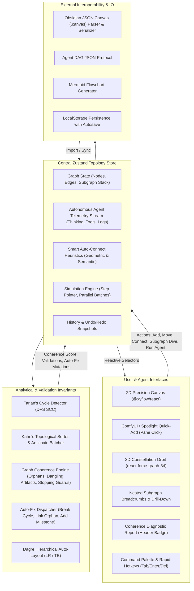

---

## 1. Node Lifecycle & Autonomous Agent State Machine

Each task or action node progresses through a deterministic dual state machine:

### Structural State:
`draft` → `pending` → `ready` → `in_progress` → `completed` | `blocked` | `failed`

### Execution Engine & Telemetry State:
Nodes are assigned a concrete **Execution Engine**:
- 🤖 **Autonomous AI Agent (`autonomous_agent`)**: Powered by LLM reasoning (`gemini-2.5-pro`, `gemini-2.5-flash`, `claude-3-7-sonnet`) with prompt templates and tool invocation.
- ⚡ **Script / Tool Runner (`automated_script`)**: Deterministic local Python/Shell script or webhook.
- 👤 **Human Operator (`human_operator`)**: Manual human authoring, code review, or approval sign-off.
- 🔀 **Decision Router (`conditional_router`)**: Branch condition evaluator.

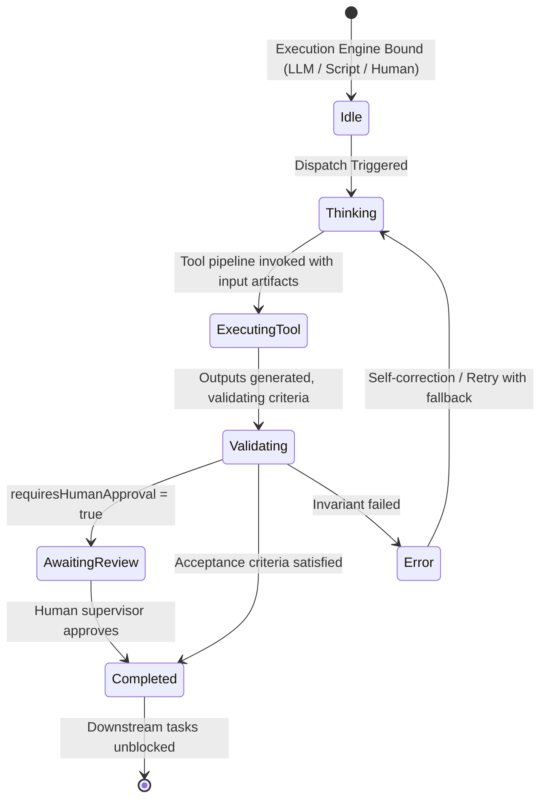

---

## 2. Nested Sub-Graphs & Recursion Safety

### Sub-Graph Navigation Stack:
When drilling into a node:
```
[Root Topology]
     │  enterSubgraph(nodeId)
     ▼
[Push current frame to subgraphStack]
     │
     ▼
[Load child nodes & child edges into active store]
     │  (Breadcrumb: Root > Parent Node > Child Step)
     ▼
[Exit Subgraph: Pop stack, save child state back into parent node.subgraph]
```

### Recursion & Stopping Guard:
- If a node is marked `recursive` or embeds a self-referential sub-graph:
  - **Inviolable Rule**: An explicit `stoppingCondition.expression` (e.g. `iteration >= 3 || accuracy >= 0.95`) must be defined.
  - If omitted, the **Graph Coherence Validator** flags an `Unbounded Recursive Loop` error and prevents automated looping until resolved or auto-fixed.

---

## 3. Smart Auto-Connect Heuristics

When a new node is created (via ComfyUI Spotlight or Canvas shortcut):
1. **Direct Selection**: If a node is currently selected, link directly from it.
2. **Geometric Proximity**: If none is selected, query nodes geometrically to the left ($X < newX$) and select the closest Euclidean neighbor.
3. **Semantic Edge Typing**:
   - `Task` → `Artifact` = `produces`
   - `Goal` → `Task` = `subtask`
   - `Task` → `Milestone` = `milestone_gate`
   - `Task` → `Task` = `depends_on`

---

## 4. Graph Coherence Validator & Auto-Fix Architecture

The coherence engine evaluates 5 topological invariants:
1. **Cycles / Deadlocks**: Detected via Tarjan's SCC. Auto-fix removes the participating back-edge.
2. **Orphan Nodes**: Detected when inDegree = 0 and outDegree = 0 (excluding single root goals). Auto-fix links to the nearest task or root goal.
3. **Dangling Artifact Dependencies**: Input artifacts required by a task that have no upstream producer. Auto-fix synthesizes a producer task step.
4. **Missing Terminal Deliverables**: Workflows with multiple divergent leaf branches without a consolidating milestone. Auto-fix synthesizes a milestone consolidation gate.
5. **Recursion Safety**: Recursive nodes lacking stopping expressions. Auto-fix adds a safe stopping condition.

---

## 5. UI Progressive Disclosure & Theme Dualism Architecture

### Stacking Context & Hover Expansion
To achieve frictionless progressive disclosure without visual overlap:
1. **Dynamic Stacking Context**:
   - In React Flow, default DOM ordering causes lower array elements to sit above higher array elements.
   - When hovering a node to reveal full prompts, tools, artifacts, and actions:
     - `.react-flow__node:hover` is assigned `z-index: 1000 !important`.
     - In `TopologyCustomNode.tsx`, `isElevated = isHovered || isSelected || isActionHovered` dynamically applies `z-index: 1000` to the card wrapper.
2. **True Light (Latte) & Dark (Mocha) Theming**:
   - Palette follows Catppuccin 1:1 color tokens.
   - Strictly borderless aesthetic (`border: none` everywhere): frosted glass `backdrop-blur-2xl`, multi-layer diffuse ambient shadows, and high-contrast typography tokens (`text-cat-latte-text` / `text-cat-mocha-text`).
   - Dynamic canvas grid dots match theme surface tones seamlessly.

---

## 6. Node Type Visual Identity & Clean Elevated Paper Design Matrix

Every node type features a clean, minimal, elevated card surface with subtle, unified paper tinting, neutral physical drop shadows, and a clean type pill header (strictly avoiding harsh borders, radial blobs, or saturated colored glows):

| Node Type | Catppuccin Hue | Shading Characteristics (Dark / Light) | Signature Visual Cue |
| :--- | :--- | :--- | :--- |
| **`goal`** | Royal Mauve (`#cba6f7` / `#8839ef`) | Subtle Mauve-tinted paper (`rgba(34, 28, 44, 0.94)` / `rgba(252, 249, 255, 0.98)`) | Target icon + clean Mauve pill badge + System Objective tag |
| **`task`** | Azure Sapphire (`#74c7ec` / `#209fb5`) | Subtle Sapphire-tinted slate (`rgba(24, 30, 44, 0.94)` / `rgba(248, 252, 255, 0.98)`) | CPU icon + clean Sapphire pill badge + Persona & Tools bound tag |
| **`decision`**| Amber Peach (`#fab387` / `#fe640b`) | Subtle Peach-tinted warm base (`rgba(36, 28, 30, 0.94)` / `rgba(255, 250, 248, 0.98)`) | GitBranch icon + clean Peach pill badge + `✓ PASS / ✗ RETRY` pills |
| **`milestone`**| Mint Emerald (`#a6e3a1` / `#40a02b`)| Subtle Emerald-tinted surface (`rgba(24, 34, 32, 0.94)` / `rgba(248, 254, 250, 0.98)`) | Flag icon + clean Emerald pill badge + Sync & Consolidation tag |
| **`artifact`** | Crystal Teal (`#94e2d5` / `#179299`)| Subtle Teal-tinted surface (`rgba(22, 32, 34, 0.94)` / `rgba(246, 253, 253, 0.98)`) | Package icon + clean Teal pill badge + Schema format indicator |
| **`agent`** | Celestial Lavender (`#b4befe` / `#7287fd`)| Subtle Lavender-tinted base (`rgba(28, 28, 44, 0.94)` / `rgba(250, 250, 255, 0.98)`) | Bot icon + clean Lavender pill badge + Persona role tag |

### Clean Elevation & Natural Shadow Architecture
- **Natural Physical Shadows**: Multi-stop neutral ambient drop shadows (`0 4px 16px -2px rgba(0, 0, 0, 0.35), 0 2px 6px -1px rgba(0, 0, 0, 0.20)`) in dark mode and ultra-soft shadows in light mode (`rgba(0, 0, 0, 0.05)`).
- **Specular Top Hairline Reflection**: Subtle inset highlight (`inset 0 1px 0 0 rgba(255, 255, 255, 0.08)`) simulating light hitting the top bevel of elevated paper.
- **Strictly Borderless**: 100% borderless (`border: none`) across all nodes, modals, and tooltips.
- **Status Indication**: Minimal, elegant 8px jewel dot indicator on the card header with subtle pulse for active tasks, leaving the card body unpolluted.

---

## 7. Artifact Data Pipeline & Synthetic Payloads

Each node can produce, view, copy, and download real code, markdown, and JSON artifact payloads:
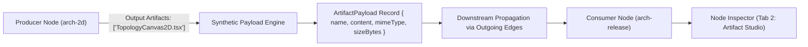
- **Syntax Viewing & Transfer**: Payloads include syntax-aware preformatted viewer, copy to clipboard, and instant file download.
- **Edge Highlighting**: Edges display `📦 payload_name` pills with active particle glow when data is transmitted.

---

## 8. Human-in-the-Loop (HITL) Review Gates & Decision Routing

For mission-critical tasks and evaluation checkpoints:
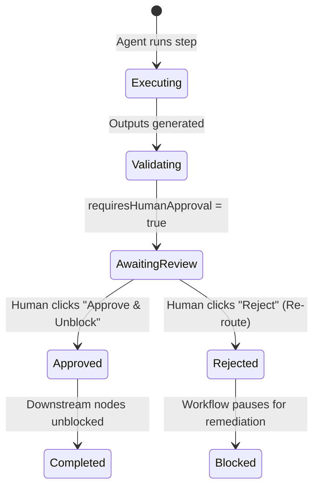
- **Decision Gates**: Evaluates conditional expressions (`coherenceScore >= 90`), lighting up `[TRUE]` branch edges (green) and inactivating `[FALSE]` branch edges (peach) with test simulator buttons.

---

## 9. Semantic Level-of-Detail (LOD) & Multi-Node Bundling

### Semantic LOD Zooming
- **Macro (Zoom < 0.55)**: Minimalist glowing beacon capsules displaying node type icons, concise labels, and pulsing status dots for macro fleet situational awareness.
- **Normal (0.55 – 1.25)**: Sleek borderless frosted cards with progressive disclosure on hover.
- **Micro (Zoom > 1.25)**: Deep-dive studio cards displaying inline artifact payloads, live telemetry thoughts, and direct HITL/Decision action controls.

### Multi-Node Operations & Subgraph Bundling
- Drag-marquee or Shift-click $\ge 2$ nodes activates the floating **MultiSelectionDock**:
  - **Bundle into Subgraph**: Packs selected nodes into a nested composite node, rewires external incoming and outgoing causal edges cleanly, and updates the canvas.
  - **Align X / Align Y**: Instant geometric alignment and even distribution.
  - **Batch Status**: Single-click bulk status transitions.

---

## 10. Universal Agent Manifest (UAM / MCP) Interoperability

Exportable directly from the Header, the Universal Agent Manifest converts the spatial visual topology into an actionable JSON specification compliant with LLM orchestration frameworks (Gemini CLI, LangChain, AutoGen, CrewAI):
- Full task definitions with role assignments and prompt templates
- Tool requirement schemas and boundary conditions
- Causal upstream and downstream dependency lists
- Invariant acceptance criteria and stopping conditions

---

## 11. Interactive Canvas MiniMap Radar HUD

The Canvas Navigator Radar provides spatial situational awareness and instant navigation:
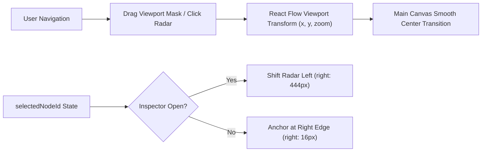
- **Pannable & Zoomable**: Supports direct viewport rect dragging and click-to-pan across the entire canvas bounding box.
- **Smart Stacking & Dynamic Offset**: Automatically shifts left (`right: 444px`) when `NodeInspector` drawer is active, ensuring the minimap is never occluded.
- **Collapsible Radar**: Header toggle allows collapsing down into a compact floating pill (`Compass` icon) or expanding into the high-resolution radar view.
- **Integrated HUD Actions**: One-click Fit View (`fitView`), Zoom In (`zoomIn`), and Zoom Out (`zoomOut`) directly on the radar chrome.

---

## 12. Tri-Palette Architectural Theming Engine

The app provides three world-class, carefully calibrated visual environments:
1. **Default (Google Material Light)**:
   - Crisp Google Workspace canvas (`#f8fafd` surface, `#ffffff` pure paper cards, `#dadce0` grid dots).
   - High-contrast Google Slate typography (`#202124` text, `#5f6368` secondary).
   - Iconic Google jewel accents:
     - *Task*: Google Blue (`#1a73e8`)
     - *Agent / Priority*: Google Red (`#ea4335`)
     - *Decision*: Google Amber (`#f9ab00`)
     - *Milestone*: Google Green (`#34a853`)
     - *Goal*: Google Purple (`#9334e6`)
     - *Artifact*: Google Teal (`#007b83`)
   - Natural Google Material paper elevation shadows (`0 1px 3px 0 rgba(60,64,67,0.16), 0 4px 14px 1px rgba(60,64,67,0.08)`) with absolute zero borders.
2. **Catppuccin (Mocha Dark)**:
   - Soft cyber pastel dark palette (`#11111b` crust, `#1e1e2e` base, `#313244` surface).
   - Pastel lavender, sapphire, peach, and mauve accents.
3. **Latte (Porcelain Light)**:
   - Crisp, glare-free porcelain paper surfaces (`#eff1f5` base, `#dce0e8` crust).
   - Warm pastel ink typography (`#4c4f69`).

### Compact Theme Palette Picker UI (`ThemePalettePicker.tsx`):
- Ultra-compact 32px jewel button trigger displaying active color cluster (e.g. 4-dot Google cluster: 🔵🔴🟡🟢).
- Rich popover preview revealing full 6-color swatch ribbons, theme descriptions, and one-click switching with zero header crowding.

---

## 13. Interactive Onboarding & Animated SVG Tutorials

- **First-Session Auto-Trigger**: Checks `localStorage.getItem('topology_tutorial_seen_v1')` on load and launches the interactive guide modal on first visit.
- **Manual Launch**: Accessible anytime via the `Guide` button (`HelpCircle`) in the top navigation header.
- **5 Bespoke Animated SVG Demonstrations**:
  1. *Precision Spatial DAG Flow*: Bezier curves with flowing energy pulse motion and multi-tier DAG topologies.
  2. *Spotlight Quick-Add & Smart Auto-Connect*: Rapid ComfyUI-style node spawning and elastic auto-linking.
  3. *Autonomous Multi-Agent Orchestration*: Live agent thought streams, tool invocation, and terminal telemetry.
  4. *Human-In-The-Loop & Decision Gates*: Conditional branch testing ([TRUE]/[FALSE]) and supervisor review sign-offs.
  5. *Universal Agent Manifest & Python CLI Interop*: Zero-dependency workflow execution and external agent integration.

---

## 14. Agent Prompt Handoff & Headless Python CLI Runner

Topology bridges the gap between visual spatial planning and autonomous CLI execution:
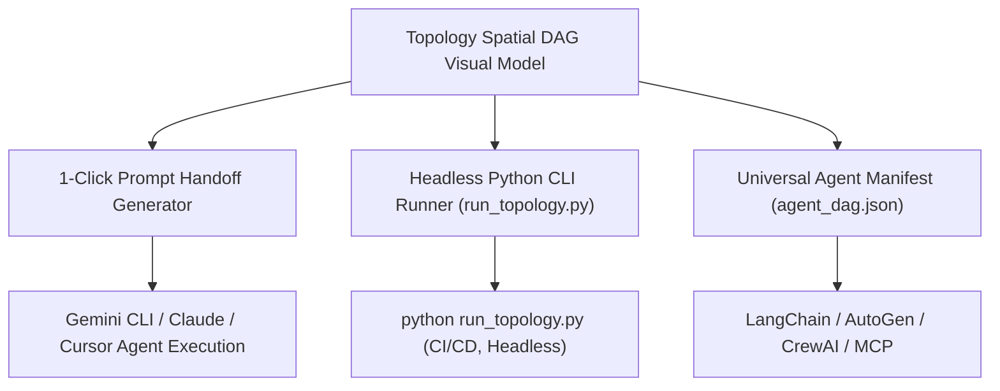
- **Single-Click Prompt Generation**: `generateAgentPromptPayload(node, nodes, edges)` extracts all upstream input dependencies, authorized tool schemas, acceptance criteria, and stopping conditions, formatting an instant prompt block for Gemini CLI.
- **Standalone Python Runner (`run_topology.py`)**: Zero-dependency Python 3 runtime using Kahn's topological sort to execute execution batches in sequence or parallel, passing emitted artifacts between nodes with full logging.

---

## 15. Canonical Topology Archetypes & % Architecture Coverage Map

Topology features a curated, industry-standard registry of **10 Canonical Software & AI Agent Topologies** across 4 engineering domains:
1. **Autonomous Coding & Dev Loops**:
   - `tdd-loop` (Autonomous TDD Coding Loop) [98% Popularity, Intermediate]
   - `code-migration` (Autonomous Codebase Migration Agent) [85% Popularity, Advanced]
   - `prompt-eval-loop` (Iterative Prompt & Eval Optimizer - DSPy) [79% Popularity, Intermediate]
2. **Knowledge & Data**:
   - `rag-synthesis` (RAG Knowledge Ingestion & Hybrid Retrieval) [95% Popularity, Advanced]
3. **Multi-Agent Reasoning**:
   - `agent-debate` (Multi-Agent Debate & Consensus Council) [88% Popularity, Advanced]
   - `map-reduce` (Hierarchical Map-Reduce & Antichain Fan-out) [92% Popularity, Intermediate]
   - `tree-of-thoughts` (Tree-of-Thoughts Backtracking Solver) [84% Popularity, Roadmap]
4. **Operations, SRE & Governance**:
   - `hitl-security` (HITL Security & Production Approval Gate) [94% Popularity, Intermediate]
   - `incident-triage` (Incident Sentry Triage & Auto-Remediation) [82% Popularity, Advanced]
   - `saga-orchestrator` (Event-Driven Saga Transaction Coordinator) [76% Popularity, Roadmap]

### % Coverage Map Calculation Engine:
- **Total Archetypes Defined**: 10
- **Ready to Instantiate**: 8 (80% Overall Software Architecture Coverage)
- **Roadmap / Community Contribution**: 2 (20%)
- **Dynamic Category Ratios**:
  - Coding & Dev Loops: 3 / 3 (100%)
  - Knowledge & RAG: 1 / 1 (100%)
  - Multi-Agent Reasoning: 2 / 3 (67%)
  - Operations & SRE: 2 / 3 (67%)

---

## 16. Topology Publishing & Community Registry Protocol

Users and autonomous agents can package, persist, and publish custom topology graphs without external databases:

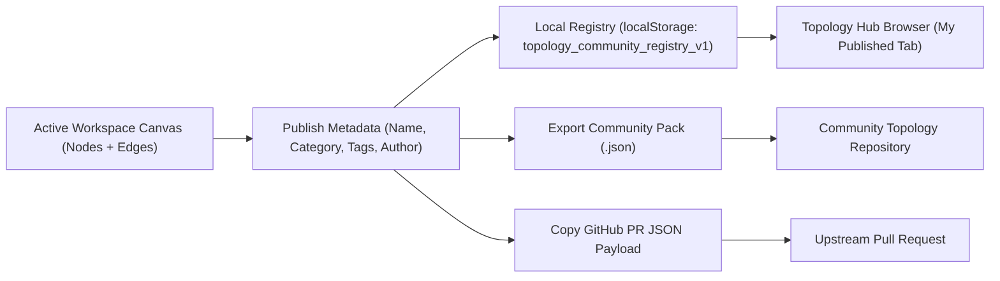

- **Local Persistence**: Custom topologies are stored in `topology_community_registry_v1`, surviving browser refreshes and editable/deletable directly from the Hub.
- **Community GitHub Interoperability**: Generates standardized JSON specs ready to be committed to an external `topologies` GitHub repository.

---

## 17. Application Error Boundary & Diagnostic Recovery Loop

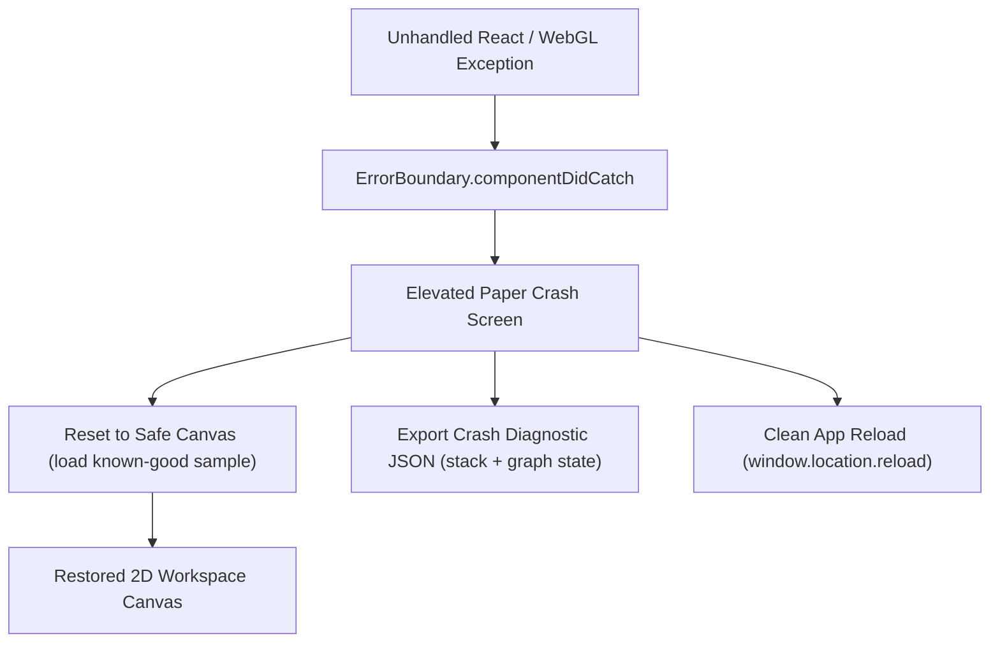

- Catches corrupted node payloads, malformed JSON imports, and WebGL context loss.
- Provides non-destructive recovery so users never lose control of their workspace.

---

## 18. Theme-Adaptive 3D WebGL Constellation Engine

The 3D WebGL engine (`react-force-graph-3d`) has been fully elevated to support multi-theme ergonomics:
- **Dynamic Viewport Dimensions**: Managed via `ResizeObserver` on the parent container, eliminating flex layout distortion or 0x0 canvas collapse.
- **Theme Adaptation**:
  - *Google Material Light*: Canvas `#f8fafd`, links `rgba(148, 163, 184, 0.5)`, particle stream `#1a73e8`, text sprite `#202124` on frosted white `#ffffff/92` pills.
  - *Dark Modes*: Canvas `#11111b`, glowing cyan `#89dceb` particles, `#cdd6f4` text sprite on obsidian `#181825/85` pills.
- **Floating 3D Camera Controls**:
  - Zoom In (`+`), Zoom Out (`-`)
  - Reset / Auto-Fit View (`Maximize2`)
---

## 19. Mobile Responsive Layout & Touch Interaction Architecture

Topology provides a seamless, touch-first experience across small mobile phones (320px+), tablets, and widescreen displays:

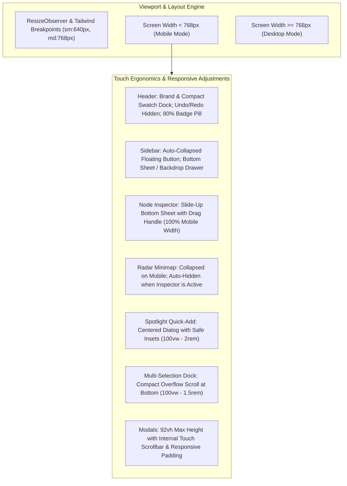

### Key Responsive Specifications:
1. **Zero Borders Invariant**: Every component maintains elevated drop shadows (`shadow-elevated-*`) and border-free surfaces.
2. **Touch Gestures in Canvas**:
   - Single-finger pan: Drag background canvas.
   - Pinch-to-zoom: Natural viewport scaling.
   - Tap node: Opens full-featured slide-up Node Inspector.
3. **Screen Real Estate Optimization**:
   - Radar minimap automatically suppresses itself on mobile when the Node Inspector is active to prevent overlapping controls.
   - Simulation bar and Multi-Selection dock are horizontally scrollable without clipping or horizontal page bounce.
   - Modals automatically scale padding (`p-3 sm:p-6`) and enforce `max-h-[92vh]` scrollable bounds.

---

## 20. Multi-Agent Asynchronous Swarm & Collaborative Execution Architecture

Topology enables multi-agent orchestration where teams of specialized AI workers operate asynchronously across parallel DAG nodes or collaborate simultaneously on shared bottleneck tasks:

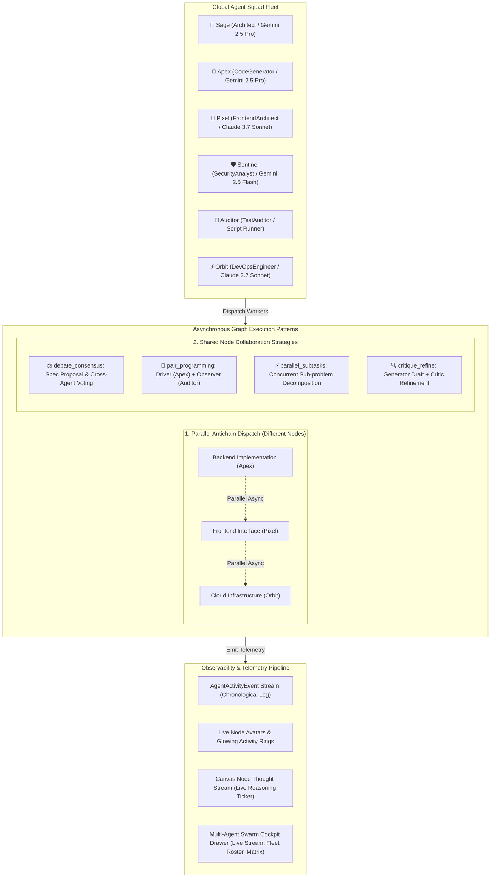

### Collaboration Strategies:
1. **`debate_consensus` (Consensus Debate ⚖️)**:
   - 2+ agents formulate proposals, cross-examine arguments, and vote before marking the node completed.
   - Example: Architecture specification debate between Sage (Architect) and Sentinel (Security Analyst).
2. **`pair_programming` (Pair Execution 👥)**:
   - Driver agent executes code generation while Observer agent continuously audits tests and invariants in lockstep.
   - Example: Automated test suite creation between Auditor (Test Auditor) and Sentinel (Security Analyst).
3. **`parallel_subtasks` (Parallel Swarm ⚡)**:
   - Multiple agents split a dense task into sub-components and work simultaneously on the same logical node.
4. **`critique_refine` (Critique & Refine 🔍)**:
   - Primary agent generates draft; secondary critic reviews and generates actionable improvements.
5. **`solo` (Single Agent 🤖)**:
   - Standard isolated agent execution.

### Observability Features:
- **Canvas Multi-Agent Badges**: Cards render overlapping color-coded avatars with pulsing active status rings and strategy badges (`⚖️ Consensus Debate`, `👥 Pair Execution`, etc.).
- **Live Active Thought Stream**: Real-time ticker on node cards and inspector drawer displaying what each agent is reasoning or which tool is being invoked.
- **Observability Cockpit**: Dedicated drawer with 3 tabs:
  1. *Live Stream*: Filterable chronological event stream with agent avatars and direct canvas node links.
  2. *Squad Fleet*: Roster with live statuses, model engines, assigned tools, and node counts.
  3. *Collab Nodes*: Real-time matrix of all nodes utilizing collaborative multi-agent execution.

---

## 21. WebGL 3D Performance, App-Wide React Memoization & Touch Architecture

### 1. Three.js Object & Material Pooling
To prevent frame drops, garbage collection spikes, and WebGL shader re-compiles during graph interactions:
- **Geometry Pooling**: Shared instances of `SphereGeometry(6, 24, 24)`, `SphereGeometry(8, 28, 28)`, and wireframe halos.
- **Material Caching**: Materials cached in a Map keyed by `${colorHex}_${isSelected}_${isLight}`.
- **Physics Cooldown Engine**:
  - `warmupTicks={60}`: Pre-positions layout off-screen.
  - `cooldownTicks={120}` / `cooldownTime={3500}`: Freezes physics engine once layout converges, dropping idle CPU/GPU load to near zero.
  - Interactive reheat (`d3ReheatSimulation()`) triggers smoothly on node drag.
- **Presentation Modes**:
  - Auto-orbit turntable mode (`requestAnimationFrame` spherical rotation).
  - 2.5D Top-Down camera projection (`Compass` preset).

### 2. App-Wide React Flow Memoization
- **Granular Node Memoization**: `TopologyCustomNode` is wrapped in `React.memo` with a custom equality comparator checking only relevant node state (`label`, `status`, `priority`, `activeThought`, `assignedAgents`, `approvalStatus`). Non-targeted nodes remain completely idle during live simulation streaming.
- **60fps rAF Drag Throttling**: Dragging nodes batches position mutations into `requestAnimationFrame`, preventing high-frequency Zustand store notification floods.
- **Vite Rollup Code Splitting**:
  - Main bundle reduced from 921 kB to 350 kB.
  - Three.js isolated into a lazy chunk (`vendor-three`) loaded on demand.
  - UI libraries (`framer-motion`, `lucide-react`) isolated into `vendor-ui`.

### 3. Mobile Responsive Architecture
- **Adaptive Drawer & Bottom Sheet**: On `< 640px` screens, `NodeInspector` smoothly animates as a bottom sheet (`y: '100%'` to `y: 0`) with a native tap-to-dismiss handle and horizontally scrollable tab ribbon.
- **Zero-Overflow Mobile Header**: Extra-wide buttons collapse on phone screens while primary studio switches (2D/3D, AI Plan, Swarm Agents, Theme) remain fully visible without horizontal scrollbar clipping.
- **Smart Dock Spacing**: Bottom docks (`SimulationBar`, `MultiAgentCockpit`, `CanvasMiniMap`) automatically negotiate screen space and auto-hide when inspector sheets are open.

---

## 22. 3D Constellation Reliability, Sidebar Anchor Invariants & Topology Hub Visual Hierarchy

### 1. 3D Constellation Rendering & Camera Viewport Invariant
- **Failure Mode Addressed**: Premature `zoomToFit` executions while nodes were at `(0, 0, 0)` caused camera vectors to collapse to zero-length, producing `NaN` matrix projections in Three.js and rendering an empty WebGL scene. Additionally, aggressive `warmupTicks` and `cooldownTicks` halted physics before the initial frame.
- **Reliable Solution**:
  - **Self-Illuminating Luminous Materials**: Shifted to pooled `MeshLambertMaterial` with `emissive` color and high emissive intensity (0.45-0.95), guaranteeing vivid visibility across light and dark modes regardless of directional lighting delay.
  - **Resilient Scene Light Injection**: Added a `requestAnimationFrame` loop that checks `fgRef.current.scene()` and injects ambient (`1.1` intensity) and dual directional lights once the canvas is initialized.
  - **Safe Camera Auto-Fit Guard**: `zoomToFit` checks `getGraphBbox()`; if the bounding box has not dispersed beyond the origin, a safe perspective camera position `{ x: 0, y: 30, z: 280 }` is applied, preventing `NaN` camera matrices.
  - **Natural Force Simulation**: Removed aggressive physics throttles, allowing `d3-force-3d` to animate smoothly to equilibrium with `onEngineStop` auto-fitting.

### 2. Sidebar Filter Top-Anchored Positioning Invariant
- **Failure Mode Addressed**: The sidebar previously jumped to the bottom on expand and back to the top when collapsed because the expanded state had `bottom-3 sm:bottom-6` and full-height stretching, altering its vertical anchor point.
- **Reliable Solution**:
  - **Unified Anchor Coordinates**: Both collapsed vertical rail and expanded filter card share the exact same `fixed top-16 sm:top-18 left-2.5 sm:left-4 z-30` anchor.
  - **In-Place Vertical Expansion**: Capped at `max-h-[calc(100vh-5.5rem)]` with internal scrollable filters (`overflow-y-auto`), expanding downward cleanly without ever anchoring to the bottom edge.
  - **Smooth Framer Motion Transition**: `AnimatePresence` with subtle scale (`0.94` to `1`) and fade morphs the rail into the panel in place.

### 3. Topology Archetype Hub Contrast & Elevated Paper Hierarchy
- **Visual Contrast Elevation**:
  - **Modal Surface Contrast**: Modal frame uses `bg-[#f8fafc] dark:bg-[#0f111a]`, ensuring elevated cards (`bg-white dark:bg-[#181a28]`) float with crisp paper depth and distinct shadows (`shadow-elevated-sm hover:shadow-elevated-md`).
  - **High-Legibility Typography**: Crisp, dark slate typography in light mode (`text-slate-900 font-bold`, `text-slate-600 font-normal`) and luminous text in dark mode (`text-white font-bold`, `text-slate-300`).
  - **High-Contrast Badges**: Vivid `Ready` (`bg-[#e6f4ea] text-[#137333] dark:bg-[#1e8e3e]/30 dark:text-[#34a853]`), `Popular` (`bg-[#fce8e6] text-[#c5221f] dark:bg-[#d93025]/25`), and `Roadmap` (`bg-[#fef7e0] text-[#b06000]`).
  - **Zero Borders**: Strictly border-free (`border-none`) throughout modal tabs, coverage map, archetype cards, and modal footer.

---

## 23. Dynamic Vertical DAG Layout & Mobile Orientation Engine

### 1. Viewport-Aware DAG Topology Orientation
- **Problem**: Horizontal Left-to-Right (`'LR'`) graphs exceed mobile screen aspect ratios ($9:16$ portrait), resulting in heavy horizontal panning, tiny fit-to-screen scale factors, and degraded readability.
- **Solution**:
  - **Automatic Mobile Detection**: On initial render and dynamic window resize (`< 768px`), `layoutDirection` automatically sets to `'TB'` (Top-to-Bottom vertical flow).
  - **Orientation State Machine**: `layoutDirection: 'LR' | 'TB'` is stored centrally in Zustand, with reactive controllers `setLayoutDirection(dir)` and `toggleLayoutDirection()`.
  - **Interactive Orientation Switcher**: Quick action floating panel on the canvas includes a dedicated orientation toggle button with `ArrowDownUp` / `ArrowLeftRight` icons and instant smooth camera reframing (`fitView`).

### 2. Dagre Hierarchical Layout Engine Adaptation
- In `calculateDagreLayout(nodes, edges, direction)`:
  - **Vertical Mode (`'TB'`) Parameters**:
    - `rankdir: 'TB'`
    - `nodesep: 65` (horizontal spacing between parallel sibling branches)
    - `ranksep: 110` (vertical spacing between causal tiers)
    - `marginx: 30`, `marginy: 30`
    - Node dimension anchors: `width: 290`, `height: 150`
    - Centered bounding coordinates: `x = Math.round(nodeWithPos.x - nodeWidth / 2)`, `y = Math.round(nodeWithPos.y - nodeHeight / 2)`
  - **Horizontal Mode (`'LR'`) Parameters**:
    - `rankdir: 'LR'`, `nodesep: 120`, `ranksep: 180`, `marginx: 50`, `marginy: 50`

### 3. Handle Priority & React Flow Edge Routing Invariant
- **React Flow Handle Binding Rule**: React Flow connects edges to the *first* declared `<Handle>` of a given type (`source` or `target`) when handle IDs are omitted.
- **Orientation-Specific Handle Ordering**:
  - **In Vertical Mode (`isVertical = true`)**:
    - Primary `target` handle: `Position.Top`
    - Primary `source` handle: `Position.Bottom`
    - Secondary fallback handles: `Position.Left` / `Position.Right`
    - Guarantees top-to-bottom bezier edge trajectories without horizontal S-curve loops.
  - **In Horizontal Mode (`isVertical = false`)**:
    - Primary `target` handle: `Position.Left`
    - Primary `source` handle: `Position.Right`
    - Secondary fallback handles: `Position.Top` / `Position.Bottom`
  - **Nano LOD Mode**: Dynamically mounts `Position.Top` + `Position.Bottom` when vertical, and `Position.Left` + `Position.Right` when horizontal.

### 4. Interactive Node Creation & Branching Offsets
- **Child Branching (`branchChildNode`)**:
  - Vertical: Offsets new child vertically downward (`y + 190`) with slight horizontal jitter (`x + random(-30, 30)`).
  - Horizontal: Offsets new child rightward (`x + 340`).
- **Parallel Siblings (`createSiblingNode`)**:
  - Vertical: Places parallel sibling alongside horizontally (`x + 310, y`).
  - Horizontal: Places parallel sibling below vertically (`x, y + 160`).
- **Archetype Loading**: `loadTopologyDirect` and `loadSampleTopology` automatically compute vertical layouts if loaded while in `'TB'` mode.
- **AI Plan Generator**: Synthesized workflows automatically layout according to the active viewport orientation.

---

## 24. Antigravity External Agent Integration, Live SSE Bridge & Model Context Protocol (MCP)

### 1. Zero-Dependency Model Context Protocol (MCP) Server (`mcp-server/index.js`)
- **Protocol**: JSON-RPC 2.0 over standard input/output (`stdio`) following the open Model Context Protocol specification.
- **Global Discovery**: Configured in `~/.gemini/config/mcp_config.json` and `.agents/mcp_config.json`. Any Antigravity agent or subagent running in any IDE workspace or CLI session automatically discovers the tools without extra installation.
- **Exposed Agent Tools**:
  1. `topology_create_plan({ title, description, nodes, edges })`: Ingests decomposed task DAGs and causal dependencies.
  2. `topology_update_node({ nodeId, status, thought, toolName, terminalLog, outputArtifacts })`: Updates real-time node state and telemetry.
  3. `topology_emit_thought({ nodeId, thought, toolName })`: Streams the agent's live reasoning thoughts and active tools to the canvas card.
  4. `topology_request_approval({ nodeId, notes, proposedArtifacts })`: Pauses workflow at a Human Review Gate for supervisor sign-off.
  5. `topology_get_plan({ includeApprovals })`: Queries current DAG state, completion progress, and human decisions.

### 2. High-Performance Server-Sent Events (SSE) Live Bridge (`plugins/topologyBridgePlugin.js`)
- **Unified Port Architecture**: Mounts directly into the Vite development server (`http://localhost:5173/api/topology/*`) via custom Vite middleware. No secondary daemon process or port is required.
- **Reactive Endpoints**:
  - `GET /api/topology/stream`: Long-lived SSE stream pushing `plan_updated`, `node_updated`, `thought_stream`, `agent_event`, and `node_approved` events to all connected browser tabs.
  - `POST /api/topology/plan`, `POST /api/topology/node`, `POST /api/topology/thought`, `POST /api/topology/event`: Ingests payloads from MCP or CLI scripts and broadcasts immediately.
  - `POST /api/topology/approve`: Ingests supervisor approval from the web canvas and stores in `.topology/approvals.json`.
  - `GET /api/topology/approval-status?nodeId=...`: Allows waiting agents to query whether a review gate has been signed off.
- **Resilient Offline Disk Fallback**: If the web UI is closed, the MCP server automatically writes updates to `.topology/plan.json`. Upon launching the UI, the bridge loads and renders the latest state immediately.

### 3. Native Desktop Alerts & Web Audio Chime Synthesis (`src/services/liveAgentSync.ts`)
- **Desktop Push Notifications**: Uses the HTML5 `Notification API` to deliver native OS desktop notifications for task dispatch, milestone completion, and human review gates, keeping the user informed even when the browser is backgrounded.
- **Synthesized Web Audio Chimes**: Generates crystal-clear sine and triangle wave chimes via `AudioContext` (C5-E5 tech chirp for task starts, C5-E5-G5-C6 triumphant chord for completions, and dual-tone alert for review gates). Requires zero external sound assets.
- **Live Canvas Card Reactivity**: Node cards update live with pulsing beacons, typing thought streams, and terminal logs without re-rendering the entire canvas.

### 4. Bidirectional Human-in-the-Loop (HITL) Execution Cycle
```
[Antigravity Agent]
       │
       ▼
calls topology_request_approval({ nodeId, notes })
       │
       ├──────────────────────────────────────────────┐
       ▼                                              ▼
MCP Server saves pending gate             Broadcasts to SSE Bridge
       │                                              │
       ▼                                              ▼
Waits / polls / checks approval           Topology UI shows Review Alert & Desktop Notification
       ▲                                              │
       │                                              ▼
       └────────────── Human clicks "Approve" ────────┘
```

---

## 25. Multi-Agent Satellite Workers, Dual-Tier Shared Context & Elevated Artifact HITL Review

### 1. Satellite Worker Nodes with Dynamic Overflow Clustering (`AgentSatelliteNodes.tsx`)
- **Orbital Positioning**: Workers assigned to a task node render as elevated pill capsules anchored along the card boundary (`absolute -top-3.5 right-3`).
- **Dynamic Cluster Collapse**:
  - **$\le 3$ Agents**: Individual pills display the worker's avatar emoji, name, colored accent, and real-time status beacon (pulsing when active or debating). Hovering triggers an elevated glass popover with full role, model engine, live thought snippet, and a shortcut to filter the Swarm Activity Stream.
  - **$> 3$ Agents**: Automatically clusters into the first 2 agents plus a compact `+N agents` gradient capsule. Hovering or clicking expands an elevated drawer popover listing the entire squad roster with individual statuses and live thoughts.

### 2. Dual-Tier Shared Context Blackboard (`SharedContextRepository`)
- **Architecture**: Provides a decentralized memory bus shared across all autonomous workers and human supervisors:
  - **Graph-Level (`scope: "global"`)**: High-level invariants, system architecture definitions, API specifications, and global security policies.
  - **Node-Level (`scope: "node"`, keyed by `nodeId`)**: Task-specific intermediate data, verified schemas, and outputs passed downstream.
- **Model Context Protocol (MCP) Tools**:
  - `topology_write_shared_context({ scope, key, value, nodeId, authorAgentRole })`: Writes an entry to memory and disk.
  - `topology_read_shared_context({ scope, key, nodeId })`: Reads single entries or scopes.
- **Real-Time Reactive Pipeline**:
  ```mermaid
  sequenceDiagram
      autonumber
      participant Agent as External Agent (CLI / Subagent)
      participant MCP as Topology MCP Server
      participant Bridge as Vite Bridge (/api/topology/context)
      participant UI as Topology Web UI (Zustand)

      Agent->>MCP: topology_write_shared_context(scope, key, value)
      MCP->>Bridge: POST /api/topology/context
      Bridge->>Bridge: Save to .topology/shared_context.json
      Bridge->>UI: SSE Event "context_updated"
      UI->>UI: Store updates sharedContext reactive state
      UI->>UI: Play pleasant audio ping & update Context badges
  ```
- **UI Blackboard Controls**:
  - **Global Context Modal (`GlobalContextModal.tsx`)**: Accessed via the "Context" button in the header navbar. Searchable key-value cards, JSON pre-formatting, copy, delete, and manual entry forms.
  - **Node Inspector Context Tab**: Displays entries scoped specifically to the selected node with an inline form to add or modify contracts.
  - **Node Card Context Pill**: Nodes with active context display a `🧠 N Context` pill in their badge row.

### 3. Elevated Artifact Inspection & In-Card HITL Sign-Off
- **Clickable Deliverable Pills**: Output artifact tags on node cards and inspector tabs are interactive buttons. Clicking immediately opens the full-screen `ArtifactViewerModal`.
- **Artifact Viewer Modal (`ArtifactViewerModal.tsx`)**:
  - Borderless elevated glass modal with Catppuccin and high-contrast styling.
  - Pre-formatted, syntax-styled view of code (`.ts`, `.tsx`), Markdown (`.md`), and JSON (`.json`).
  - Size formatting, formatted timestamp, "Copy Content", and "Download File" actions.
  - Integrated HITL review controls: "Request Revision" with reason notes, and "Approve Deliverable".
- **In-Card HITL Review Checkpoint**:
  - Nodes awaiting approval display an in-card supervisor action bar.
  - "Review Deliverable" opens the generated artifact in the viewer modal.
  - "Approve & Send to Squad" and "Reject" buttons immediately post to `/api/topology/approve`, persisting decisions to `.topology/approvals.json` and broadcasting back to the agent.

---

## 26. Fail-Open Architecture, Non-Critical Observability & Standard Error Taxonomy (`TOPOLOGY_ERR_*`)

### 1. Philosophy: Observability Companion, Not Critical Infrastructure
Topology is strictly an **observability and orchestration companion**. If the Vite dev server is offline, the port is occupied, or any network/bridge call fails, external agents **must continue executing their tasks unhindered**.

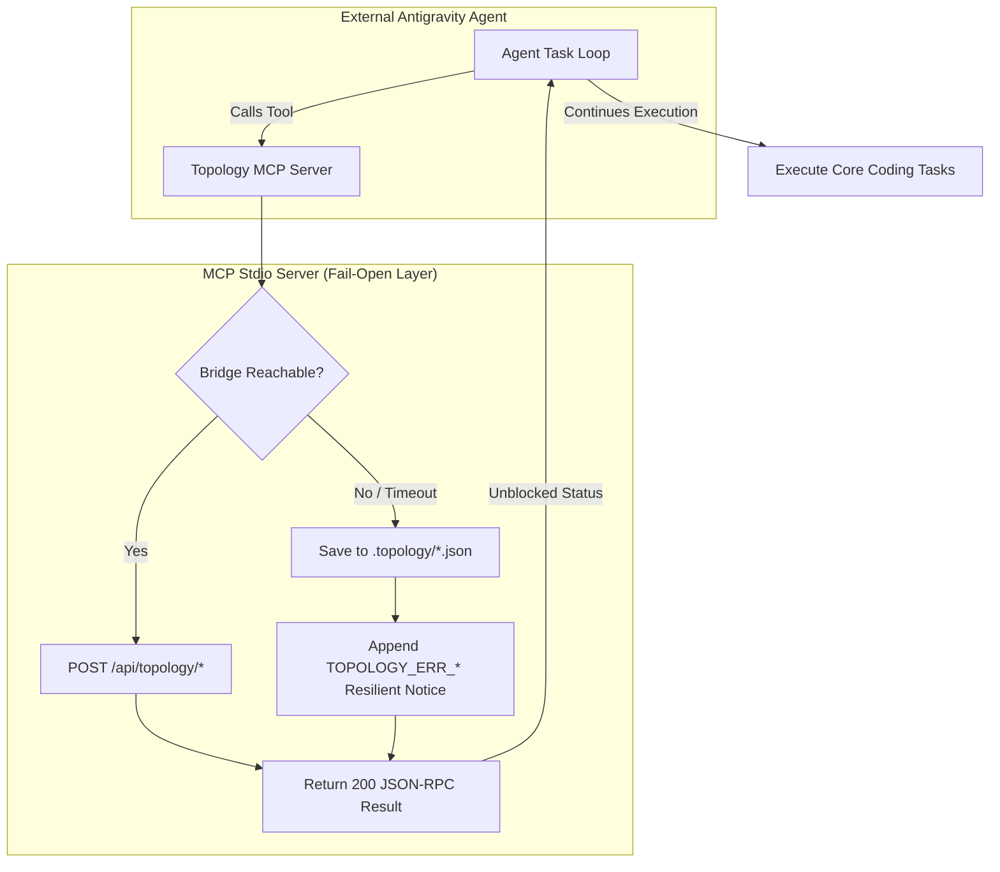

### 2. Standardized Error Taxonomy (`TOPOLOGY_ERR_*`)

| Error Code | Layer | Trigger Condition | Fail-Open Fallback Behavior |
|:---|:---|:---|:---|
| `TOPOLOGY_ERR_BRIDGE_OFFLINE` | MCP / REST | Dev server at `http://localhost:5173` is not running | Workflow state is safely persisted to `.topology/plan.json`. Agent receives `200 OK` JSON-RPC result with unblocked confirmation. |
| `TOPOLOGY_ERR_BRIDGE_TIMEOUT` | MCP / REST | Request to bridge exceeds 1500ms timeout | Aborts HTTP request cleanly, writes to `.topology/`, returns unblocked confirmation. |
| `TOPOLOGY_ERR_CACHE_IO_FAILED` | Filesystem | Disk read/write fails in `.topology/` | Falls back to in-memory state repository. Agent continues unblocked. |
| `TOPOLOGY_ERR_INVALID_SCHEMA` | Validation | Missing required parameters (e.g. missing `nodeId`) | Defaults missing fields or emits non-fatal notice. Agent does not crash. |
| `TOPOLOGY_ERR_CYCLIC_DEPENDENCY` | Graph Invariants | Cyclic edges detected in incoming plan | Ignores circular back-edge in rendering; workflow proceeds. |
| `TOPOLOGY_ERR_GATE_UNATTENDED` | HITL Review | Review gate requested while bridge is offline | Agent receives autonomy directive: prompt supervisor in chat or proceed autonomously. |
| `TOPOLOGY_ERR_SSE_DROPPED` | Sync Engine | Browser SSE stream disconnected | Silent exponential backoff retry (1.5s, 3s, 6s, 10s max). UI remains interactive. |
| `TOPOLOGY_ERR_UI_RENDER_CRASH` | Frontend UI | React render tree exception caught by ErrorBoundary | Displays error code, non-critical companion notice, and 1-click "Reset to Safe Canvas". |
| `TOPOLOGY_ERR_INTERNAL` | MCP Server | Uncaught internal exception in tool execution | Converts to non-fatal JSON-RPC result payload so agent harness is never terminated. |

### 3. Human-in-the-Loop Deadlock Safeguard
When `topology_request_approval` is invoked without an active bridge supervisor:
1. State is recorded as pending in `.topology/approvals.json`.
2. Instead of blocking the agent in an infinite waiting loop, the tool returns:
   `[TOPOLOGY_ERR_GATE_UNATTENDED]: Topology UI is unattended or offline. Prompt supervisor in chat, or proceed if invariant criteria are met.`
3. The external agent can either prompt the user directly in terminal/chat or proceed according to safety rules.


