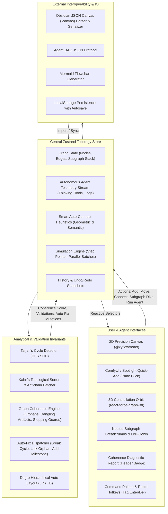
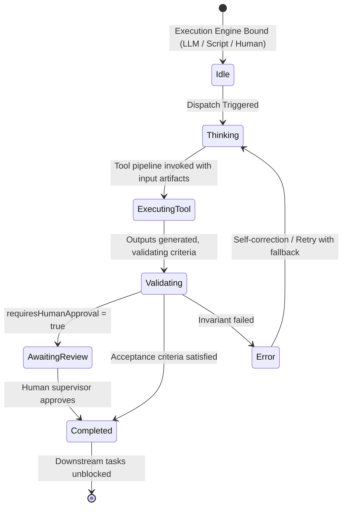
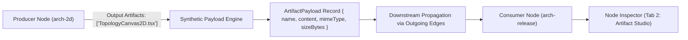
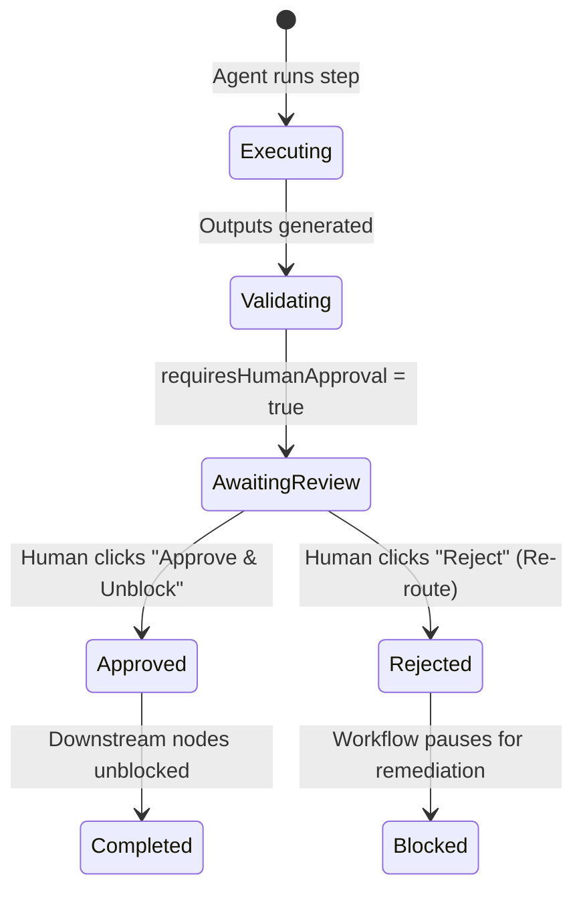
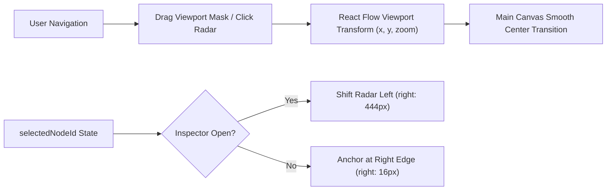
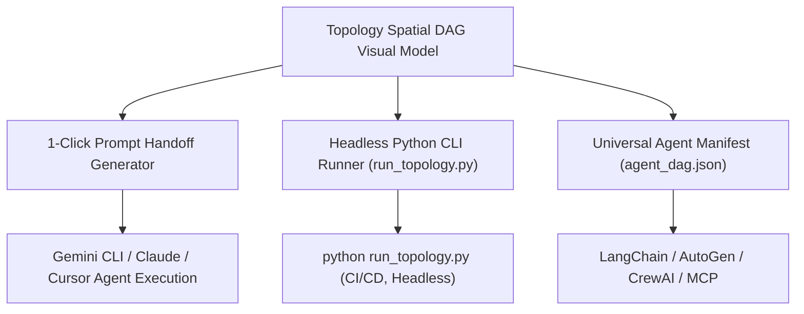
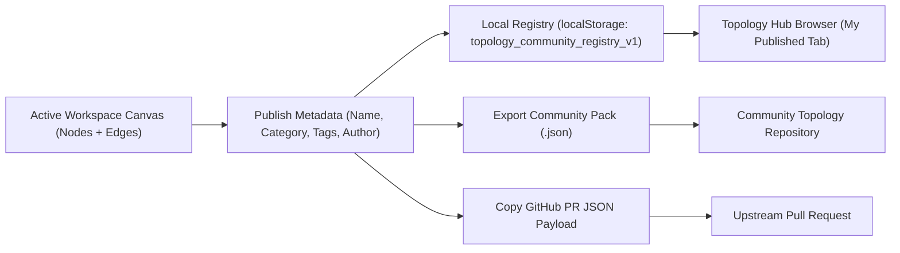
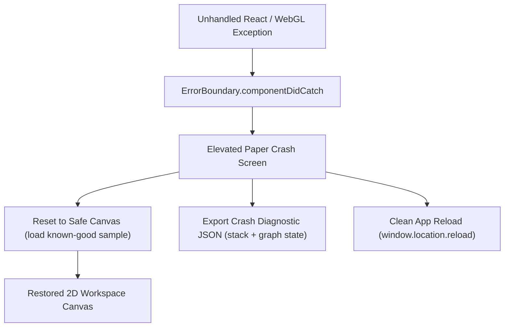

# Topology App: Reactive Dataflow & State Architecture

This document defines the complete reactive dataflow, state machine, event pipeline, and error handling architecture for the Topology Agent Planning system, including nested sub-graphs, autonomous multi-agent dispatch, and coherence validation.



---

## 1. Node Lifecycle & Autonomous Agent State Machine

Each task or action node progresses through a deterministic dual state machine:

### Structural State:
`draft` → `pending` → `ready` → `in_progress` → `completed` | `blocked` | `failed`

### Execution Engine & Telemetry State:
Nodes are assigned a concrete **Execution Engine**:
- 🤖 **Autonomous AI Agent (`autonomous_agent`)**: Powered by LLM reasoning (`gemini-2.5-pro`, `gemini-2.5-flash`, `claude-3-7-sonnet`) with prompt templates and tool invocation.
- ⚡ **Script / Tool Runner (`automated_script`)**: Deterministic local Python/Shell script or webhook.
- 👤 **Human Operator (`human_operator`)**: Manual human authoring, code review, or approval sign-off.
- 🔀 **Decision Router (`conditional_router`)**: Branch condition evaluator.



---

## 2. Nested Sub-Graphs & Recursion Safety

### Sub-Graph Navigation Stack:
When drilling into a node:
```
[Root Topology]
     │  enterSubgraph(nodeId)
     ▼
[Push current frame to subgraphStack]
     │
     ▼
[Load child nodes & child edges into active store]
     │  (Breadcrumb: Root > Parent Node > Child Step)
     ▼
[Exit Subgraph: Pop stack, save child state back into parent node.subgraph]
```

### Recursion & Stopping Guard:
- If a node is marked `recursive` or embeds a self-referential sub-graph:
  - **Inviolable Rule**: An explicit `stoppingCondition.expression` (e.g. `iteration >= 3 || accuracy >= 0.95`) must be defined.
  - If omitted, the **Graph Coherence Validator** flags an `Unbounded Recursive Loop` error and prevents automated looping until resolved or auto-fixed.

---

## 3. Smart Auto-Connect Heuristics

When a new node is created (via ComfyUI Spotlight or Canvas shortcut):
1. **Direct Selection**: If a node is currently selected, link directly from it.
2. **Geometric Proximity**: If none is selected, query nodes geometrically to the left ($X < newX$) and select the closest Euclidean neighbor.
3. **Semantic Edge Typing**:
   - `Task` → `Artifact` = `produces`
   - `Goal` → `Task` = `subtask`
   - `Task` → `Milestone` = `milestone_gate`
   - `Task` → `Task` = `depends_on`

---

## 4. Graph Coherence Validator & Auto-Fix Architecture

The coherence engine evaluates 5 topological invariants:
1. **Cycles / Deadlocks**: Detected via Tarjan's SCC. Auto-fix removes the participating back-edge.
2. **Orphan Nodes**: Detected when inDegree = 0 and outDegree = 0 (excluding single root goals). Auto-fix links to the nearest task or root goal.
3. **Dangling Artifact Dependencies**: Input artifacts required by a task that have no upstream producer. Auto-fix synthesizes a producer task step.
4. **Missing Terminal Deliverables**: Workflows with multiple divergent leaf branches without a consolidating milestone. Auto-fix synthesizes a milestone consolidation gate.
5. **Recursion Safety**: Recursive nodes lacking stopping expressions. Auto-fix adds a safe stopping condition.

---

## 5. UI Progressive Disclosure & Theme Dualism Architecture

### Stacking Context & Hover Expansion
To achieve frictionless progressive disclosure without visual overlap:
1. **Dynamic Stacking Context**:
   - In React Flow, default DOM ordering causes lower array elements to sit above higher array elements.
   - When hovering a node to reveal full prompts, tools, artifacts, and actions:
     - `.react-flow__node:hover` is assigned `z-index: 1000 !important`.
     - In `TopologyCustomNode.tsx`, `isElevated = isHovered || isSelected || isActionHovered` dynamically applies `z-index: 1000` to the card wrapper.
2. **True Light (Latte) & Dark (Mocha) Theming**:
   - Palette follows Catppuccin 1:1 color tokens.
   - Strictly borderless aesthetic (`border: none` everywhere): frosted glass `backdrop-blur-2xl`, multi-layer diffuse ambient shadows, and high-contrast typography tokens (`text-cat-latte-text` / `text-cat-mocha-text`).
   - Dynamic canvas grid dots match theme surface tones seamlessly.

---

## 6. Node Type Visual Identity & Clean Elevated Paper Design Matrix

Every node type features a clean, minimal, elevated card surface with subtle, unified paper tinting, neutral physical drop shadows, and a clean type pill header (strictly avoiding harsh borders, radial blobs, or saturated colored glows):

| Node Type | Catppuccin Hue | Shading Characteristics (Dark / Light) | Signature Visual Cue |
| :--- | :--- | :--- | :--- |
| **`goal`** | Royal Mauve (`#cba6f7` / `#8839ef`) | Subtle Mauve-tinted paper (`rgba(34, 28, 44, 0.94)` / `rgba(252, 249, 255, 0.98)`) | Target icon + clean Mauve pill badge + System Objective tag |
| **`task`** | Azure Sapphire (`#74c7ec` / `#209fb5`) | Subtle Sapphire-tinted slate (`rgba(24, 30, 44, 0.94)` / `rgba(248, 252, 255, 0.98)`) | CPU icon + clean Sapphire pill badge + Persona & Tools bound tag |
| **`decision`**| Amber Peach (`#fab387` / `#fe640b`) | Subtle Peach-tinted warm base (`rgba(36, 28, 30, 0.94)` / `rgba(255, 250, 248, 0.98)`) | GitBranch icon + clean Peach pill badge + `✓ PASS / ✗ RETRY` pills |
| **`milestone`**| Mint Emerald (`#a6e3a1` / `#40a02b`)| Subtle Emerald-tinted surface (`rgba(24, 34, 32, 0.94)` / `rgba(248, 254, 250, 0.98)`) | Flag icon + clean Emerald pill badge + Sync & Consolidation tag |
| **`artifact`** | Crystal Teal (`#94e2d5` / `#179299`)| Subtle Teal-tinted surface (`rgba(22, 32, 34, 0.94)` / `rgba(246, 253, 253, 0.98)`) | Package icon + clean Teal pill badge + Schema format indicator |
| **`agent`** | Celestial Lavender (`#b4befe` / `#7287fd`)| Subtle Lavender-tinted base (`rgba(28, 28, 44, 0.94)` / `rgba(250, 250, 255, 0.98)`) | Bot icon + clean Lavender pill badge + Persona role tag |

### Clean Elevation & Natural Shadow Architecture
- **Natural Physical Shadows**: Multi-stop neutral ambient drop shadows (`0 4px 16px -2px rgba(0, 0, 0, 0.35), 0 2px 6px -1px rgba(0, 0, 0, 0.20)`) in dark mode and ultra-soft shadows in light mode (`rgba(0, 0, 0, 0.05)`).
- **Specular Top Hairline Reflection**: Subtle inset highlight (`inset 0 1px 0 0 rgba(255, 255, 255, 0.08)`) simulating light hitting the top bevel of elevated paper.
- **Strictly Borderless**: 100% borderless (`border: none`) across all nodes, modals, and tooltips.
- **Status Indication**: Minimal, elegant 8px jewel dot indicator on the card header with subtle pulse for active tasks, leaving the card body unpolluted.

---

## 7. Artifact Data Pipeline & Synthetic Payloads

Each node can produce, view, copy, and download real code, markdown, and JSON artifact payloads:

- **Syntax Viewing & Transfer**: Payloads include syntax-aware preformatted viewer, copy to clipboard, and instant file download.
- **Edge Highlighting**: Edges display `📦 payload_name` pills with active particle glow when data is transmitted.

---

## 8. Human-in-the-Loop (HITL) Review Gates & Decision Routing

For mission-critical tasks and evaluation checkpoints:

- **Decision Gates**: Evaluates conditional expressions (`coherenceScore >= 90`), lighting up `[TRUE]` branch edges (green) and inactivating `[FALSE]` branch edges (peach) with test simulator buttons.

---

## 9. Semantic Level-of-Detail (LOD) & Multi-Node Bundling

### Semantic LOD Zooming
- **Macro (Zoom < 0.55)**: Minimalist glowing beacon capsules displaying node type icons, concise labels, and pulsing status dots for macro fleet situational awareness.
- **Normal (0.55 – 1.25)**: Sleek borderless frosted cards with progressive disclosure on hover.
- **Micro (Zoom > 1.25)**: Deep-dive studio cards displaying inline artifact payloads, live telemetry thoughts, and direct HITL/Decision action controls.

### Multi-Node Operations & Subgraph Bundling
- Drag-marquee or Shift-click $\ge 2$ nodes activates the floating **MultiSelectionDock**:
  - **Bundle into Subgraph**: Packs selected nodes into a nested composite node, rewires external incoming and outgoing causal edges cleanly, and updates the canvas.
  - **Align X / Align Y**: Instant geometric alignment and even distribution.
  - **Batch Status**: Single-click bulk status transitions.

---

## 10. Universal Agent Manifest (UAM / MCP) Interoperability

Exportable directly from the Header, the Universal Agent Manifest converts the spatial visual topology into an actionable JSON specification compliant with LLM orchestration frameworks (Gemini CLI, LangChain, AutoGen, CrewAI):
- Full task definitions with role assignments and prompt templates
- Tool requirement schemas and boundary conditions
- Causal upstream and downstream dependency lists
- Invariant acceptance criteria and stopping conditions

---

## 11. Interactive Canvas MiniMap Radar HUD

The Canvas Navigator Radar provides spatial situational awareness and instant navigation:

- **Pannable & Zoomable**: Supports direct viewport rect dragging and click-to-pan across the entire canvas bounding box.
- **Smart Stacking & Dynamic Offset**: Automatically shifts left (`right: 444px`) when `NodeInspector` drawer is active, ensuring the minimap is never occluded.
- **Collapsible Radar**: Header toggle allows collapsing down into a compact floating pill (`Compass` icon) or expanding into the high-resolution radar view.
- **Integrated HUD Actions**: One-click Fit View (`fitView`), Zoom In (`zoomIn`), and Zoom Out (`zoomOut`) directly on the radar chrome.

---

## 12. Tri-Palette Architectural Theming Engine

The app provides three world-class, carefully calibrated visual environments:
1. **Default (Google Material Light)**:
   - Crisp Google Workspace canvas (`#f8fafd` surface, `#ffffff` pure paper cards, `#dadce0` grid dots).
   - High-contrast Google Slate typography (`#202124` text, `#5f6368` secondary).
   - Iconic Google jewel accents:
     - *Task*: Google Blue (`#1a73e8`)
     - *Agent / Priority*: Google Red (`#ea4335`)
     - *Decision*: Google Amber (`#f9ab00`)
     - *Milestone*: Google Green (`#34a853`)
     - *Goal*: Google Purple (`#9334e6`)
     - *Artifact*: Google Teal (`#007b83`)
   - Natural Google Material paper elevation shadows (`0 1px 3px 0 rgba(60,64,67,0.16), 0 4px 14px 1px rgba(60,64,67,0.08)`) with absolute zero borders.
2. **Catppuccin (Mocha Dark)**:
   - Soft cyber pastel dark palette (`#11111b` crust, `#1e1e2e` base, `#313244` surface).
   - Pastel lavender, sapphire, peach, and mauve accents.
3. **Latte (Porcelain Light)**:
   - Crisp, glare-free porcelain paper surfaces (`#eff1f5` base, `#dce0e8` crust).
   - Warm pastel ink typography (`#4c4f69`).

### Compact Theme Palette Picker UI (`ThemePalettePicker.tsx`):
- Ultra-compact 32px jewel button trigger displaying active color cluster (e.g. 4-dot Google cluster: 🔵🔴🟡🟢).
- Rich popover preview revealing full 6-color swatch ribbons, theme descriptions, and one-click switching with zero header crowding.

---

## 13. Interactive Onboarding & Animated SVG Tutorials

- **First-Session Auto-Trigger**: Checks `localStorage.getItem('topology_tutorial_seen_v1')` on load and launches the interactive guide modal on first visit.
- **Manual Launch**: Accessible anytime via the `Guide` button (`HelpCircle`) in the top navigation header.
- **5 Bespoke Animated SVG Demonstrations**:
  1. *Precision Spatial DAG Flow*: Bezier curves with flowing energy pulse motion and multi-tier DAG topologies.
  2. *Spotlight Quick-Add & Smart Auto-Connect*: Rapid ComfyUI-style node spawning and elastic auto-linking.
  3. *Autonomous Multi-Agent Orchestration*: Live agent thought streams, tool invocation, and terminal telemetry.
  4. *Human-In-The-Loop & Decision Gates*: Conditional branch testing ([TRUE]/[FALSE]) and supervisor review sign-offs.
  5. *Universal Agent Manifest & Python CLI Interop*: Zero-dependency workflow execution and external agent integration.

---

## 14. Agent Prompt Handoff & Headless Python CLI Runner

Topology bridges the gap between visual spatial planning and autonomous CLI execution:

- **Single-Click Prompt Generation**: `generateAgentPromptPayload(node, nodes, edges)` extracts all upstream input dependencies, authorized tool schemas, acceptance criteria, and stopping conditions, formatting an instant prompt block for Gemini CLI.
- **Standalone Python Runner (`run_topology.py`)**: Zero-dependency Python 3 runtime using Kahn's topological sort to execute execution batches in sequence or parallel, passing emitted artifacts between nodes with full logging.

---

## 15. Canonical Topology Archetypes & % Architecture Coverage Map

Topology features a curated, industry-standard registry of **10 Canonical Software & AI Agent Topologies** across 4 engineering domains:
1. **Autonomous Coding & Dev Loops**:
   - `tdd-loop` (Autonomous TDD Coding Loop) [98% Popularity, Intermediate]
   - `code-migration` (Autonomous Codebase Migration Agent) [85% Popularity, Advanced]
   - `prompt-eval-loop` (Iterative Prompt & Eval Optimizer - DSPy) [79% Popularity, Intermediate]
2. **Knowledge & Data**:
   - `rag-synthesis` (RAG Knowledge Ingestion & Hybrid Retrieval) [95% Popularity, Advanced]
3. **Multi-Agent Reasoning**:
   - `agent-debate` (Multi-Agent Debate & Consensus Council) [88% Popularity, Advanced]
   - `map-reduce` (Hierarchical Map-Reduce & Antichain Fan-out) [92% Popularity, Intermediate]
   - `tree-of-thoughts` (Tree-of-Thoughts Backtracking Solver) [84% Popularity, Roadmap]
4. **Operations, SRE & Governance**:
   - `hitl-security` (HITL Security & Production Approval Gate) [94% Popularity, Intermediate]
   - `incident-triage` (Incident Sentry Triage & Auto-Remediation) [82% Popularity, Advanced]
   - `saga-orchestrator` (Event-Driven Saga Transaction Coordinator) [76% Popularity, Roadmap]

### % Coverage Map Calculation Engine:
- **Total Archetypes Defined**: 10
- **Ready to Instantiate**: 8 (80% Overall Software Architecture Coverage)
- **Roadmap / Community Contribution**: 2 (20%)
- **Dynamic Category Ratios**:
  - Coding & Dev Loops: 3 / 3 (100%)
  - Knowledge & RAG: 1 / 1 (100%)
  - Multi-Agent Reasoning: 2 / 3 (67%)
  - Operations & SRE: 2 / 3 (67%)

---

## 16. Topology Publishing & Community Registry Protocol

Users and autonomous agents can package, persist, and publish custom topology graphs without external databases:



- **Local Persistence**: Custom topologies are stored in `topology_community_registry_v1`, surviving browser refreshes and editable/deletable directly from the Hub.
- **Community GitHub Interoperability**: Generates standardized JSON specs ready to be committed to an external `topologies` GitHub repository.

---

## 17. Application Error Boundary & Diagnostic Recovery Loop



- Catches corrupted node payloads, malformed JSON imports, and WebGL context loss.
- Provides non-destructive recovery so users never lose control of their workspace.

---

## 18. Theme-Adaptive 3D WebGL Constellation Engine

The 3D WebGL engine (`react-force-graph-3d`) has been fully elevated to support multi-theme ergonomics:
- **Dynamic Viewport Dimensions**: Managed via `ResizeObserver` on the parent container, eliminating flex layout distortion or 0x0 canvas collapse.
- **Theme Adaptation**:
  - *Google Material Light*: Canvas `#f8fafd`, links `rgba(148, 163, 184, 0.5)`, particle stream `#1a73e8`, text sprite `#202124` on frosted white `#ffffff/92` pills.
  - *Dark Modes*: Canvas `#11111b`, glowing cyan `#89dceb` particles, `#cdd6f4` text sprite on obsidian `#181825/85` pills.
- **Floating 3D Camera Controls**:
  - Zoom In (`+`), Zoom Out (`-`)
  - Reset / Auto-Fit View (`Maximize2`)
  - Fast Return to 2D Studio (`Layers`)


