# Topology App: Reactive Dataflow & State Architecture

This document defines the complete reactive dataflow, state machine, event pipeline, and error handling architecture for the Topology Agent Planning system, including nested sub-graphs, autonomous multi-agent dispatch, and coherence validation.

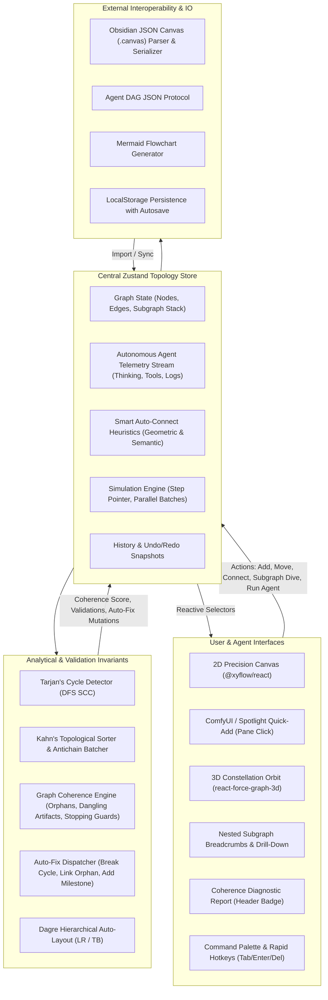
```mermaid
flowchart TD
    subgraph UI_Interaction ["User & Agent Interfaces"]
        A1["2D Precision Canvas (@xyflow/react)"]
        A2["ComfyUI / Spotlight Quick-Add (Pane Click)"]
        A3["3D Constellation Orbit (react-force-graph-3d)"]
        A4["Nested Subgraph Breadcrumbs & Drill-Down"]
        A5["Coherence Diagnostic Report (Header Badge)"]
        A6["Command Palette & Rapid Hotkeys (Tab/Enter/Del)"]
    end

    subgraph State_Layer ["Central Zustand Topology Store"]
        S1["Graph State (Nodes, Edges, Subgraph Stack)"]
        S2["Autonomous Agent Telemetry Stream (Thinking, Tools, Logs)"]
        S3["Smart Auto-Connect Heuristics (Geometric & Semantic)"]
        S4["Simulation Engine (Step Pointer, Parallel Batches)"]
        S5["History & Undo/Redo Snapshots"]
    end

    subgraph Analytical_Engine ["Analytical & Validation Invariants"]
        G1["Tarjan's Cycle Detector (DFS SCC)"]
        G2["Kahn's Topological Sorter & Antichain Batcher"]
        G3["Graph Coherence Engine (Orphans, Dangling Artifacts, Stopping Guards)"]
        G4["Auto-Fix Dispatcher (Break Cycle, Link Orphan, Add Milestone)"]
        G5["Dagre Hierarchical Auto-Layout (LR / TB)"]
    end

    subgraph Interop_IO ["External Interoperability & IO"]
        IO1["Obsidian JSON Canvas (.canvas) Parser & Serializer"]
        IO2["Agent DAG JSON Protocol"]
        IO3["Mermaid Flowchart Generator"]
        IO4["LocalStorage Persistence with Autosave"]
    end

    UI_Interaction -->|Actions: Add, Move, Connect, Subgraph Dive, Run Agent| State_Layer
    State_Layer --> Analytical_Engine
    Analytical_Engine -->|Coherence Score, Validations, Auto-Fix Mutations| State_Layer
    State_Layer --> Interop_IO
    Interop_IO -->|Import / Sync| State_Layer
    State_Layer -->|Reactive Selectors| UI_Interaction
```

---

## 1. Node Lifecycle & Autonomous Agent State Machine

Each task or action node progresses through a deterministic dual state machine:

### Structural State:
`draft` → `pending` → `ready` → `in_progress` → `completed` | `blocked` | `failed`

### Execution Engine & Telemetry State:
Nodes are assigned a concrete **Execution Engine**:
- 🤖 **Autonomous AI Agent (`autonomous_agent`)**: Powered by LLM reasoning (`gemini-2.5-pro`, `gemini-2.5-flash`, `claude-3-7-sonnet`) with prompt templates and tool invocation.
- ⚡ **Script / Tool Runner (`automated_script`)**: Deterministic local Python/Shell script or webhook.
- 👤 **Human Operator (`human_operator`)**: Manual human authoring, code review, or approval sign-off.
- 🔀 **Decision Router (`conditional_router`)**: Branch condition evaluator.

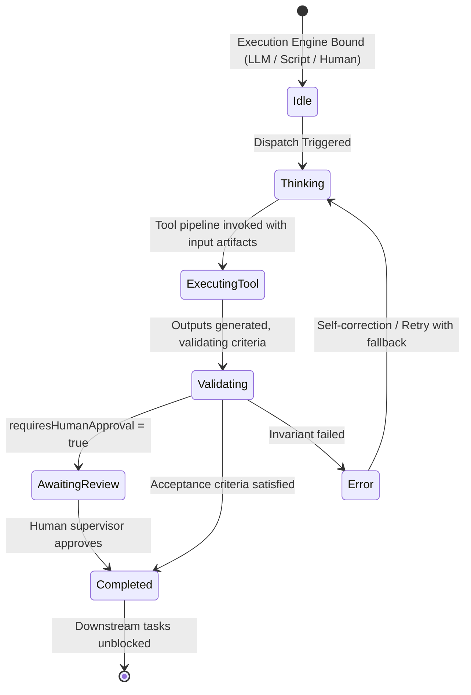
```mermaid
stateDiagram-v2
    [*] --> Idle : Execution Engine Bound (LLM / Script / Human)
    Idle --> Thinking : Dispatch Triggered
    Thinking --> ExecutingTool : Tool pipeline invoked with input artifacts
    ExecutingTool --> Validating : Outputs generated, validating criteria
    Validating --> AwaitingReview : requiresHumanApproval = true
    AwaitingReview --> Completed : Human supervisor approves
    Validating --> Completed : Acceptance criteria satisfied
    Validating --> Error : Invariant failed
    Error --> Thinking : Self-correction / Retry with fallback
    Completed --> [*] : Downstream tasks unblocked
```

---

## 2. Nested Sub-Graphs & Recursion Safety

### Sub-Graph Navigation Stack:
When drilling into a node:
```
[Root Topology]
     │  enterSubgraph(nodeId)
     ▼
[Push current frame to subgraphStack]
     │
     ▼
[Load child nodes & child edges into active store]
     │  (Breadcrumb: Root > Parent Node > Child Step)
     ▼
[Exit Subgraph: Pop stack, save child state back into parent node.subgraph]
```

### Recursion & Stopping Guard:
- If a node is marked `recursive` or embeds a self-referential sub-graph:
  - **Inviolable Rule**: An explicit `stoppingCondition.expression` (e.g. `iteration >= 3 || accuracy >= 0.95`) must be defined.
  - If omitted, the **Graph Coherence Validator** flags an `Unbounded Recursive Loop` error and prevents automated looping until resolved or auto-fixed.

---

## 3. Smart Auto-Connect Heuristics

When a new node is created (via ComfyUI Spotlight or Canvas shortcut):
1. **Direct Selection**: If a node is currently selected, link directly from it.
2. **Geometric Proximity**: If none is selected, query nodes geometrically to the left ($X < newX$) and select the closest Euclidean neighbor.
3. **Semantic Edge Typing**:
   - `Task` → `Artifact` = `produces`
   - `Goal` → `Task` = `subtask`
   - `Task` → `Milestone` = `milestone_gate`
   - `Task` → `Task` = `depends_on`

---

## 4. Graph Coherence Validator & Auto-Fix Architecture

The coherence engine evaluates 5 topological invariants:
1. **Cycles / Deadlocks**: Detected via Tarjan's SCC. Auto-fix removes the participating back-edge.
2. **Orphan Nodes**: Detected when inDegree = 0 and outDegree = 0 (excluding single root goals). Auto-fix links to the nearest task or root goal.
3. **Dangling Artifact Dependencies**: Input artifacts required by a task that have no upstream producer. Auto-fix synthesizes a producer task step.
4. **Missing Terminal Deliverables**: Workflows with multiple divergent leaf branches without a consolidating milestone. Auto-fix synthesizes a milestone consolidation gate.
5. **Recursion Safety**: Recursive nodes lacking stopping expressions. Auto-fix adds a safe stopping condition.

---

## 5. UI Progressive Disclosure & Theme Dualism Architecture

### Stacking Context & Hover Expansion
To achieve frictionless progressive disclosure without visual overlap:
1. **Dynamic Stacking Context**:
   - In React Flow, default DOM ordering causes lower array elements to sit above higher array elements.
   - When hovering a node to reveal full prompts, tools, artifacts, and actions:
     - `.react-flow__node:hover` is assigned `z-index: 1000 !important`.
     - In `TopologyCustomNode.tsx`, `isElevated = isHovered || isSelected || isActionHovered` dynamically applies `z-index: 1000` to the card wrapper.
2. **True Light (Latte) & Dark (Mocha) Theming**:
   - Palette follows Catppuccin 1:1 color tokens.
   - Strictly borderless aesthetic (`border: none` everywhere): frosted glass `backdrop-blur-2xl`, multi-layer diffuse ambient shadows, and high-contrast typography tokens (`text-cat-latte-text` / `text-cat-mocha-text`).
   - Dynamic canvas grid dots match theme surface tones seamlessly.

---

## 6. Node Type Visual Identity & Clean Elevated Paper Design Matrix

Every node type features a clean, minimal, elevated card surface with subtle, unified paper tinting, neutral physical drop shadows, and a clean type pill header (strictly avoiding harsh borders, radial blobs, or saturated colored glows):

| Node Type | Catppuccin Hue | Shading Characteristics (Dark / Light) | Signature Visual Cue |
| :--- | :--- | :--- | :--- |
| **`goal`** | Royal Mauve (`#cba6f7` / `#8839ef`) | Subtle Mauve-tinted paper (`rgba(34, 28, 44, 0.94)` / `rgba(252, 249, 255, 0.98)`) | Target icon + clean Mauve pill badge + System Objective tag |
| **`task`** | Azure Sapphire (`#74c7ec` / `#209fb5`) | Subtle Sapphire-tinted slate (`rgba(24, 30, 44, 0.94)` / `rgba(248, 252, 255, 0.98)`) | CPU icon + clean Sapphire pill badge + Persona & Tools bound tag |
| **`decision`**| Amber Peach (`#fab387` / `#fe640b`) | Subtle Peach-tinted warm base (`rgba(36, 28, 30, 0.94)` / `rgba(255, 250, 248, 0.98)`) | GitBranch icon + clean Peach pill badge + `✓ PASS / ✗ RETRY` pills |
| **`milestone`**| Mint Emerald (`#a6e3a1` / `#40a02b`)| Subtle Emerald-tinted surface (`rgba(24, 34, 32, 0.94)` / `rgba(248, 254, 250, 0.98)`) | Flag icon + clean Emerald pill badge + Sync & Consolidation tag |
| **`artifact`** | Crystal Teal (`#94e2d5` / `#179299`)| Subtle Teal-tinted surface (`rgba(22, 32, 34, 0.94)` / `rgba(246, 253, 253, 0.98)`) | Package icon + clean Teal pill badge + Schema format indicator |
| **`agent`** | Celestial Lavender (`#b4befe` / `#7287fd`)| Subtle Lavender-tinted base (`rgba(28, 28, 44, 0.94)` / `rgba(250, 250, 255, 0.98)`) | Bot icon + clean Lavender pill badge + Persona role tag |

### Clean Elevation & Natural Shadow Architecture
- **Natural Physical Shadows**: Multi-stop neutral ambient drop shadows (`0 4px 16px -2px rgba(0, 0, 0, 0.35), 0 2px 6px -1px rgba(0, 0, 0, 0.20)`) in dark mode and ultra-soft shadows in light mode (`rgba(0, 0, 0, 0.05)`).
- **Specular Top Hairline Reflection**: Subtle inset highlight (`inset 0 1px 0 0 rgba(255, 255, 255, 0.08)`) simulating light hitting the top bevel of elevated paper.
- **Strictly Borderless**: 100% borderless (`border: none`) across all nodes, modals, and tooltips.
- **Status Indication**: Minimal, elegant 8px jewel dot indicator on the card header with subtle pulse for active tasks, leaving the card body unpolluted.

---

## 7. Artifact Data Pipeline & Synthetic Payloads

Each node can produce, view, copy, and download real code, markdown, and JSON artifact payloads:
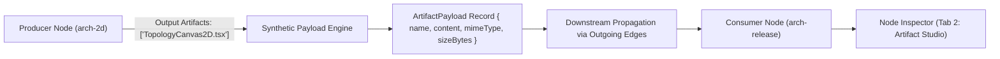
```mermaid
flowchart LR
    Producer["Producer Node (arch-2d)"] -->|"Output Artifacts: ['TopologyCanvas2D.tsx']"| Synthesis["Synthetic Payload Engine"]
    Synthesis --> Payload["ArtifactPayload Record { name, content, mimeType, sizeBytes }"]
    Payload --> Pass["Downstream Propagation via Outgoing Edges"]
    Pass --> Consumer["Consumer Node (arch-release)"]
    Consumer --> Inspector["Node Inspector (Tab 2: Artifact Studio)"]
```
- **Syntax Viewing & Transfer**: Payloads include syntax-aware preformatted viewer, copy to clipboard, and instant file download.
- **Edge Highlighting**: Edges display `📦 payload_name` pills with active particle glow when data is transmitted.

---

## 8. Human-in-the-Loop (HITL) Review Gates & Decision Routing

For mission-critical tasks and evaluation checkpoints:
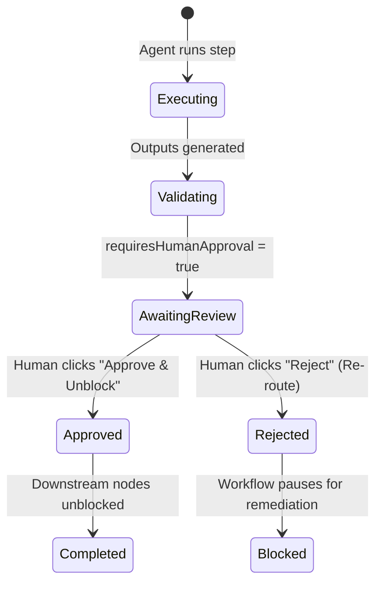
```mermaid
stateDiagram-v2
    [*] --> Executing : Agent runs step
    Executing --> Validating : Outputs generated
    Validating --> AwaitingReview : requiresHumanApproval = true
    AwaitingReview --> Approved : Human clicks "Approve & Unblock"
    AwaitingReview --> Rejected : Human clicks "Reject" (Re-route)
    Approved --> Completed : Downstream nodes unblocked
    Rejected --> Blocked : Workflow pauses for remediation
```
- **Decision Gates**: Evaluates conditional expressions (`coherenceScore >= 90`), lighting up `[TRUE]` branch edges (green) and inactivating `[FALSE]` branch edges (peach) with test simulator buttons.

---

## 9. Semantic Level-of-Detail (LOD) & Multi-Node Bundling

### Semantic LOD Zooming
- **Macro (Zoom < 0.55)**: Minimalist glowing beacon capsules displaying node type icons, concise labels, and pulsing status dots for macro fleet situational awareness.
- **Normal (0.55 – 1.25)**: Sleek borderless frosted cards with progressive disclosure on hover.
- **Micro (Zoom > 1.25)**: Deep-dive studio cards displaying inline artifact payloads, live telemetry thoughts, and direct HITL/Decision action controls.

### Multi-Node Operations & Subgraph Bundling
- Drag-marquee or Shift-click $\ge 2$ nodes activates the floating **MultiSelectionDock**:
  - **Bundle into Subgraph**: Packs selected nodes into a nested composite node, rewires external incoming and outgoing causal edges cleanly, and updates the canvas.
  - **Align X / Align Y**: Instant geometric alignment and even distribution.
  - **Batch Status**: Single-click bulk status transitions.

---

## 10. Universal Agent Manifest (UAM / MCP) Interoperability

Exportable directly from the Header, the Universal Agent Manifest converts the spatial visual topology into an actionable JSON specification compliant with LLM orchestration frameworks (Gemini CLI, LangChain, AutoGen, CrewAI):
- Full task definitions with role assignments and prompt templates
- Tool requirement schemas and boundary conditions
- Causal upstream and downstream dependency lists
- Invariant acceptance criteria and stopping conditions

---

## 11. Interactive Canvas MiniMap Radar HUD

The Canvas Navigator Radar provides spatial situational awareness and instant navigation:
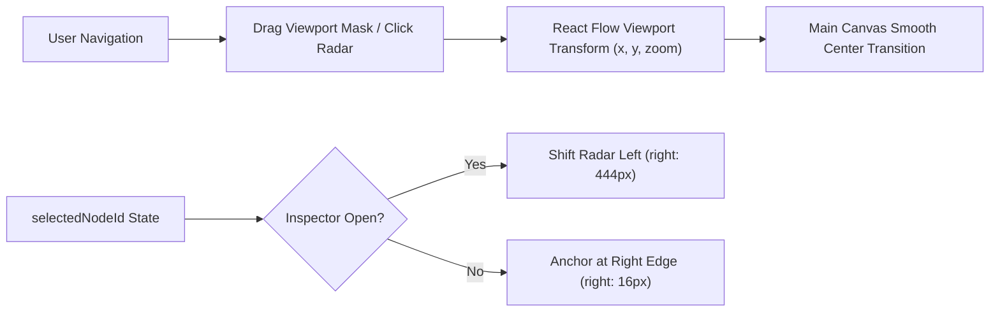
```mermaid
flowchart LR
    User["User Navigation"] --> DragPan["Drag Viewport Mask / Click Radar"]
    DragPan --> RFViewport["React Flow Viewport Transform (x, y, zoom)"]
    RFViewport --> MainCanvas["Main Canvas Smooth Center Transition"]
    InspectorState["selectedNodeId State"] --> OffsetCheck{"Inspector Open?"}
    OffsetCheck -->|Yes| ShiftLeft["Shift Radar Left (right: 444px)"]
    OffsetCheck -->|No| NormalRight["Anchor at Right Edge (right: 16px)"]
```
- **Pannable & Zoomable**: Supports direct viewport rect dragging and click-to-pan across the entire canvas bounding box.
- **Smart Stacking & Dynamic Offset**: Automatically shifts left (`right: 444px`) when `NodeInspector` drawer is active, ensuring the minimap is never occluded.
- **Collapsible Radar**: Header toggle allows collapsing down into a compact floating pill (`Compass` icon) or expanding into the high-resolution radar view.
- **Integrated HUD Actions**: One-click Fit View (`fitView`), Zoom In (`zoomIn`), and Zoom Out (`zoomOut`) directly on the radar chrome.

---

## 12. Tri-Palette Architectural Theming Engine

The app provides three world-class, carefully calibrated visual environments:
1. **Default (Google Material Light)**:
   - Crisp Google Workspace canvas (`#f8fafd` surface, `#ffffff` pure paper cards, `#dadce0` grid dots).
   - High-contrast Google Slate typography (`#202124` text, `#5f6368` secondary).
   - Iconic Google jewel accents:
     - *Task*: Google Blue (`#1a73e8`)
     - *Agent / Priority*: Google Red (`#ea4335`)
     - *Decision*: Google Amber (`#f9ab00`)
     - *Milestone*: Google Green (`#34a853`)
     - *Goal*: Google Purple (`#9334e6`)
     - *Artifact*: Google Teal (`#007b83`)
   - Natural Google Material paper elevation shadows (`0 1px 3px 0 rgba(60,64,67,0.16), 0 4px 14px 1px rgba(60,64,67,0.08)`) with absolute zero borders.
2. **Catppuccin (Mocha Dark)**:
   - Soft cyber pastel dark palette (`#11111b` crust, `#1e1e2e` base, `#313244` surface).
   - Pastel lavender, sapphire, peach, and mauve accents.
3. **Latte (Porcelain Light)**:
   - Crisp, glare-free porcelain paper surfaces (`#eff1f5` base, `#dce0e8` crust).
   - Warm pastel ink typography (`#4c4f69`).

### Compact Theme Palette Picker UI (`ThemePalettePicker.tsx`):
- Ultra-compact 32px jewel button trigger displaying active color cluster (e.g. 4-dot Google cluster: 🔵🔴🟡🟢).
- Rich popover preview revealing full 6-color swatch ribbons, theme descriptions, and one-click switching with zero header crowding.

---

## 13. Interactive Onboarding & Animated SVG Tutorials

- **First-Session Auto-Trigger**: Checks `localStorage.getItem('topology_tutorial_seen_v1')` on load and launches the interactive guide modal on first visit.
- **Manual Launch**: Accessible anytime via the `Guide` button (`HelpCircle`) in the top navigation header.
- **5 Bespoke Animated SVG Demonstrations**:
  1. *Precision Spatial DAG Flow*: Bezier curves with flowing energy pulse motion and multi-tier DAG topologies.
  2. *Spotlight Quick-Add & Smart Auto-Connect*: Rapid ComfyUI-style node spawning and elastic auto-linking.
  3. *Autonomous Multi-Agent Orchestration*: Live agent thought streams, tool invocation, and terminal telemetry.
  4. *Human-In-The-Loop & Decision Gates*: Conditional branch testing ([TRUE]/[FALSE]) and supervisor review sign-offs.
  5. *Universal Agent Manifest & Python CLI Interop*: Zero-dependency workflow execution and external agent integration.

---

## 14. Agent Prompt Handoff & Headless Python CLI Runner

Topology bridges the gap between visual spatial planning and autonomous CLI execution:
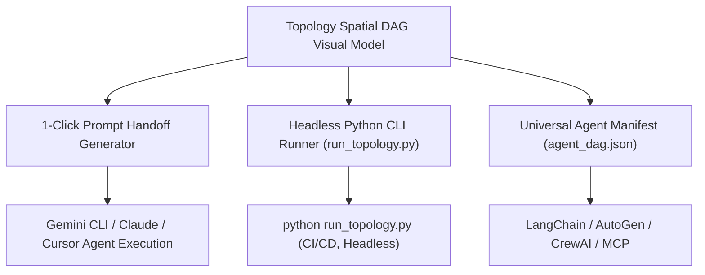
```mermaid
flowchart TD
    DAG["Topology Spatial DAG Visual Model"] --> Handoff1["1-Click Prompt Handoff Generator"]
    DAG --> Handoff2["Headless Python CLI Runner (run_topology.py)"]
    DAG --> Handoff3["Universal Agent Manifest (agent_dag.json)"]

    Handoff1 --> GeminiCLI["Gemini CLI / Claude / Cursor Agent Execution"]
    Handoff2 --> LocalPython["python run_topology.py (CI/CD, Headless)"]
    Handoff3 --> Orchestrators["LangChain / AutoGen / CrewAI / MCP"]
```
- **Single-Click Prompt Generation**: `generateAgentPromptPayload(node, nodes, edges)` extracts all upstream input dependencies, authorized tool schemas, acceptance criteria, and stopping conditions, formatting an instant prompt block for Gemini CLI.
- **Standalone Python Runner (`run_topology.py`)**: Zero-dependency Python 3 runtime using Kahn's topological sort to execute execution batches in sequence or parallel, passing emitted artifacts between nodes with full logging.

---

## 15. Canonical Topology Archetypes & % Architecture Coverage Map

Topology features a curated, industry-standard registry of **10 Canonical Software & AI Agent Topologies** across 4 engineering domains:
1. **Autonomous Coding & Dev Loops**:
   - `tdd-loop` (Autonomous TDD Coding Loop) [98% Popularity, Intermediate]
   - `code-migration` (Autonomous Codebase Migration Agent) [85% Popularity, Advanced]
   - `prompt-eval-loop` (Iterative Prompt & Eval Optimizer - DSPy) [79% Popularity, Intermediate]
2. **Knowledge & Data**:
   - `rag-synthesis` (RAG Knowledge Ingestion & Hybrid Retrieval) [95% Popularity, Advanced]
3. **Multi-Agent Reasoning**:
   - `agent-debate` (Multi-Agent Debate & Consensus Council) [88% Popularity, Advanced]
   - `map-reduce` (Hierarchical Map-Reduce & Antichain Fan-out) [92% Popularity, Intermediate]
   - `tree-of-thoughts` (Tree-of-Thoughts Backtracking Solver) [84% Popularity, Roadmap]
4. **Operations, SRE & Governance**:
   - `hitl-security` (HITL Security & Production Approval Gate) [94% Popularity, Intermediate]
   - `incident-triage` (Incident Sentry Triage & Auto-Remediation) [82% Popularity, Advanced]
   - `saga-orchestrator` (Event-Driven Saga Transaction Coordinator) [76% Popularity, Roadmap]

### % Coverage Map Calculation Engine:
- **Total Archetypes Defined**: 10
- **Ready to Instantiate**: 8 (80% Overall Software Architecture Coverage)
- **Roadmap / Community Contribution**: 2 (20%)
- **Dynamic Category Ratios**:
  - Coding & Dev Loops: 3 / 3 (100%)
  - Knowledge & RAG: 1 / 1 (100%)
  - Multi-Agent Reasoning: 2 / 3 (67%)
  - Operations & SRE: 2 / 3 (67%)

---

## 16. Topology Publishing & Community Registry Protocol

Users and autonomous agents can package, persist, and publish custom topology graphs without external databases:

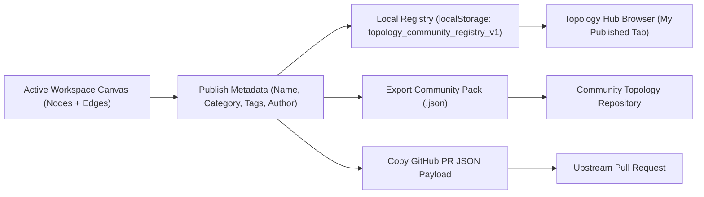
```mermaid
flowchart LR
    Canvas["Active Workspace Canvas (Nodes + Edges)"] --> Form["Publish Metadata (Name, Category, Tags, Author)"]
    Form --> LocalStore["Local Registry (localStorage: topology_community_registry_v1)"]
    Form --> JSONExport["Export Community Pack (.json)"]
    Form --> PRFormat["Copy GitHub PR JSON Payload"]

    LocalStore --> Hub["Topology Hub Browser (My Published Tab)"]
    JSONExport --> GitRepo["Community Topology Repository"]
    PRFormat --> GitHubPR["Upstream Pull Request"]
```

- **Local Persistence**: Custom topologies are stored in `topology_community_registry_v1`, surviving browser refreshes and editable/deletable directly from the Hub.
- **Community GitHub Interoperability**: Generates standardized JSON specs ready to be committed to an external `topologies` GitHub repository.

---

## 17. Application Error Boundary & Diagnostic Recovery Loop

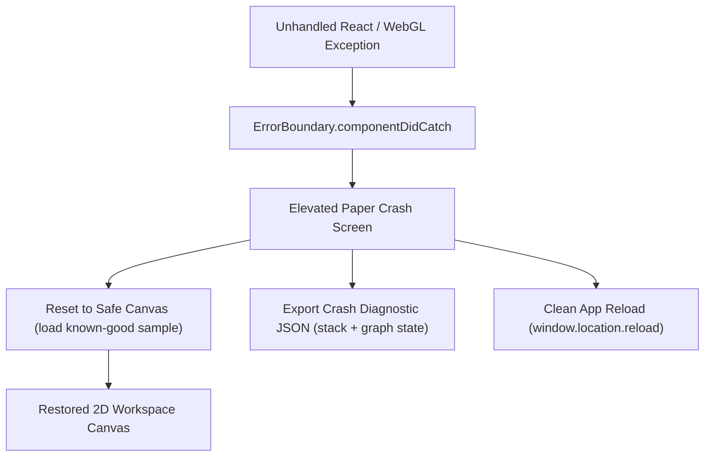
```mermaid
flowchart TD
    RenderCrash["Unhandled React / WebGL Exception"] --> Catch["ErrorBoundary.componentDidCatch"]
    Catch --> DiagnosticScreen["Elevated Paper Crash Screen"]
    
    DiagnosticScreen --> Action1["Reset to Safe Canvas (load known-good sample)"]
    DiagnosticScreen --> Action2["Export Crash Diagnostic JSON (stack + graph state)"]
    DiagnosticScreen --> Action3["Clean App Reload (window.location.reload)"]

    Action1 --> RestoredCanvas["Restored 2D Workspace Canvas"]
```

- Catches corrupted node payloads, malformed JSON imports, and WebGL context loss.
- Provides non-destructive recovery so users never lose control of their workspace.

---

## 18. Theme-Adaptive 3D WebGL Constellation Engine

The 3D WebGL engine (`react-force-graph-3d`) has been fully elevated to support multi-theme ergonomics:
- **Dynamic Viewport Dimensions**: Managed via `ResizeObserver` on the parent container, eliminating flex layout distortion or 0x0 canvas collapse.
- **Theme Adaptation**:
  - *Google Material Light*: Canvas `#f8fafd`, links `rgba(148, 163, 184, 0.5)`, particle stream `#1a73e8`, text sprite `#202124` on frosted white `#ffffff/92` pills.
  - *Dark Modes*: Canvas `#11111b`, glowing cyan `#89dceb` particles, `#cdd6f4` text sprite on obsidian `#181825/85` pills.
- **Floating 3D Camera Controls**:
  - Zoom In (`+`), Zoom Out (`-`)
  - Reset / Auto-Fit View (`Maximize2`)
---

## 19. Mobile Responsive Layout & Touch Interaction Architecture

Topology provides a seamless, touch-first experience across small mobile phones (320px+), tablets, and widescreen displays:

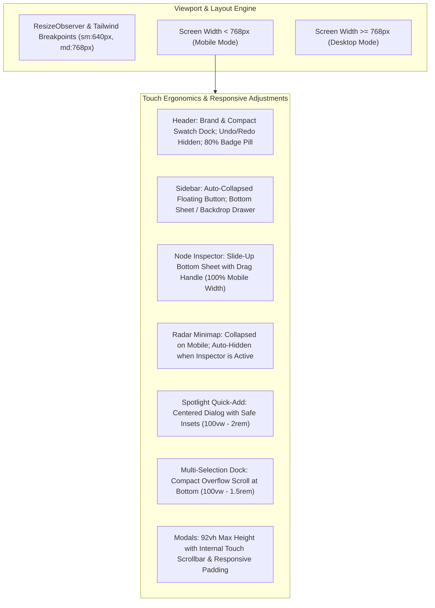
```mermaid
flowchart TD
    subgraph Viewport_Detection ["Viewport & Layout Engine"]
        V1["ResizeObserver & Tailwind Breakpoints (sm:640px, md:768px)"]
        V2["Screen Width < 768px (Mobile Mode)"]
        V3["Screen Width >= 768px (Desktop Mode)"]
    end

    subgraph Mobile_Adaptations ["Touch Ergonomics & Responsive Adjustments"]
        M1["Header: Brand & Compact Swatch Dock; Undo/Redo Hidden; 80% Badge Pill"]
        M2["Sidebar: Auto-Collapsed Floating Button; Bottom Sheet / Backdrop Drawer"]
        M3["Node Inspector: Slide-Up Bottom Sheet with Drag Handle (100% Mobile Width)"]
        M4["Radar Minimap: Collapsed on Mobile; Auto-Hidden when Inspector is Active"]
        M5["Spotlight Quick-Add: Centered Dialog with Safe Insets (100vw - 2rem)"]
        M6["Multi-Selection Dock: Compact Overflow Scroll at Bottom (100vw - 1.5rem)"]
        M7["Modals: 92vh Max Height with Internal Touch Scrollbar & Responsive Padding"]
    end

    V2 --> Mobile_Adaptations
```

### Key Responsive Specifications:
1. **Zero Borders Invariant**: Every component maintains elevated drop shadows (`shadow-elevated-*`) and border-free surfaces.
2. **Touch Gestures in Canvas**:
   - Single-finger pan: Drag background canvas.
   - Pinch-to-zoom: Natural viewport scaling.
   - Tap node: Opens full-featured slide-up Node Inspector.
3. **Screen Real Estate Optimization**:
   - Radar minimap automatically suppresses itself on mobile when the Node Inspector is active to prevent overlapping controls.
   - Simulation bar and Multi-Selection dock are horizontally scrollable without clipping or horizontal page bounce.
   - Modals automatically scale padding (`p-3 sm:p-6`) and enforce `max-h-[92vh]` scrollable bounds.

---

## 20. Multi-Agent Asynchronous Swarm & Collaborative Execution Architecture

Topology enables multi-agent orchestration where teams of specialized AI workers operate asynchronously across parallel DAG nodes or collaborate simultaneously on shared bottleneck tasks:

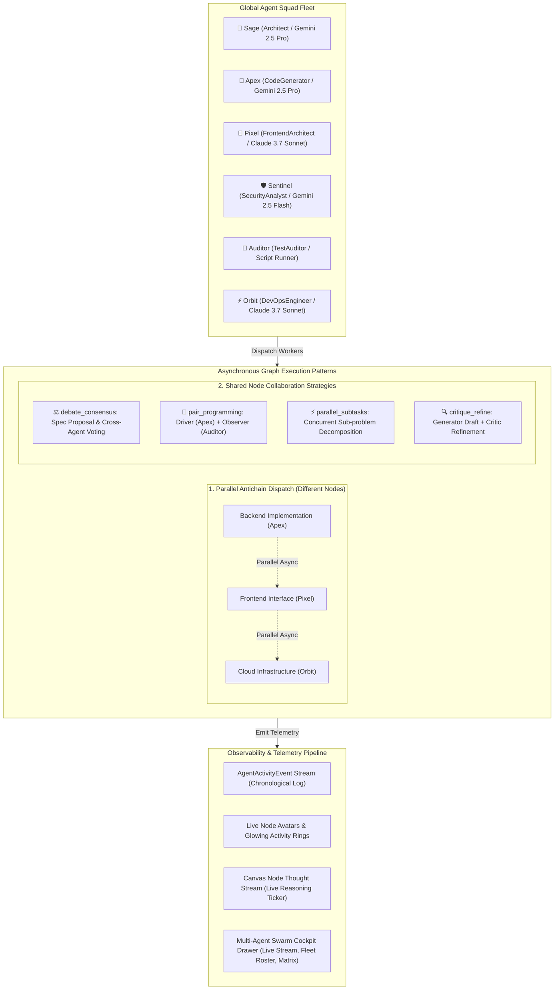
```mermaid
flowchart TD
    subgraph Squad_Fleet ["Global Agent Squad Fleet"]
        AG1["🧠 Sage (Architect / Gemini 2.5 Pro)"]
        AG2["🤖 Apex (CodeGenerator / Gemini 2.5 Pro)"]
        AG3["🎨 Pixel (FrontendArchitect / Claude 3.7 Sonnet)"]
        AG4["🛡️ Sentinel (SecurityAnalyst / Gemini 2.5 Flash)"]
        AG5["🔬 Auditor (TestAuditor / Script Runner)"]
        AG6["⚡ Orbit (DevOpsEngineer / Claude 3.7 Sonnet)"]
    end

    subgraph Execution_Scenarios ["Asynchronous Graph Execution Patterns"]
        subgraph Pattern1 ["1. Parallel Antichain Dispatch (Different Nodes)"]
            N1["Backend Implementation (Apex)"]
            N2["Frontend Interface (Pixel)"]
            N3["Cloud Infrastructure (Orbit)"]
            N1 -.->|Parallel Async| N2
            N2 -.->|Parallel Async| N3
        end

        subgraph Pattern2 ["2. Shared Node Collaboration Strategies"]
            S_Debate["⚖️ debate_consensus: Spec Proposal & Cross-Agent Voting"]
            S_Pair["👥 pair_programming: Driver (Apex) + Observer (Auditor)"]
            S_Subtasks["⚡ parallel_subtasks: Concurrent Sub-problem Decomposition"]
            S_Critique["🔍 critique_refine: Generator Draft + Critic Refinement"]
        end
    end

    subgraph Observability_Engine ["Observability & Telemetry Pipeline"]
        TEL1["AgentActivityEvent Stream (Chronological Log)"]
        TEL2["Live Node Avatars & Glowing Activity Rings"]
        TEL3["Canvas Node Thought Stream (Live Reasoning Ticker)"]
        TEL4["Multi-Agent Swarm Cockpit Drawer (Live Stream, Fleet Roster, Matrix)"]
    end

    Squad_Fleet -->|Dispatch Workers| Execution_Scenarios
    Execution_Scenarios -->|Emit Telemetry| Observability_Engine
```

### Collaboration Strategies:
1. **`debate_consensus` (Consensus Debate ⚖️)**:
   - 2+ agents formulate proposals, cross-examine arguments, and vote before marking the node completed.
   - Example: Architecture specification debate between Sage (Architect) and Sentinel (Security Analyst).
2. **`pair_programming` (Pair Execution 👥)**:
   - Driver agent executes code generation while Observer agent continuously audits tests and invariants in lockstep.
   - Example: Automated test suite creation between Auditor (Test Auditor) and Sentinel (Security Analyst).
3. **`parallel_subtasks` (Parallel Swarm ⚡)**:
   - Multiple agents split a dense task into sub-components and work simultaneously on the same logical node.
4. **`critique_refine` (Critique & Refine 🔍)**:
   - Primary agent generates draft; secondary critic reviews and generates actionable improvements.
5. **`solo` (Single Agent 🤖)**:
   - Standard isolated agent execution.

### Observability Features:
- **Canvas Multi-Agent Badges**: Cards render overlapping color-coded avatars with pulsing active status rings and strategy badges (`⚖️ Consensus Debate`, `👥 Pair Execution`, etc.).
- **Live Active Thought Stream**: Real-time ticker on node cards and inspector drawer displaying what each agent is reasoning or which tool is being invoked.
- **Observability Cockpit**: Dedicated drawer with 3 tabs:
  1. *Live Stream*: Filterable chronological event stream with agent avatars and direct canvas node links.
  2. *Squad Fleet*: Roster with live statuses, model engines, assigned tools, and node counts.
  3. *Collab Nodes*: Real-time matrix of all nodes utilizing collaborative multi-agent execution.

---

## 21. WebGL 3D Performance, App-Wide React Memoization & Touch Architecture

### 1. Three.js Object & Material Pooling
To prevent frame drops, garbage collection spikes, and WebGL shader re-compiles during graph interactions:
- **Geometry Pooling**: Shared instances of `SphereGeometry(6, 24, 24)`, `SphereGeometry(8, 28, 28)`, and wireframe halos.
- **Material Caching**: Materials cached in a Map keyed by `${colorHex}_${isSelected}_${isLight}`.
- **Physics Cooldown Engine**:
  - `warmupTicks={60}`: Pre-positions layout off-screen.
  - `cooldownTicks={120}` / `cooldownTime={3500}`: Freezes physics engine once layout converges, dropping idle CPU/GPU load to near zero.
  - Interactive reheat (`d3ReheatSimulation()`) triggers smoothly on node drag.
- **Presentation Modes**:
  - Auto-orbit turntable mode (`requestAnimationFrame` spherical rotation).
  - 2.5D Top-Down camera projection (`Compass` preset).

### 2. App-Wide React Flow Memoization
- **Granular Node Memoization**: `TopologyCustomNode` is wrapped in `React.memo` with a custom equality comparator checking only relevant node state (`label`, `status`, `priority`, `activeThought`, `assignedAgents`, `approvalStatus`). Non-targeted nodes remain completely idle during live simulation streaming.
- **60fps rAF Drag Throttling**: Dragging nodes batches position mutations into `requestAnimationFrame`, preventing high-frequency Zustand store notification floods.
- **Vite Rollup Code Splitting**:
  - Main bundle reduced from 921 kB to 350 kB.
  - Three.js isolated into a lazy chunk (`vendor-three`) loaded on demand.
  - UI libraries (`framer-motion`, `lucide-react`) isolated into `vendor-ui`.

### 3. Mobile Responsive Architecture
- **Adaptive Drawer & Bottom Sheet**: On `< 640px` screens, `NodeInspector` smoothly animates as a bottom sheet (`y: '100%'` to `y: 0`) with a native tap-to-dismiss handle and horizontally scrollable tab ribbon.
- **Zero-Overflow Mobile Header**: Extra-wide buttons collapse on phone screens while primary studio switches (2D/3D, AI Plan, Swarm Agents, Theme) remain fully visible without horizontal scrollbar clipping.
- **Smart Dock Spacing**: Bottom docks (`SimulationBar`, `MultiAgentCockpit`, `CanvasMiniMap`) automatically negotiate screen space and auto-hide when inspector sheets are open.

---

## 22. 3D Constellation Reliability, Sidebar Anchor Invariants & Topology Hub Visual Hierarchy

### 1. 3D Constellation Rendering & Camera Viewport Invariant
- **Failure Mode Addressed**: Premature `zoomToFit` executions while nodes were at `(0, 0, 0)` caused camera vectors to collapse to zero-length, producing `NaN` matrix projections in Three.js and rendering an empty WebGL scene. Additionally, aggressive `warmupTicks` and `cooldownTicks` halted physics before the initial frame.
- **Reliable Solution**:
  - **Self-Illuminating Luminous Materials**: Shifted to pooled `MeshLambertMaterial` with `emissive` color and high emissive intensity (0.45-0.95), guaranteeing vivid visibility across light and dark modes regardless of directional lighting delay.
  - **Resilient Scene Light Injection**: Added a `requestAnimationFrame` loop that checks `fgRef.current.scene()` and injects ambient (`1.1` intensity) and dual directional lights once the canvas is initialized.
  - **Safe Camera Auto-Fit Guard**: `zoomToFit` checks `getGraphBbox()`; if the bounding box has not dispersed beyond the origin, a safe perspective camera position `{ x: 0, y: 30, z: 280 }` is applied, preventing `NaN` camera matrices.
  - **Natural Force Simulation**: Removed aggressive physics throttles, allowing `d3-force-3d` to animate smoothly to equilibrium with `onEngineStop` auto-fitting.

### 2. Sidebar Filter Top-Anchored Positioning Invariant
- **Failure Mode Addressed**: The sidebar previously jumped to the bottom on expand and back to the top when collapsed because the expanded state had `bottom-3 sm:bottom-6` and full-height stretching, altering its vertical anchor point.
- **Reliable Solution**:
  - **Unified Anchor Coordinates**: Both collapsed vertical rail and expanded filter card share the exact same `fixed top-16 sm:top-18 left-2.5 sm:left-4 z-30` anchor.
  - **In-Place Vertical Expansion**: Capped at `max-h-[calc(100vh-5.5rem)]` with internal scrollable filters (`overflow-y-auto`), expanding downward cleanly without ever anchoring to the bottom edge.
  - **Smooth Framer Motion Transition**: `AnimatePresence` with subtle scale (`0.94` to `1`) and fade morphs the rail into the panel in place.

### 3. Topology Archetype Hub Contrast & Elevated Paper Hierarchy
- **Visual Contrast Elevation**:
  - **Modal Surface Contrast**: Modal frame uses `bg-[#f8fafc] dark:bg-[#0f111a]`, ensuring elevated cards (`bg-white dark:bg-[#181a28]`) float with crisp paper depth and distinct shadows (`shadow-elevated-sm hover:shadow-elevated-md`).
  - **High-Legibility Typography**: Crisp, dark slate typography in light mode (`text-slate-900 font-bold`, `text-slate-600 font-normal`) and luminous text in dark mode (`text-white font-bold`, `text-slate-300`).
  - **High-Contrast Badges**: Vivid `Ready` (`bg-[#e6f4ea] text-[#137333] dark:bg-[#1e8e3e]/30 dark:text-[#34a853]`), `Popular` (`bg-[#fce8e6] text-[#c5221f] dark:bg-[#d93025]/25`), and `Roadmap` (`bg-[#fef7e0] text-[#b06000]`).
  - **Zero Borders**: Strictly border-free (`border-none`) throughout modal tabs, coverage map, archetype cards, and modal footer.

---

## 23. Dynamic Vertical DAG Layout & Mobile Orientation Engine

### 1. Viewport-Aware DAG Topology Orientation
- **Problem**: Horizontal Left-to-Right (`'LR'`) graphs exceed mobile screen aspect ratios ($9:16$ portrait), resulting in heavy horizontal panning, tiny fit-to-screen scale factors, and degraded readability.
- **Solution**:
  - **Automatic Mobile Detection**: On initial render and dynamic window resize (`< 768px`), `layoutDirection` automatically sets to `'TB'` (Top-to-Bottom vertical flow).
  - **Orientation State Machine**: `layoutDirection: 'LR' | 'TB'` is stored centrally in Zustand, with reactive controllers `setLayoutDirection(dir)` and `toggleLayoutDirection()`.
  - **Interactive Orientation Switcher**: Quick action floating panel on the canvas includes a dedicated orientation toggle button with `ArrowDownUp` / `ArrowLeftRight` icons and instant smooth camera reframing (`fitView`).

### 2. Dagre Hierarchical Layout Engine Adaptation
- In `calculateDagreLayout(nodes, edges, direction)`:
  - **Vertical Mode (`'TB'`) Parameters**:
    - `rankdir: 'TB'`
    - `nodesep: 65` (horizontal spacing between parallel sibling branches)
    - `ranksep: 110` (vertical spacing between causal tiers)
    - `marginx: 30`, `marginy: 30`
    - Node dimension anchors: `width: 290`, `height: 150`
    - Centered bounding coordinates: `x = Math.round(nodeWithPos.x - nodeWidth / 2)`, `y = Math.round(nodeWithPos.y - nodeHeight / 2)`
  - **Horizontal Mode (`'LR'`) Parameters**:
    - `rankdir: 'LR'`, `nodesep: 120`, `ranksep: 180`, `marginx: 50`, `marginy: 50`

### 3. Handle Priority & React Flow Edge Routing Invariant
- **React Flow Handle Binding Rule**: React Flow connects edges to the *first* declared `<Handle>` of a given type (`source` or `target`) when handle IDs are omitted.
- **Orientation-Specific Handle Ordering**:
  - **In Vertical Mode (`isVertical = true`)**:
    - Primary `target` handle: `Position.Top`
    - Primary `source` handle: `Position.Bottom`
    - Secondary fallback handles: `Position.Left` / `Position.Right`
    - Guarantees top-to-bottom bezier edge trajectories without horizontal S-curve loops.
  - **In Horizontal Mode (`isVertical = false`)**:
    - Primary `target` handle: `Position.Left`
    - Primary `source` handle: `Position.Right`
    - Secondary fallback handles: `Position.Top` / `Position.Bottom`
  - **Nano LOD Mode**: Dynamically mounts `Position.Top` + `Position.Bottom` when vertical, and `Position.Left` + `Position.Right` when horizontal.

### 4. Interactive Node Creation & Branching Offsets
- **Child Branching (`branchChildNode`)**:
  - Vertical: Offsets new child vertically downward (`y + 190`) with slight horizontal jitter (`x + random(-30, 30)`).
  - Horizontal: Offsets new child rightward (`x + 340`).
- **Parallel Siblings (`createSiblingNode`)**:
  - Vertical: Places parallel sibling alongside horizontally (`x + 310, y`).
  - Horizontal: Places parallel sibling below vertically (`x, y + 160`).
- **Archetype Loading**: `loadTopologyDirect` and `loadSampleTopology` automatically compute vertical layouts if loaded while in `'TB'` mode.
- **AI Plan Generator**: Synthesized workflows automatically layout according to the active viewport orientation.

---

## 24. Antigravity External Agent Integration, Live SSE Bridge & Model Context Protocol (MCP)

### 1. Zero-Dependency Model Context Protocol (MCP) Server (`mcp-server/index.js`)
- **Protocol**: JSON-RPC 2.0 over standard input/output (`stdio`) following the open Model Context Protocol specification.
- **Global Discovery**: Configured in `~/.gemini/config/mcp_config.json` and `.agents/mcp_config.json`. Any Antigravity agent or subagent running in any IDE workspace or CLI session automatically discovers the tools without extra installation.
- **Exposed Agent Tools**:
  1. `topology_create_plan({ title, description, nodes, edges })`: Ingests decomposed task DAGs and causal dependencies.
  2. `topology_update_node({ nodeId, status, thought, toolName, terminalLog, outputArtifacts })`: Updates real-time node state and telemetry.
  3. `topology_emit_thought({ nodeId, thought, toolName })`: Streams the agent's live reasoning thoughts and active tools to the canvas card.
  4. `topology_request_approval({ nodeId, notes, proposedArtifacts })`: Pauses workflow at a Human Review Gate for supervisor sign-off.
  5. `topology_get_plan({ includeApprovals })`: Queries current DAG state, completion progress, and human decisions.

### 2. High-Performance Server-Sent Events (SSE) Live Bridge (`plugins/topologyBridgePlugin.js`)
- **Unified Port Architecture**: Mounts directly into the Vite development server (`http://localhost:5173/api/topology/*`) via custom Vite middleware. No secondary daemon process or port is required.
- **Reactive Endpoints**:
  - `GET /api/topology/stream`: Long-lived SSE stream pushing `plan_updated`, `node_updated`, `thought_stream`, `agent_event`, and `node_approved` events to all connected browser tabs.
  - `POST /api/topology/plan`, `POST /api/topology/node`, `POST /api/topology/thought`, `POST /api/topology/event`: Ingests payloads from MCP or CLI scripts and broadcasts immediately.
  - `POST /api/topology/approve`: Ingests supervisor approval from the web canvas and stores in `.topology/approvals.json`.
  - `GET /api/topology/approval-status?nodeId=...`: Allows waiting agents to query whether a review gate has been signed off.
- **Resilient Offline Disk Fallback**: If the web UI is closed, the MCP server automatically writes updates to `.topology/plan.json`. Upon launching the UI, the bridge loads and renders the latest state immediately.

### 3. Native Desktop Alerts & Web Audio Chime Synthesis (`src/services/liveAgentSync.ts`)
- **Desktop Push Notifications**: Uses the HTML5 `Notification API` to deliver native OS desktop notifications for task dispatch, milestone completion, and human review gates, keeping the user informed even when the browser is backgrounded.
- **Synthesized Web Audio Chimes**: Generates crystal-clear sine and triangle wave chimes via `AudioContext` (C5-E5 tech chirp for task starts, C5-E5-G5-C6 triumphant chord for completions, and dual-tone alert for review gates). Requires zero external sound assets.
- **Live Canvas Card Reactivity**: Node cards update live with pulsing beacons, typing thought streams, and terminal logs without re-rendering the entire canvas.

### 4. Bidirectional Human-in-the-Loop (HITL) Execution Cycle
```
[Antigravity Agent]
       │
       ▼
calls topology_request_approval({ nodeId, notes })
       │
       ├──────────────────────────────────────────────┐
       ▼                                              ▼
MCP Server saves pending gate             Broadcasts to SSE Bridge
       │                                              │
       ▼                                              ▼
Waits / polls / checks approval           Topology UI shows Review Alert & Desktop Notification
       ▲                                              │
       │                                              ▼
       └────────────── Human clicks "Approve" ────────┘
```

---

## 25. Multi-Agent Satellite Workers, Dual-Tier Shared Context & Elevated Artifact HITL Review

### 1. Satellite Worker Nodes with Dynamic Overflow Clustering (`AgentSatelliteNodes.tsx`)
- **Orbital Positioning**: Workers assigned to a task node render as elevated pill capsules anchored along the card boundary (`absolute -top-3.5 right-3`).
- **Dynamic Cluster Collapse**:
  - **$\le 3$ Agents**: Individual pills display the worker's avatar emoji, name, colored accent, and real-time status beacon (pulsing when active or debating). Hovering triggers an elevated glass popover with full role, model engine, live thought snippet, and a shortcut to filter the Swarm Activity Stream.
  - **$> 3$ Agents**: Automatically clusters into the first 2 agents plus a compact `+N agents` gradient capsule. Hovering or clicking expands an elevated drawer popover listing the entire squad roster with individual statuses and live thoughts.

### 2. Dual-Tier Shared Context Blackboard (`SharedContextRepository`)
- **Architecture**: Provides a decentralized memory bus shared across all autonomous workers and human supervisors:
  - **Graph-Level (`scope: "global"`)**: High-level invariants, system architecture definitions, API specifications, and global security policies.
  - **Node-Level (`scope: "node"`, keyed by `nodeId`)**: Task-specific intermediate data, verified schemas, and outputs passed downstream.
- **Model Context Protocol (MCP) Tools**:
  - `topology_write_shared_context({ scope, key, value, nodeId, authorAgentRole })`: Writes an entry to memory and disk.
  - `topology_read_shared_context({ scope, key, nodeId })`: Reads single entries or scopes.
- **Real-Time Reactive Pipeline**:
  ```mermaid
  sequenceDiagram
      autonumber
      participant Agent as External Agent (CLI / Subagent)
      participant MCP as Topology MCP Server
      participant Bridge as Vite Bridge (/api/topology/context)
      participant UI as Topology Web UI (Zustand)

      Agent->>MCP: topology_write_shared_context(scope, key, value)
      MCP->>Bridge: POST /api/topology/context
      Bridge->>Bridge: Save to .topology/shared_context.json
      Bridge->>UI: SSE Event "context_updated"
      UI->>UI: Store updates sharedContext reactive state
      UI->>UI: Play pleasant audio ping & update Context badges
  ```
- **UI Blackboard Controls**:
  - **Global Context Modal (`GlobalContextModal.tsx`)**: Accessed via the "Context" button in the header navbar. Searchable key-value cards, JSON pre-formatting, copy, delete, and manual entry forms.
  - **Node Inspector Context Tab**: Displays entries scoped specifically to the selected node with an inline form to add or modify contracts.
  - **Node Card Context Pill**: Nodes with active context display a `🧠 N Context` pill in their badge row.

### 3. Elevated Artifact Inspection & In-Card HITL Sign-Off
- **Clickable Deliverable Pills**: Output artifact tags on node cards and inspector tabs are interactive buttons. Clicking immediately opens the full-screen `ArtifactViewerModal`.
- **Artifact Viewer Modal (`ArtifactViewerModal.tsx`)**:
  - Borderless elevated glass modal with Catppuccin and high-contrast styling.
  - Pre-formatted, syntax-styled view of code (`.ts`, `.tsx`), Markdown (`.md`), and JSON (`.json`).
  - Size formatting, formatted timestamp, "Copy Content", and "Download File" actions.
  - Integrated HITL review controls: "Request Revision" with reason notes, and "Approve Deliverable".
- **In-Card HITL Review Checkpoint**:
  - Nodes awaiting approval display an in-card supervisor action bar.
  - "Review Deliverable" opens the generated artifact in the viewer modal.
  - "Approve & Send to Squad" and "Reject" buttons immediately post to `/api/topology/approve`, persisting decisions to `.topology/approvals.json` and broadcasting back to the agent.

---

## 26. Fail-Open Architecture, Non-Critical Observability & Standard Error Taxonomy (`TOPOLOGY_ERR_*`)

### 1. Philosophy: Observability Companion, Not Critical Infrastructure
Topology is strictly an **observability and orchestration companion**. If the Vite dev server is offline, the port is occupied, or any network/bridge call fails, external agents **must continue executing their tasks unhindered**.

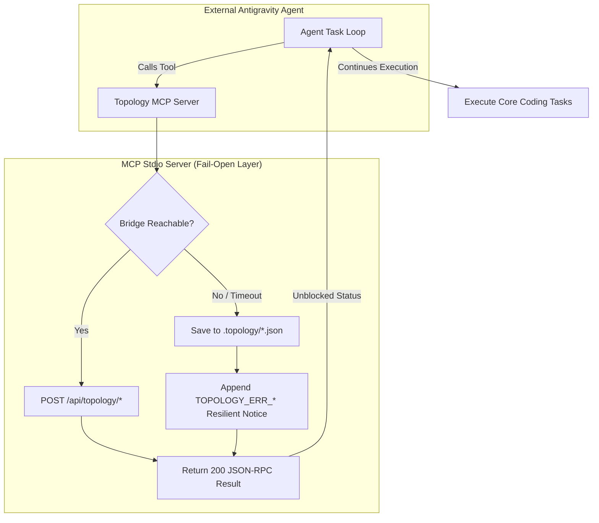
```mermaid
flowchart TD
    subgraph Agent_Harness ["External Antigravity Agent"]
        A[Agent Task Loop] -->|Calls Tool| MCP[Topology MCP Server]
    end

    subgraph MCP_Resilience ["MCP Stdio Server (Fail-Open Layer)"]
        MCP --> TryBridge{Bridge Reachable?}
        TryBridge -->|Yes| POST[POST /api/topology/*]
        TryBridge -->|No / Timeout| Fallback[Save to .topology/*.json]
        POST --> ReturnOK[Return 200 JSON-RPC Result]
        Fallback --> AppendNotice[Append TOPOLOGY_ERR_* Resilient Notice]
        AppendNotice --> ReturnOK
    end

    ReturnOK -->|Unblocked Status| A
    A -->|Continues Execution| NextTask[Execute Core Coding Tasks]
```

### 2. Standardized Error Taxonomy (`TOPOLOGY_ERR_*`)

| Error Code | Layer | Trigger Condition | Fail-Open Fallback Behavior |
|:---|:---|:---|:---|
| `TOPOLOGY_ERR_BRIDGE_OFFLINE` | MCP / REST | Dev server at `http://localhost:5173` is not running | Workflow state is safely persisted to `.topology/plan.json`. Agent receives `200 OK` JSON-RPC result with unblocked confirmation. |
| `TOPOLOGY_ERR_BRIDGE_TIMEOUT` | MCP / REST | Request to bridge exceeds 1500ms timeout | Aborts HTTP request cleanly, writes to `.topology/`, returns unblocked confirmation. |
| `TOPOLOGY_ERR_CACHE_IO_FAILED` | Filesystem | Disk read/write fails in `.topology/` | Falls back to in-memory state repository. Agent continues unblocked. |
| `TOPOLOGY_ERR_INVALID_SCHEMA` | Validation | Missing required parameters (e.g. missing `nodeId`) | Defaults missing fields or emits non-fatal notice. Agent does not crash. |
| `TOPOLOGY_ERR_CYCLIC_DEPENDENCY` | Graph Invariants | Cyclic edges detected in incoming plan | Ignores circular back-edge in rendering; workflow proceeds. |
| `TOPOLOGY_ERR_GATE_UNATTENDED` | HITL Review | Review gate requested while bridge is offline | Agent receives autonomy directive: prompt supervisor in chat or proceed autonomously. |
| `TOPOLOGY_ERR_SSE_DROPPED` | Sync Engine | Browser SSE stream disconnected | Silent exponential backoff retry (1.5s, 3s, 6s, 10s max). UI remains interactive. |
| `TOPOLOGY_ERR_UI_RENDER_CRASH` | Frontend UI | React render tree exception caught by ErrorBoundary | Displays error code, non-critical companion notice, and 1-click "Reset to Safe Canvas". |
| `TOPOLOGY_ERR_INTERNAL` | MCP Server | Uncaught internal exception in tool execution | Converts to non-fatal JSON-RPC result payload so agent harness is never terminated. |

### 3. Human-in-the-Loop Deadlock Safeguard
When `topology_request_approval` is invoked without an active bridge supervisor:
1. State is recorded as pending in `.topology/approvals.json`.
2. Instead of blocking the agent in an infinite waiting loop, the tool returns:
   `[TOPOLOGY_ERR_GATE_UNATTENDED]: Topology UI is unattended or offline. Prompt supervisor in chat, or proceed if invariant criteria are met.`
3. The external agent can either prompt the user directly in terminal/chat or proceed according to safety rules.

---

## 27. Git-Backed Append-Only Log, Local Locking Architecture & Distributed Synchronization

### 1. Motivation & Distributed Architectural Invariants
In multi-agent environments, multiple autonomous agents (local CLI processes, subagents, or remote machines working on git clones) interact with common graph nodes and shared project resources. Two fundamental requirements emerge:
1. **Local Concurrency Control**: Preventing multiple local agents from conflicting or overwriting each other's work on the same graph node or resource simultaneously.
2. **Distributed Conflict-Free Synchronization**: Propagating execution telemetry across distributed agents on different machines or Git branches without encountering merge conflicts.

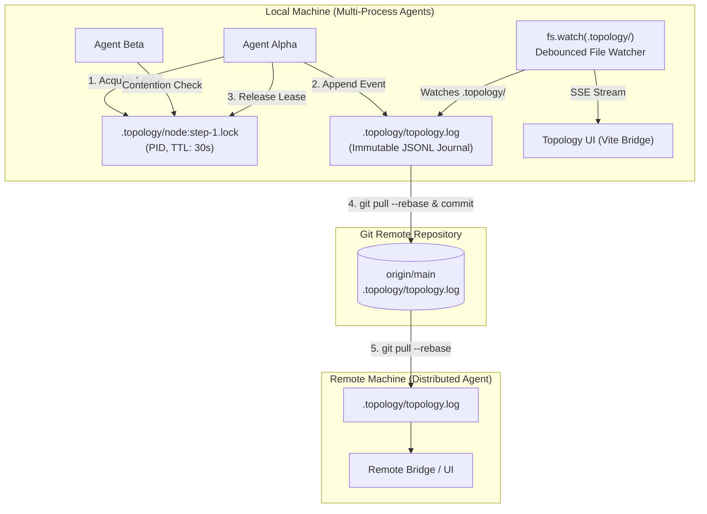
```mermaid
flowchart TB
    subgraph LocalHost ["Local Machine (Multi-Process Agents)"]
        A1[Agent Alpha] -->|1. Acquire Lease| L1[".topology/node:step-1.lock<br/>(PID, TTL: 30s)"]
        A2[Agent Beta] -->|Contention Check| L1
        A1 -->|2. Append Event| J[".topology/topology.log<br/>(Immutable JSONL Journal)"]
        A1 -->|3. Release Lease| L1
        FW["fs.watch(.topology/)<br/>Debounced File Watcher"] -->|Watches .topology/| J
        FW -->|SSE Stream| UI["Topology UI (Vite Bridge)"]
    end

    subgraph GitCloud ["Git Remote Repository"]
        J -->|4. git pull --rebase & commit| RemoteRepo[("origin/main<br/>.topology/topology.log")]
    end

    subgraph RemoteHost ["Remote Machine (Distributed Agent)"]
        RemoteRepo -->|5. git pull --rebase| RLog[".topology/topology.log"]
        RLog --> RWatcher["Remote Bridge / UI"]
    end
```

### 2. Process-Safe Advisory Locking (`mcp-server/gitLock.js`)
- **Atomic Creation**: Lock acquisition utilizes atomic file creation (`fs.openSync(lockPath, 'wx')`), guaranteeing process-safe exclusion at the operating system filesystem level.
- **Lease Metadata**: Lock files contain structured JSON:
  ```json
  {
    "resource": "node:step-1",
    "agentId": "agent-alpha",
    "agentName": "ArchitectAgent",
    "pid": 12844,
    "acquiredAt": 1725883200000,
    "expiresAt": 1725883230000,
    "ttlSeconds": 30
  }
  ```
- **Deadlock Breaker (Lease TTL Auto-Expiration)**: If an agent process crashes or is killed before calling `releaseLock`, locks automatically expire when `Date.now() > lock.expiresAt`. Other agents acquire the lock immediately without manual intervention.
- **Contention Handling (`TOPOLOGY_ERR_LOCK_CONTENTION`)**: When an unexpired lock is held by another process, acquisition returns `TOPOLOGY_ERR_LOCK_CONTENTION` with remaining lease seconds, allowing agents to backoff, retry, or move to alternate nodes.

### 3. Append-Only Execution Log (`.topology/topology.log`)
- **Immutable JSONL Format**: Every graph update, agent thought, status transition, and advisory lock event is appended as a single JSON line:
  ```jsonl
  {"timestamp":"2026-09-09T10:45:00.000Z","action":"lock_acquired","resource":"node:step-1","agentId":"alpha","details":{"ttlSeconds":30}}
  {"timestamp":"2026-09-09T10:45:02.000Z","action":"node_updated","nodeId":"step-1","status":"in_progress","thought":"Designing DB schema"}
  {"timestamp":"2026-09-09T10:45:15.000Z","action":"lock_released","resource":"node:step-1","agentId":"alpha"}
  ```
- **Git Merge Conflict Immunity**: Because events are append-only lines, standard Git merge and `git pull --rebase` operations unite logs cleanly from multiple machines or branches with zero merge conflicts.
- **Gitignore Segregation**:
  ```gitignore
  .topology/*
  !.topology/topology.log
  !.topology/config.json
  ```
  Temporary lock files (`.topology/*.lock`) remain local and uncommitted, while the append-only event stream (`.topology/topology.log`) is committed and pushed.

### 4. Live Bridge SSE Streaming & UI Observability
- **Debounced File Watcher (`plugins/topologyBridgePlugin.js`)**:
  Vite's dev bridge watches `.topology/` with a 60ms debounce. Direct appends by CLI scripts or external git pulls trigger real-time SSE broadcasts (`log_event`, `locks_updated`, and `node_updated`) to the browser canvas without restarting the server.
- **Canvas Node Lock Badges (`TopologyCustomNode.tsx`)**:
  Nodes currently locked display an elevated amber lock badge with the active agent name and countdown timer (`🔒 [Agent] (24s)`).
- **Git & Locks Management Modal Tab (`AgentSyncModal.tsx`)**:
  A dedicated tab in the Live Agent Sync modal displays:
  1. Active advisory leases with PID, remaining TTL, and manual force-release buttons.
  2. Git repository synchronization controls and branch/commit telemetry.
  3. Real-time append-only event stream table from `.topology/topology.log`.
  4. Quick copy snippets for the zero-dependency CLI.

### 5. Zero-Dependency Agent CLI (`scripts/topology-log.mjs`)
Agents without direct MCP server integration can execute standard operations via shell commands:
```bash
# Health audit (port 5173, PID, log size, lock contention)
node scripts/topology-log.mjs health

# Ensure visualizer server is running
node scripts/topology-log.mjs server

# Acquire lock
node scripts/topology-log.mjs lock node:step-1 --agent="Worker" --ttl=30

# Log node status or thought
node scripts/topology-log.mjs log --action="node_updated" --nodeId="step-1" --status="completed"

# Inspect active leases
node scripts/topology-log.mjs locks

# Release lock
node scripts/topology-log.mjs unlock node:step-1 --agent="Worker"

# Pull rebase & push to remote repository
node scripts/topology-log.mjs sync --push
```

---

## 7. High-Performance Rendering & Observability Architecture

### 1. Canvas Render Isolation & Atomic Selectors (`TopologyCustomNode.tsx`)
- **Eliminated Global Re-Renders**:
  - Removed unused whole-graph subscriptions (`nodes`, `edges`).
  - Replaced full-dictionary subscriptions with atomic, node-scoped boolean selectors:
    ```tsx
    const isSelfHovered = useTopologyStore(s => s.hoveredNodeId === id);
    const isMultiSelected = useTopologyStore(s => s.selectedNodeIds.includes(id));
    const nodeLock = useTopologyStore(s => s.activeLocks[id] || s.activeLocks['node:' + id]);
    const nodeContextCount = useTopologyStore(s => Object.keys(s.sharedContext?.nodes?.[id] || {}).length);
    ```
  - Only the single node that changes hover, selection, lock, or context re-renders. All peer nodes remain untouched.
- **Harden `React.memo` Comparator**:
  - Compares all visually relevant fields: `label`, `description`, `status`, `priority`, `type`, `updatedAt`, `tags`, `activeThought`, `collaborationMode`, `approvalStatus`, `requiresHumanApproval`, `stoppingCondition`, `telemetry` (state, liveThought, activeTool, lastUpdated), assigned agents, artifact payloads, output artifacts, and subgraph counts.

### 2. High-Frequency Telemetry Snapshot Bypass (`useTopologyStore.ts`)
- **Problem**: In autonomous workflows, agents stream thoughts and logs at 10–20Hz. Previously, `updateNode` called `saveSnapshot()`, serializing the entire graph with `JSON.parse(JSON.stringify(nodes))` on every thought token, causing extreme GC pauses and polluting the undo stack.
- **Solution**: Added `{ skipSnapshot?: boolean }` option to `updateNode`.
  - High-frequency streaming events (`thought_stream`, live terminal logs) pass `skipSnapshot: true`.
  - 60fps canvas dragging in `TopologyCanvas2D.tsx` passes `skipSnapshot: true`, recording a single snapshot on `onNodeDragStop`.
  - Undo/redo history remains lightweight and reserved for structural mutations.

### 3. GPU Texture Pooling in 3D Galaxy (`TopologyGraph3D.tsx`)
- **Canvas Texture Reuse**: `SpriteText` prototypes are cached in `spriteTextCache` keyed by `${label}_${theme}`. Cloned sprites share the underlying WebGL canvas texture, eliminating repeated canvas 2D rasterization and GPU texture allocations during 3D constellation animation.

### 4. Reverse Chunk Log Reader (`mcp-server/gitLock.js`)
- **Tail Buffer Chunking**: For `.topology/topology.log` files larger than 64KB, `readRecentLogs` opens a file descriptor and reads only the trailing 128KB chunk from disk backwards, parsing JSON lines until the limit is satisfied. Tail operations remain instantaneous regardless of log size.

### 5. Background Supervisor Zombie Detection (`mcp-server/serverSupervisor.js`)
- **Process Liveness Verification**: Inspects recorded PIDs with `process.kill(pid, 0)`. If a recorded supervisor PID is dead or orphaned, stale lock and metadata files are automatically cleaned up on startup.
- **CLI Commands**:
  - `node scripts/topology-log.mjs health`: Audits bridge HTTP latency, supervisor PID, log byte size, and active locks.
  - `node scripts/topology-log.mjs stop-server`: Gracefully terminates background Vite processes across Windows and POSIX.

### 6. In-App Telemetry HUD (`DiagnosticsModal.tsx`)
- **Elevated Borderless Glass HUD**:
  - **Live Render FPS**: Measured via `requestAnimationFrame` delta over 60 frames.
  - **Bridge Latency Ping**: Dynamically measures roundtrip HTTP latency to `/api/topology/status`.
  - **Active Leases Table**: Real-time TTL countdown with 1-click force release.
  - **Recent Log Tail**: Displays last 25 JSONL events with role and status badges.
  - **1-Click Diagnostics Export**: Generates `topology-diagnostics-report.json` bundle containing browser specs, graph metrics, coherence diagnostics, active locks, and bridge status.
  - **Hotkeys**: `Ctrl+Shift+D` or Header "Telemetry" pill.

---

## 28. Active Work Observability: Radiant Aura & Orbital Satellite Nodes

Topology provides immediate, borderless spatial situational awareness identifying which nodes are being actively worked on by AI agents or human operators:

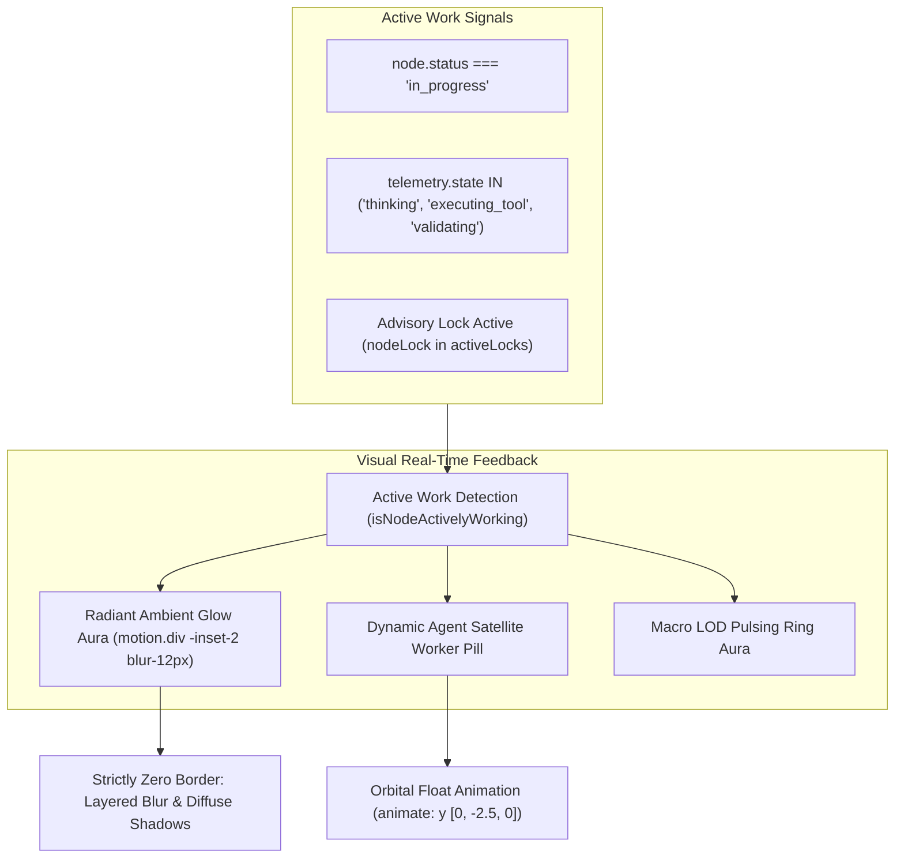
```mermaid
flowchart TD
    subgraph Signal_Inputs ["Active Work Signals"]
        S1["node.status === 'in_progress'"]
        S2["telemetry.state IN ('thinking', 'executing_tool', 'validating')"]
        S3["Advisory Lock Active (nodeLock in activeLocks)"]
    end

    Signal_Inputs --> Detector["Active Work Detection (isNodeActivelyWorking)"]

    subgraph Visual_Manifestation ["Visual Real-Time Feedback"]
        Detector --> Aura["Radiant Ambient Glow Aura (motion.div -inset-2 blur-12px)"]
        Detector --> DynSat["Dynamic Agent Satellite Worker Pill"]
        Detector --> MacroPill["Macro LOD Pulsing Ring Aura"]
    end

    Aura --> ZeroBorder["Strictly Zero Border: Layered Blur & Diffuse Shadows"]
    DynSat --> Orbital["Orbital Float Animation (animate: y [0, -2.5, 0])"]
```

### 1. Multi-Signal Active Work Invariant
A node is classified as actively undergoing work (`isNodeActivelyWorking`) if **any** of three criteria are met:
1. `node.status === 'in_progress'`
2. `isAgentActive`: `node.context.telemetry?.state` is `'thinking'`, `'executing_tool'`, or `'validating'`.
3. `Boolean(nodeLock)`: An active process or external agent holds an advisory lease (`activeLocks[id]` or `activeLocks['node:' + id]`).

### 2. Radiant Borderless Ambient Glow Aura (`TopologyCustomNode.tsx`)
In accordance with zero-border design principles, active nodes indicate work without any hard lines or borders:
- **Pulsing Backdrop Aura**: Rendered via an absolute `motion.div` positioned `-inset-2` behind the card with `filter: blur(12px)`.
- **Gentle Respiratory Breathing**: Animated via Framer Motion with `opacity: [0.5, 0.88, 0.5]` and `scale: [0.99, 1.025, 0.99]` over a 2.6-second smooth loop.
- **Adaptive Accent Tint**: Tinted with the active lock amber hue (`#f59e0b`) if locked by a external agent lease, or the node's type color (e.g. Google Blue `#1a73e8`, Purple `#9334e6`) with theme-adaptive opacity (`0.45` in dark mode, `0.28` in light mode).
- **Macro LOD Pulsing Ring**: When zoomed out below 0.55 LOD, the minimal beacon capsule features an animated pulsing aura (`scale: [0.96, 1.06, 0.96]`, `filter: blur-sm`).

### 3. Dynamic Agent Satellite Node Synthesis (`AgentSatelliteNodes.tsx`)
External AI agents operating via CLI or MCP may not pre-populate `node.context.assignedAgents`. To ensure live satellite representation:
- **Dynamic Worker Synthesis**: If `assignedAgents` is empty but `isNodeActivelyWorking` is true, an active `AgentWorker` is dynamically synthesized from `nodeLock.agent` or `node.context.role`/`telemetry`:
  ```tsx
  const effectiveAgents = useMemo<AgentWorker[]>(() => {
    if (assignedAgents.length > 0) return assignedAgents;
    if (isNodeActivelyWorking) {
      return [{
        id: nodeLock ? `lock-${nodeLock.agent}` : `active-agent-${id}`,
        name: nodeLock ? nodeLock.agent : (node.context.role || 'Active Agent'),
        role: node.context.role || 'Autonomous Worker',
        avatar: nodeLock ? '🔒' : '🤖',
        color: activeGlowColor,
        status: isAgentActive ? 'thinking' : 'active',
        activeThought: telemetry?.liveThought || activeThought,
      }];
    }
    return [];
  }, [assignedAgents, isNodeActivelyWorking, nodeLock, activeGlowColor, isAgentActive, telemetry, activeThought, id, node.context.role]);
  ```
- **Orbital Floating Physics**: Active worker pills float elevated above the card (`-top-4 right-3`) with continuous subtle vertical bobbing (`animate={{ y: [0, -2.5, 0] }}`).
- **Ambient Glow Shadow**: Active worker pill drop shadow incorporates glowing ambient colored halos (`0 0 12px 1px ${agent.color}80, 0 3px 8px -2px rgba(0,0,0,0.25)`).
- **Interactive Live Telemetry Popover**: Hovering the satellite node reveals the worker's active thought stream, tool invocation, role, and model engine in an elevated glass popover.

---

## 29. Multi-Agent Fleet Orchestration & Multi-Plan Workspace Tabs

When multiple autonomous agents (e.g. Architect, Frontend, DevOps, Quality Engineer) work concurrently, each agent can own, initialize, and execute a distinct workflow DAG (`planId`) on the exact same Topology server instance without cross-contamination.

```mermaid
flowchart TD
    subgraph Multi_Agent_Ecosystem ["Concurrent Agent Fleet"]
        AgentA["Agent A (Architect)\nPlan: 'backend-refactor'"]
        AgentB["Agent B (Frontend)\nPlan: 'frontend-ui'"]
        AgentC["Agent C (DevOps)\nPlan: 'devops-infra'"]
    end

    subgraph Storage_Layer ["Server & Disk State (.topology/)"]
        PlansRegistry[".topology/plans.json\n{ [planId]: TopologyPlanRecord }"]
        ActivePlanPointer[".topology/active_plan.json\n{ activePlanId: 'backend-refactor' }"]
        LegacyPlan[".topology/plan.json\n(Backwards-Compatible Mirror)"]
        AppendLog[".topology/topology.log\n(Append-Only Multi-Plan Audit Trail)"]
    end

    subgraph Bridge_API ["Topology Bridge Server (:5173/api/topology)"]
        GetPlans["GET /plans (Fleet Registry & Summaries)"]
        PostPlan["POST /plan (Create / Ingest Plan with planId)"]
        PostNode["POST /node (Auto-resolves owning plan via nodeId)"]
        PostThought["POST /thought (Streams thought with planId beacon)"]
        SwitchActive["POST /active-plan (Atomic Canvas Switch)"]
        SSEStream["GET /events (Multi-Plan Realtime SSE Stream)"]
    end

    subgraph Frontend_Store ["Zustand Multi-Plan State Store"]
        ZPlans["plans: Record<string, TopologyPlanRecord>"]
        ZActiveId["activePlanId: string"]
        ZSummaries["plansList: PlanSummary[]"]
        ZCanvas["Canvas Nodes & Edges (Bound to activePlanId)"]
    end

    subgraph Visual_Surfaces ["Elevated Borderless UI"]
        DropdownSelector["PlanSelectorDropdown (Compact Workspace Selector)"]
        Beacon["Live Thought Pulsing Beacon (Background Plan Activity)"]
        FleetModal["MultiPlanFleetModal (Multi-Agent Grid View & Switcher)"]
        Canvas2D["2D Precision ReactFlow Canvas (Active Plan DAG)"]
    end

    AgentA -->|MCP / REST: topology_create_plan| PostPlan
    AgentB -->|MCP / REST: topology_emit_thought| PostThought
    AgentC -->|MCP / CLI: node scripts/topology-log.mjs| PostNode

    PostPlan --> PlansRegistry
    PostPlan --> LegacyPlan
    PostNode --> PlansRegistry
    PostThought --> PlansRegistry
    SwitchActive --> ActivePlanPointer

    PlansRegistry --> SSEStream
    ActivePlanPointer --> SSEStream

    SSEStream -->|SSE: plans_list_updated, active_plan_changed, thought_stream| Frontend_Store
    Frontend_Store --> DropdownSelector
    Frontend_Store --> FleetModal
    Frontend_Store --> Canvas2D
    DropdownSelector -->|User Select: switchPlan(id)| SwitchActive
    FleetModal -->|User Click: switchPlan(id)| SwitchActive
```

### 1. Plan Registry Invariant & Fail-Open Storage
- **Multi-Plan Persistence (`.topology/plans.json`)**: Contains a hash map keyed by `planId` where each entry is a full `TopologyPlanRecord` (`id`, `title`, `description`, `agentId`, `agentRole`, `nodes`, `edges`, `updatedAt`).
- **Active Plan Pointer (`.topology/active_plan.json`)**: Contains `{ activePlanId: string, updatedAt: number }`.
- **Legacy Single-Plan Mirror (`.topology/plan.json`)**: Automatically synchronized to mirror whichever plan is currently active, guaranteeing 100% backward compatibility with legacy tooling.
- **Node Collision Safeguard (`findPlanByNodeId`)**: When external tools emit `topology_update_node` or `topology_emit_thought` without explicitly providing `planId`, the bridge searches registered plans for the target `nodeId`. If found, it routes the update to that plan; otherwise it defaults to `activePlanId`.

### 2. Multi-Plan API Endpoints
| Endpoint | Method | Purpose |
| :--- | :--- | :--- |
| `/api/topology/plans` | `GET` | Returns list of all registered plans, summaries, node completion counts, and active thoughts. |
| `/api/topology/plan` | `GET` | Returns active plan (or specific plan via `?planId=<id>`). |
| `/api/topology/plan` | `POST` | Upserts a plan with given `planId`, `agentId`, `agentRole`, and graph DAG. |
| `/api/topology/active-plan` | `POST` | Atomically switches the active plan displayed on the canvas. |
| `/api/topology/plan` | `DELETE` | Removes a completed plan from registry (safeguards `default` plan). |

### 3. Reactive SSE Multi-Plan Telemetry
The bridge broadcasts events over `GET /api/topology/events`:
- `plans_list_updated`: Sent whenever a plan is added, modified, or removed. Contains full list of plan summaries.
- `active_plan_changed`: Broadcasts `{ activePlanId: string }`.
- `plan_updated`: Broadcasts `{ planId, plan }`.
- `node_updated`: Broadcasts `{ planId, nodeId, status, thought, agentId, ... }`.
- `thought_stream`: Broadcasts `{ planId, nodeId, thought, agentId, ... }`.

### 4. Compact Workspace Dropdown & Decluttered Navigation (`PlanSelectorDropdown.tsx` & `Header.tsx`)
- **Single Compact Dropdown**: Replaces horizontal scrolling tabs with a sleek, elevated workspace selector pill (`[🤖 Active Plan Title  3/6  ▾]`) occupying just ~240px. Zero horizontal scrollbars.
- **Background Activity Beacon**: If any background agent is running, a subtle pulsing beacon dot animates on the trigger button.
- **Rich Elevated Menu**: Clicking the dropdown reveals all active workflows with real-time completion stats, agent avatars, mini thought snippets, quick deletion, and an inline `+ Create New Plan` form.
- **Decluttered Top Navigation**: Secondary tools (Swarm cockpit, Context blackboard, Live Agent sync, Telemetry HUD, Hub) are streamlined into elegant, high-density icon buttons with badges and rich "hover on appear" tooltips, restoring visual balance and generous breathing room.

### 5. Fleet Matrix Modal (`MultiPlanFleetModal.tsx`)
- Pressing the **Fleet** matrix launcher button in the top nav opens an elevated backdrop-blurred modal.
- Provides a bird's-eye view across all agents running in the ecosystem:
  - Agent avatar, name, and role.
  - Plan title, description, and task completion percentage progress bar.
  - Active thought bubble with real-time streaming badge.
  - One-click "Switch to Canvas" button.
  - Instant search filter by agent role, name, or plan title.

---

## 30. Responsive Header Progressive Disclosure, Sidebar Defaults & Vertical Graph Layout

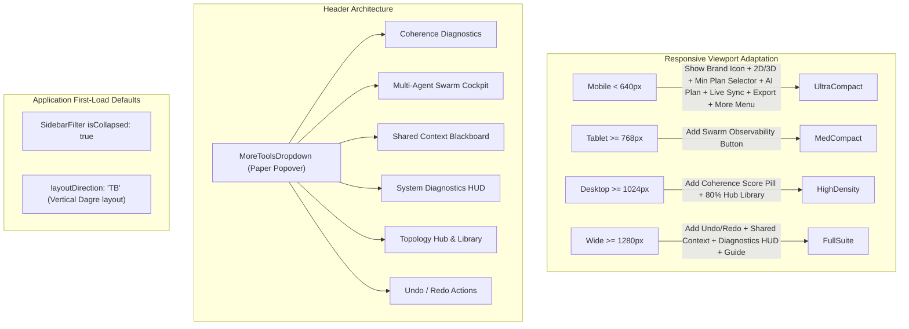
```mermaid
flowchart TD
    subgraph Viewport_Breakpoints["Responsive Viewport Adaptation"]
        XS["Mobile < 640px"] -->|Show Brand Icon + 2D/3D + Min Plan Selector + AI Plan + Live Sync + Export + More Menu| UltraCompact
        MD["Tablet >= 768px"] -->|Add Swarm Observability Button| MedCompact
        LG["Desktop >= 1024px"] -->|Add Coherence Score Pill + 80% Hub Library| HighDensity
        XL["Wide >= 1280px"] -->|Add Undo/Redo + Shared Context + Diagnostics HUD + Guide| FullSuite
    end

    subgraph Header_Progressive["Header Architecture"]
        MoreTools["MoreToolsDropdown (Paper Popover)"]
        MoreTools --> CoherenceItem["Coherence Diagnostics"]
        MoreTools --> SwarmItem["Multi-Agent Swarm Cockpit"]
        MoreTools --> SharedCtxItem["Shared Context Blackboard"]
        MoreTools --> DiagItem["System Diagnostics HUD"]
        MoreTools --> HubItem["Topology Hub & Library"]
        MoreTools --> HistoryItem["Undo / Redo Actions"]
    end

    subgraph Startup_Defaults["Application First-Load Defaults"]
        SidebarInit["SidebarFilter isCollapsed: true"]
        GraphDirInit["layoutDirection: 'TB' (Vertical Dagre layout)"]
    end
```

### 1. Header Responsiveness & Progressive Disclosure
- **Fluid Plan Selector Width**: Uses `min-w-0 w-full max-w-[125px] xs:max-w-[160px] sm:max-w-[210px] md:max-w-[270px] lg:max-w-[320px]` with flex item `truncate flex-1 min-w-0` to avoid toolbar overflow or horizontal clipping on small screens.
- **Progressive Breakpoints**:
  - `hidden sm:inline`: Topology brand text.
  - `hidden md:flex`: Swarm Observability count pill.
  - `hidden lg:flex`: Coherence Health Score pill and Hub Archetype link.
  - `hidden xl:flex`: Undo/Redo pair, Shared Context blackboard pill, Diagnostics HUD icon button, Interactive Onboarding guide.
  - `flex xl:hidden`: `MoreToolsDropdown` consolidated paper popover hosting overflow controls.
- **Export Menu Outside-Click Listener**: Consolidated export/import menu attaches `mousedown` and `Escape` key listeners with `exportMenuRef` to guarantee clean unmounting.

### 2. First-Load Layout Invariants
- **Sidebar Closed by Default**: `SidebarFilter.tsx` initializes `isCollapsed = useState(true)` to maximize initial canvas viewport area and present an uncluttered workspace on first boot.
- **Default Graph Direction Vertical (`'TB'`)**:
  - `useTopologyStore.ts`: `getInitialGraph()` computes Dagre positions with `rankdir: 'TB'` and sets `layoutDirection: 'TB'`.
  - `graphAlgorithms.ts`: `calculateDagreLayout` defaults `direction: 'LR' | 'TB' = 'TB'`.
  - `TopologyCanvas2D.tsx`: Removed the auto-resize listener that forcefully toggled `'LR'` on desktop widths, preserving the vertical workflow orientation selected by default.

---

## 31. Real Plan LocalStorage Persistence & Lifecycle State Machine

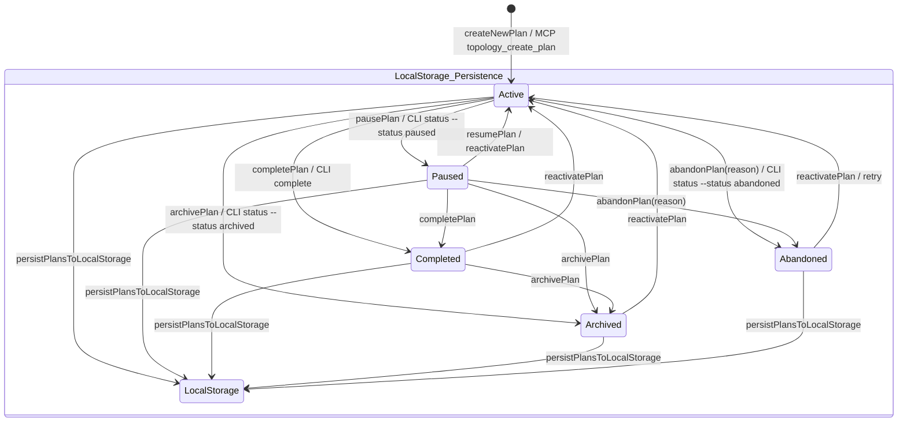
```mermaid
stateDiagram-v2
    [*] --> Active: createNewPlan / MCP topology_create_plan
    Active --> Paused: pausePlan / CLI status --status paused
    Paused --> Active: resumePlan / reactivatePlan
    Active --> Completed: completePlan / CLI complete
    Paused --> Completed: completePlan
    Active --> Abandoned: abandonPlan(reason) / CLI status --status abandoned
    Paused --> Abandoned: abandonPlan(reason)
    Active --> Archived: archivePlan / CLI status --status archived
    Paused --> Archived: archivePlan
    Completed --> Archived: archivePlan
    Completed --> Active: reactivatePlan
    Archived --> Active: reactivatePlan
    Abandoned --> Active: reactivatePlan / retry

    state LocalStorage_Persistence {
        Active --> LocalStorage: persistPlansToLocalStorage
        Paused --> LocalStorage: persistPlansToLocalStorage
        Completed --> LocalStorage: persistPlansToLocalStorage
        Archived --> LocalStorage: persistPlansToLocalStorage
        Abandoned --> LocalStorage: persistPlansToLocalStorage
    }
```

### 1. Complete Plan Lifecycle States (`PlanStatus`)
Plans progress through five strongly typed states:
1. `active`: Under continuous execution by autonomous agents or user. Displays live beacon pulse when active work is underway.
2. `paused` / `inactive`: Temporarily paused by user or agent lease timeout. Displays amber `Paused` pill.
3. `completed`: Successfully finished with verified output artifacts and summary note. Displays emerald `Done` / `Completed` pill.
4. `archived`: Retained for long-term historical reference or canonical documentation. Displays slate `Archived` pill.
5. `abandoned`: Terminated early due to failure, user abort, or superseding direction. Preserves `abandonReason` string displayed in dedicated callouts.

### 2. Browser LocalStorage Persistence Invariant
- **Storage Keys**:
  - `topology_plans_registry_v1`: Complete dictionary mapping `planId` to `TopologyPlanRecord`.
  - `topology_active_plan_v1`: String ID of currently focused canvas plan.
- **Fail-Open Hydration**:
  - On application startup, `loadInitialPlansFromStorage(initialDefaultPlan)` reads cached plans from `localStorage`.
  - If entries exist, it restores all genuine user/agent plans across all states (active, paused, completed, archived, abandoned).
  - If storage is empty, it registers the clean default plan and writes it to disk/storage.
  - Every mutation (`switchPlan`, `createNewPlan`, `completePlan`, `reactivatePlan`, `archivePlan`, `abandonPlan`, `pausePlan`, `resumePlan`, `setPlanStatus`, `removePlan`) writes atomically to `localStorage`.
- **Zero Fake Plans**: No artificial or dummy plans are generated; only genuine workflows executed by agents or created by the user are stored.

### 3. Lifecycle Actions & Multi-Channel Synchronization
| Channel | Action | Behavior |
| :--- | :--- | :--- |
| **Dropdown UI** | 1-Click Hover Actions | Quick Pause, Play, Done, Archive, Abandon, Reactivate, or Delete buttons on each plan row. |
| **Fleet Modal** | Status Filter Tabs & Action Bar | Filter by `All`, `Active`, `Paused`, `Completed`, `Archived`, `Abandoned`. Comprehensive action buttons per card. |
| **Bridge API** | `POST /api/topology/plan/status` | Updates `targetPlan.status`, sets timestamps (`completedAt`, `pausedAt`, `archivedAt`, `abandonedAt`), records `abandonReason`, updates node statuses if completed, appends to log, and broadcasts SSE event `plan_status_changed`. |
| **CLI** | `node scripts/topology-log.mjs status --status <state>` | Allows autonomous CLI agents to transition plan status headlessly with optional `--reason` or `--thought`. |
| **SSE Event** | `plan_status_changed` | Frontend listener receives real-time broadcasts and synchronizes Zustand store and `localStorage`. |

---

## 32. Deterministic Vertical Layout Pipeline & Autonomous Sequential Edge Synthesis

```mermaid
flowchart TD
    subgraph Agent_Ingestion ["Agent / User Plan Creation"]
        A[Agent creates plan with N nodes] --> CheckEdges{edges.length > 0?}
    end

    subgraph Auto_Synthesis ["Autonomous Sequential Edge Synthesis"]
        CheckEdges -->|No / Empty| Synth[ensureSequentialEdges: node[i] -> node[i+1]]
        CheckEdges -->|Yes| Keep[Preserve Explicit Causal Edges]
    end

    subgraph Layout_Engine ["Dagre Vertical Alignment ('TB')"]
        Synth --> Dagre[calculateDagreLayout direction: TB]
        Keep --> Dagre
        Dagre --> Fallback{Are Edges Present?}
        Fallback -->|Yes| Hierarchy[Dagre Hierarchical Top-to-Bottom Tree]
        Fallback -->|No (Single / Disconnected)| VertCol[Vertical Column x: 60, y: 60 + idx * stepY]
    end

    subgraph Render_Pipeline ["React Flow 12 Edge & Handle Routing"]
        Hierarchy --> CleanHandles[Single Target: Top / Single Source: Bottom]
        VertCol --> CleanHandles
        CleanHandles --> RFEdges[Smooth Cubic Bezier Curves with Animated Status Glow]
    end
```

### 1. Root Cause Analysis: Disconnected Horizontal Ranks
Prior to this enhancement, two compounding issues produced horizontal/missing edges:
1. **Dagre Rank 0 Collapsing**: In Dagre layout, nodes without connecting edges belong to rank 0. When `rankdir: 'TB'`, Dagre spaces rank 0 nodes perpendicular to the direction—i.e. horizontally side-by-side along the X-axis (`y = 30px, x = 30, 405, 780...`). If an agent created tasks without explicit causal edges, Dagre arranged them horizontally.
2. **Handle Ambiguity in React Flow 12**: `TopologyCustomNode.tsx` previously rendered four handles (Top, Bottom, Left, Right) without unique handle `id` properties in Normal LOD. When React Flow resolved edges between nodes with multiple handles of the same type, handle coordinates could clash or misalign.

### 2. Autonomous Sequential Edge Synthesis (`ensureSequentialEdges`)
- **Algorithm**: If a workflow plan contains multiple nodes (`nodes.length > 1`) but no explicit edges (`edges: []`), the system automatically synthesizes causal sequential dependency edges (`node[i] -> node[i+1]`) with `type: 'depends_on'` and `animated: true`.
- **Multi-Layer Enforcement**:
  - **MCP Server (`mcp-server/index.js`)**: Automatically synthesizes sequential edges before writing to `.topology/` or transmitting via HTTP.
  - **Bridge Plugin (`plugins/topologyBridgePlugin.js`)**: Auto-synthesizes edges upon receiving `/api/topology/plan` POST and when reading legacy or edge-less plans from `.topology/plans.json`.
  - **LiveSync Engine (`liveAgentSync.ts`)**: Auto-synthesizes edges upon receiving `plan_updated` SSE broadcasts before executing layout.
  - **Zustand Store (`useTopologyStore.ts`)**: Enforces `ensureSequentialEdges` in `loadInitialPlansFromStorage`, startup initialization, `switchPlan`, `setPlansRegistry`, `upsertPlan`, and `applyDagreLayout`.

### 3. Vertical-First Fallback in `calculateDagreLayout`
- When `edges.length === 0`:
  - If `direction === 'TB'` (the visualizer default): arranges disconnected nodes vertically in a single column (`x: 60, y: 60 + idx * (nodeHeight + 80)`).
  - Disconnected nodes or task lists are guaranteed to never collapse into horizontal side-by-side strips.

### 4. Deterministic React Flow 12 Handle Binding
- In `TopologyCustomNode.tsx`:
  - When `isVertical === true` (`'TB'`): renders strictly `<Handle type="target" position={Position.Top} />` and `<Handle type="source" position={Position.Bottom} />`.
  - When `isVertical === false` (`'LR'`): renders strictly `<Handle type="target" position={Position.Left} />` and `<Handle type="source" position={Position.Right} />`.
  - Eliminates handle ID ambiguity, ensuring React Flow renders clean, vertically aligned cubic bezier paths that smoothly exit from the bottom of each card and enter into the top of the subsequent card.

---

## 33. First-Class Task Node Completion, Auto-Advancing Pipeline & Scoped Single-Agent Orbital Telemetry

```mermaid
flowchart TD
    subgraph Agent_Execution ["Agent Execution Loop"]
        Act[Agent works on Task Node N] --> Complete["topology_complete_node(nodeId, summary, artifacts)"]
    end

    subgraph State_Transition ["Atomic Node Transition & Satellite Scoping"]
        Complete --> MarkCompleted["Set node[N].status = 'completed'\ntelemetry.state = 'completed'\nrecord outputArtifacts"]
        MarkCompleted --> DespawnSatellite["Clear Satellite Worker from Node N\n(effectiveAgents = [])"]
    end

    subgraph Auto_Advancement ["Auto-Advancing Pipeline (advanceNextNode = true)"]
        DespawnSatellite --> CheckNext{Next pending node N+1 exists?}
        CheckNext -->|Yes| Advance["Set node[N+1].status = 'in_progress'\ntelemetry.state = 'thinking'\nBind Satellite Worker to Node N+1"]
        CheckNext -->|No| CheckAllDone
    end

    subgraph Plan_Completion ["Auto Plan Completion (autoCompletePlan = true)"]
        CheckNext -->|No / All Nodes Done| CheckAllDone{nodes.every(status === 'completed')?}
        CheckAllDone -->|Yes| CompletePlan["Set plan.status = 'completed'\nSet plan.completedAt = now()\nBroadcast SSE: plan_status_changed\nPersist to LocalStorage"]
        CheckAllDone -->|No| Done
        Advance --> Done[Canvas & Telemetry Synchronized]
        CompletePlan --> Done
    end
```

### 1. Root Cause Analysis: Hanging Plans & Ghost Agent Clones
Two compounding visual and state issues were resolved:
1. **Hanging Plans**: External agents previously had to manually call plan-level completion APIs after marking their final task done. When agents omitted this final step, completed plans remained in `active` status indefinitely.
2. **Ghost Satellite Agent Clones**: In `TopologyCustomNode.tsx`, lines previously evaluated `if (isNodeActivelyWorking || Boolean(node.context?.telemetry?.liveThought))`. Because `liveThought` strings persist in node context after task execution finishes, ANY task node that had ever emitted a thought continued rendering an orbital satellite agent badge. Furthermore, worker IDs were generated as synthetic strings (`id: worker-${node.id}`), giving each card its own artificial worker and making a single agent look like 3-5 concurrent clones spread across different nodes.

### 2. First-Class Task Node Completion (`topology_complete_node`)
- **MCP Tool Registration**:
  - Registered as `topology_complete_node` with complete input schema: `nodeId` (required), `planId` (optional, auto-resolved), `summary` (optional), `outputArtifacts` (optional string array), `advanceNextNode` (boolean, default true), and `autoCompletePlan` (boolean, default true).
- **Atomic Operations**:
  - Transitions the target node status to `completed`.
  - Attaches `outputArtifacts` to `node.context.outputArtifacts`.
  - Stamps telemetry with `state: 'completed'`, clears `activeTool`, records `[COMPLETED] summary` in `terminalLogs`, and sets `lastUpdated: Date.now()`.
  - Enforces **single-agent mutual exclusion**: if any other nodes in the same plan were lingering in `in_progress`, they are cleaned up and transitioned to `completed`.

### 3. Auto-Advancing Pipeline (`advanceNextNode: true`)
- External coding agents typically work sequentially through dependency tasks.
- When `advanceNextNode` is `true` (the default), `completeNode` locates the immediate next `pending` or `ready` node in the topological sequence and transitions it to `in_progress` with `telemetry.state: 'thinking'` (`"Starting: <node.label>"`).
- This ensures the UI continuously tracks the agent's forward momentum without requiring multiple roundtrips or manual status switches.

### 4. Zero Hanging Plans (`autoCompletePlan: true`)
- When all nodes in a plan reach `completed` (`plan.nodes.every(n => n.status === 'completed')`):
  - Automatically transitions `plan.status = 'completed'`.
  - Sets `plan.completedAt = Date.now()`.
  - Sets `plan.summary` to the final task's verification note or a canonical completion summary.
  - Broadcasts `plan_status_changed` via SSE to all connected visualizer clients and persists to `localStorage`.

### 5. Scoped Single-Agent Orbital Telemetry
- In `src/components/canvas/TopologyCustomNode.tsx`:
  - **Zero Satellite Agents on Completed Cards**: `effectiveAgents` strictly returns empty `[]` whenever `node.status === 'completed'` or `!isNodeActivelyWorking`. Completed nodes never render spinning satellites.
  - **Real Agent Identity Binding**: Rather than generating artificial `worker-${node.id}` IDs, the satellite worker's identity is bound to the genuine agent executing the workflow (`nodeLock?.agentId || activePlan?.agentId || 'agent-primary'`).
  - When an agent completes Task A and moves to Task B, the single orbital agent cleanly despawns from Task A and appears on Task B.

---

## 34. Dynamic Plan Lifecycle Reconciliation & Autonomous Clean-Up Pipeline

```mermaid
flowchart TD
    subgraph Triggers ["Reconciliation Triggers"]
        T1["App Hydration (On Load)"]
        T2["Background Interval (Every 20-25s)"]
        T3["Window Focus (visibilitychange)"]
        T4["SSE Events (connected, locks_updated)"]
        T5["CLI: clean-plans / API: /plans/clean"]
    end

    subgraph Evaluator ["reconcilePlans / reconcilePlanRecord Engine"]
        T1 & T2 & T3 & T4 & T5 --> Eval[Inspect Nodes, Status, Heartbeats, Locks & Timestamps]

        Eval --> CheckComplete{nodes.every(completed)?}
        CheckComplete -->|Yes| SetCompleted["status: 'completed'\nset completedAt\nclear activeTool"]
        
        CheckComplete -->|No| CheckTerminal{archived or abandoned?}
        CheckTerminal -->|Yes| Preserve[Preserve Explicit Terminal State]

        CheckTerminal -->|No| CheckActive{Active lock held OR (in_progress & updated < 5m & connected)?}
        CheckActive -->|Yes| SetActive["status: 'active'\nclear pausedAt"]
        CheckActive -->|No| SetPaused["status: 'paused'\nset pausedAt"]
    end

    subgraph Persistence_Broadcast ["Persistence & Synchronization"]
        SetCompleted & SetActive & SetPaused & Preserve --> Persist[Persist to LocalStorage & .topology/plans.json]
        Persist --> Broadcast[Broadcast SSE: plans_list_updated & plan_status_changed]
    end
```

### 1. Problem Statement & Stale State Dynamics
Workspaces with long-running autonomous agents frequently encounter out-of-sync plan statuses:
1. **False Active Glowing Beacons**: Plans left in `active` despite an agent finishing all tasks, disconnecting, or crashing.
2. **Hanging Completed Workflows**: Plans with 100% finished tasks remaining in `active` because the agent omitted a manual plan-level completion API call.
3. **Ghost Idle Plans**: Inactive plans without any in-progress nodes or active locks showing as "active" in dropdowns and fleet cards.
4. **Dangling or Corrupted Records**: Malformed plan entries or plans with missing causal dependency edges.

### 2. Multi-Tier Autonomous Reconciliation Engine
The reconciliation engine operates across three synchronized tiers:
- **Server Tier (`plugins/topologyBridgePlugin.js`)**:
  - `reconcilePlans(plans, { activeLocks, clientCount })`: Validates all plans, synthesizes edges, evaluates task completion, and assigns precise lifecycle statuses.
  - Automatically invoked during `loadAllPlans()`, `GET /api/topology/plans`, SSE client connection, and on a recurring 25-second background interval (`periodicReconcileTimer`).
  - Exposes dedicated endpoint `/api/topology/plans/clean` (GET/POST).
- **Client Tier (`src/store/useTopologyStore.ts` & `src/services/liveAgentSync.ts`)**:
  - `reconcilePlanRecord` and `reconcilePlansMap`: Reconciles stored plans during LocalStorage hydration (`loadInitialPlansFromStorage`), plan upserts (`upsertPlan`), and registry updates (`setPlansRegistry`).
  - Store action `cleanAndReconcilePlans()`: Periodically called every 20 seconds, on mount, and on document `visibilitychange` (when switching back to the tab).
- **Agent & MCP Tier (`mcp-server/index.js` & `scripts/topology-log.mjs`)**:
  - MCP tools (`topology_list_plans`, `topology_get_plan`) automatically reconcile plan statuses before returning summaries to external agents.
  - CLI command `node scripts/topology-log.mjs clean-plans` enables instant headless reconciliation of on-disk plans.

### 3. Concrete State Resolution Matrix
| Condition | Resolved Status | Side Effects |
| :--- | :--- | :--- |
| `nodes.length > 0 && nodes.every(status === 'completed')` | `'completed'` | Stamped with `completedAt`, activeTool cleared, orbital satellites despawned. |
| User explicitly marked `archived` or `abandoned` | `'archived'` / `'abandoned'` | Preserved unchanged; idle in-progress nodes cleared. |
| Active advisory lease held OR (in-progress node updated within last 5 min AND SSE connected) | `'active'` | Displays active pulse beacon, satellite orbital node bound to active task. |
| No active locks AND (0 in-progress nodes OR last activity > 5 min OR SSE disconnected) | `'paused'` | Stamped with `pausedAt`; beacon switches from green active to amber paused. |
| Malformed or corrupted plan without valid `id` | Pruned | Removed from registry and storage. |
| Multiple nodes without connecting edges | Synthesized | Causal dependency edges auto-generated (`ensureSequentialEdges`). |

---

## 35. Recurrent Multi-Model Council (Gemini 3.8 Flash, Claude 4.6 Opus, GPT-OSS 120b) & Gemini Ultra Quota Architecture

```mermaid
flowchart TD
    subgraph Client_Invocation ["Agent & User Invocations"]
        MCP_Call["MCP Tool: topology_spawn_council\n(goal, rounds, strategy)"]
        UI_Modal["UI Council Monitor Modal\n(Convene Council Button)"]
        CLI_Call["CLI: node scripts/topology-log.mjs council\n(--goal, --rounds, --strategy)"]
    end

    subgraph Budget_Governor ["Budget Governor & Safety Buffer (budgetTracker.js)"]
        Preflight["Pre-flight Quota Check\n(canConsume)"]
        SlidingWindow["60s Sliding Window\nRPM & TPM Tracking"]
        DailyTracker["Daily Quota Tracker\n(00:00 UTC Reset)"]
        SafetyThreshold{"Usage >= 85%?\n(15% Reserve)"}
        SafetyStop["🛑 Safety Stop Triggered\n(Halt / Fallback / Pause)"]
    end

    subgraph Deliberation_Council ["Recurrent Multi-Model Council (councilOrchestrator.js)"]
        R1["Round 1: Independent Ideation\n⚡ Flash | 🧠 Opus | 🌐 GPT-OSS"]
        R2["Round 2: Adversarial Critique\nCross-Model Peer Invariant Checking"]
        R3["Round 3: Unified Consensus\nDecomposed DAG Synthesis"]
        DAG_Output["Actionable DAG Plan\n(Nodes, Causal Edges, Acceptance Criteria)"]
    end

    subgraph Execution_Engine ["Deterministic Execution Boundary"]
        GeminiExecution["⚡ Gemini 3.8 Flash\n(Deterministic Code Execution Lead)"]
    end

    subgraph Topology_Visualizer ["Visualizer Canvas & Telemetry HUD"]
        CanvasNodes["Live Dynamic DAG Nodes\nhttp://localhost:5173"]
        TopBarPill["Top-bar Council Pill 🏛️\nLive Green/Amber/Red Health Dot"]
        CouncilModal["Elevated Glassmorphic Monitor\nLive RPM/TPM Gauges & TTR Timers"]
    end

    MCP_Call & UI_Modal & CLI_Call --> Preflight
    Preflight --> SlidingWindow & DailyTracker --> SafetyThreshold
    SafetyThreshold -->|Yes| SafetyStop
    SafetyThreshold -->|No (Headroom OK)| R1

    R1 -->|Proposals Formulated| R2
    R2 -->|Critiques & Amendments| R3
    R3 -->|Consensus Formed| DAG_Output

    DAG_Output --> GeminiExecution
    R1 & R2 & R3 & DAG_Output --> CanvasNodes
    SlidingWindow & DailyTracker --> TopBarPill & CouncilModal
```

### 1. Architectural Role Decomposition & The 3-Family Paradigm
Research demonstrates that combining model families supported under the Gemini Ultra plan yields superior ideation, architectural planning, and invariant verification compared to single-model systems:
1. **Gemini 3.8 Flash (`⚡`, Google DeepMind, `#1a73e8`)**:
   - **Role**: Fast Architect, Execution Orchestrator, DAG Lead.
   - **Characteristics**: Extreme throughput, low latency, structured JSON schema emission. Generates initial broad decomposition and synthesizes the final actionable DAG.
   - **Post-Council Role**: Deterministic code generator and tool-calling execution engine.
2. **Claude 5.5 Opus & Claude 4.6 Opus (`🧠`, Anthropic, `#9334e6`)**:
   - **Role**: Deep Conceptual Reasoning, Frontier Logic & Invariant Critic.
   - **Characteristics**: Interrogates subtle edge cases, concurrency hazards, race conditions, and mathematical/formal correctness. Challenges assumptions in peer proposals with frontier depth (`claude-5.5-opus` / `opus-5.5`).
3. **GPT-OSS 120b (`🌐`, Open-Weight / OpenAI-compatible, `#10a37f`)**:
   - **Role**: Alternative Paradigm & Robustness Auditor.
   - **Characteristics**: Proposes non-standard algorithmic paradigms (e.g. event sourcing vs mutative state), stress-tests failure boundaries, and audits Byzantine failure recovery.

### 2. Gemini Ultra Plan Quota Allocations & Sliding-Window Tracking
| Model | RPM Ceiling | TPM Ceiling | Daily Token Limit | 85% Safe Ceiling (RPM) | 85% Safe Ceiling (TPM) |
| :--- | :--- | :--- | :--- | :--- | :--- |
| **Gemini 3.8 Flash** | 1,000 | 4,000,000 | 100,000,000 | 850 | 3,400,000 |
| **Claude 5.5 Opus** | 60 | 400,000 | 10,000,000 | 51 | 340,000 |
| **Claude 4.6 Opus** | 50 | 300,000 | 5,000,000 | 42 | 255,000 |
| **GPT-OSS 120b** | 120 | 500,000 | 10,000,000 | 102 | 425,000 |

#### The 15% Proactive Safety Buffer
To guarantee that the user is never locked out of their primary development models due to sudden API throttling or provider hard-blocks:
- A hard stop threshold is armed at **85% capacity** (`SAFETY_STOP_THRESHOLD = 0.85`).
- The remaining **15% headroom is preserved** strictly as an emergency reserve.
- If an invocation would cross the 85% limit, `canConsume()` returns `allowed: false` with the exact Time-To-Refresh (TTR) countdown.

#### Sliding Window & TTR Formulas
- **Rolling 60s Window**: Tracks timestamped request entries `{ timestamp, tokens }`. Entries older than `now - 60000ms` are pruned.
- **Window TTR (Time-To-Refresh)**:
  $$\text{TTR}_{\text{window}} = \max\left(0, \left\lceil \frac{t_{\text{oldest}} + 60000 - \text{now}}{1000} \right\rceil\right)$$
- **Daily TTR (UTC Midnight Reset)**:
  $$\text{TTR}_{\text{daily}} = \max\left(0, \left\lceil \frac{t_{\text{midnightUTC}} - \text{now}}{1000} \right\rceil\right)$$

### 3. Deliberation Protocols & Allocation Strategies
- **Round 1 (Independent Ideation)**: Each model analyzes the user's goal without peer influence and emits its distinctive strategy.
- **Round 2 (Adversarial Peer Critique)**: Cross-model review. Opus interrogates Flash's concurrency assumptions; GPT-OSS tests scaling and backpressure; Flash synthesizes constraints.
- **Round 3 (Consensus & DAG Synthesis)**: Gemini 3.8 Flash unifies the best elements into a clean, 4-phase DAG with explicit acceptance invariants, ready for execution.
- **Allocation Strategies**:
  - `halt_before_limit` (Default): Safely pause council execution before exceeding 85% threshold; notify user and report exact TTR.
  - `fallback_gemini_flash`: Temporarily route a throttled model's seat to Gemini 3.8 Flash (which has 4M TPM and 1000 RPM capacity).
  - `pause_for_refresh`: Await rolling window roll-off before continuing.

### 4. Registered Tooling & Integration Endpoints
- **Native Antigravity MCP Tools** (`C:\Users\Logan\.gemini\antigravity\mcp\topology\`):
  - `topology_spawn_council`: Convenes the multi-model council with goal, rounds, members, and strategy parameters.
  - `topology_get_council_budget`: Returns live quota health, RPM/TPM usage, and TTR countdowns.
  - `topology_optimize_council_allocation`: Computes optimal rosters and surrogate fallbacks.
  - Global Antigravity Registration: Synchronized automatically via `scripts/register-mcp-council.mjs` to `~/.gemini/config/mcp_config.json` and `~/.gemini/config/skills/` (`topology-planner`, `topology-ooda-loop`).
- **Bridge API Endpoints** (`http://localhost:5173/api/topology`):
  - `GET /api/topology/council/budget`
  - `POST /api/topology/council/budget/reset`
  - `POST /api/topology/council/spawn`
- **CLI Commands** (`scripts/topology-log.mjs`):
  - `node scripts/topology-log.mjs council --goal "..." [--rounds 3] [--strategy halt_before_limit]`
  - `node scripts/topology-log.mjs budget`
- **Visualizer UI**:
  - Top-bar `🏛️ Council` button with live color-coded health indicator.
  - Glassmorphic zero-border `CouncilMonitorModal` with live model gauges, sliding window countdowns, launch panel, and deliberation history transcript.

---

## 36. Multi-Model Council Upgrades: Context Ingestion, Dual-Mode Provider Engine, ADR Generator, Session History & Financial Cost Tracking

### 1. Architectural Overview & Design Motivation
The Multi-Model Council orchestrator (`mcp-server/councilOrchestrator.js`, `mcp-server/providerClient.js`, `mcp-server/budgetTracker.js`) has been upgraded to a production-grade multi-agent deliberation engine. It addresses 5 foundational operational requirements:
1. **Workspace Context Ingestion (`contextFiles`)**: Ingests ground-truth code files from the local filesystem directly into model prompts, preventing hallucinations about existing type signatures, schemas, or invariants.
2. **Architectural Invariants Enforcement (`constraints`)**: Injects non-negotiable architectural constraints (e.g. "Zero borders UI", "Memory < 128MB", "Fail-open resilience") directly into Claude Opus and GPT-OSS adversarial critique rounds.
3. **Dual-Mode LLM Provider Client (`mcp-server/providerClient.js`)**: Seamlessly connects to live LLM providers (`gemini-2.5-flash`/`gemini-1.5-pro` via `GEMINI_API_KEY`, `claude-3-5-sonnet`/`claude-opus` via `ANTHROPIC_API_KEY`, and `gpt-4o`/Ollama via `OPENAI_API_KEY`/`OPENAI_BASE_URL`), transparently falling back to the cognitive synthesis engine if offline or unconfigured.
4. **Automated Architectural Decision Record (ADR) Export (`topology_export_council_adr`)**: Serializes consensus decisions into standard Michael Nygard-compliant markdown records (`docs/adr/ADR-XXXX-<slug>.md`).
5. **Historical Session Retrieval & Persistence (`topology_list_council_sessions`)**: Saves all deliberation rounds, individual contributions, token counts, and consensus DAGs to `.topology/councils/<sessionId>.json`.
6. **Real-Time Financial Cost Governor ($ USD)**: Calculates live dollar costs based on input/output token pricing per model family, tracking session cost, daily cost, and all-time financial expenditure.

```mermaid
graph TD
    Agent[Antigravity Agent / User] -->|1. spawnCouncil| Orch[Council Orchestrator]
    Orch -->|2. Ingest Context| FS[Local Code Files\ncontextFiles]
    Orch -->|3. Check Headroom| Gov[Financial & Quota Governor\nbudgetTracker.js]
    Gov -->|Allow / Reserve 15%| Orch
    Orch -->|4. Query Seats| Prov[Dual-Mode Provider Engine\nproviderClient.js]
    Prov -->|Live API / Fallback| Flash[⚡ Gemini 3.8 Flash]
    Prov -->|Live API / Fallback| Opus[🧠 Claude 4.6 Opus]
    Prov -->|Live API / Fallback| OSS[🌐 GPT-OSS 120b]
    Flash & Opus & OSS -->|Round 1, 2, 3 Deliberation| Orch
    Orch -->|5. Save ADR| ADR[docs/adr/ADR-XXXX.md]
    Orch -->|6. Persist Session| Store[.topology/councils/*.json]
    Orch -->|7. Live Streaming| Bridge[Vite Bridge :5173]
    Bridge -->|SSE Broadcast| UI[CouncilMonitorModal\nQuotas + Convene + ADRs]
```

### 2. Dual-Mode Provider Engine (`mcp-server/providerClient.js`)
Configured through environment variables or `.topology/council_config.json`:
- **Gemini**: `GEMINI_API_KEY` (Direct Google Generative Language API)
- **Anthropic**: `ANTHROPIC_API_KEY` (Anthropic Messages API `v1/messages`)
- **OpenAI / Ollama / Open-Weights**: `OPENAI_API_KEY` & `OPENAI_BASE_URL` (e.g. `http://localhost:11434/v1` for local 120b models)
- **Fail-Safe Fallback**: If keys are absent or an endpoint times out (15s deadline), the provider client automatically delegates to the deterministic cognitive synthesis engine without throwing fatal exceptions or blocking agent execution.

### 3. Financial Cost Tracker & Rates
Rates per 1,000,000 tokens tracked in `mcp-server/budgetTracker.js`:
| Model | Family | Input Rate ($/M) | Output Rate ($/M) |
| :--- | :--- | :--- | :--- |
| **Gemini 3.8 Flash** | Google DeepMind | $0.075 | $0.30 |
| **Claude 4.6 Opus** | Anthropic | $15.00 | $75.00 |
| **GPT-OSS 120b** | OpenAI / Open-Weights | $0.15 | $0.60 |

Financial metrics tracked per session, daily (reset at 00:00 UTC), and all-time lifetime.

### 4. Registered MCP Tools & Schema Signatures
Synced to `mcp-server/schemas/` and `C:\Users\Logan\.gemini\antigravity\mcp\topology\`:
1. `topology_spawn_council`:
   - Parameters: `goal` (string), `planId` (string, opt), `rounds` (number, opt), `strategy` (enum, opt), `contextFiles` (array of strings, opt), `constraints` (array of strings, opt), `specialists` (object, opt), `saveAdr` (boolean, default true).
2. `topology_get_council_budget`:
   - Parameters: `modelId` (enum, opt), `reset` (boolean, default false). Returns RPM, TPM, safe ceilings, TTR countdowns, and financial costs ($ USD).
3. `topology_export_council_adr`:
   - Parameters: `sessionId` (string, opt), `title` (string, opt), `saveToDisk` (boolean, default true). Generates and persists ADR markdown.
4. `topology_list_council_sessions`:
   - Parameters: `limit` (number, default 10). Lists past sessions, dates, costs, tokens, and ADR paths.

### 5. Zero-Dependency CLI Commands (`scripts/topology-log.mjs`)
```bash
# Convene council with context files and invariants
node scripts/topology-log.mjs council --goal "Refactor Council UI" --context "src/types/topology.ts" --constraints "Zero borders UI,Subtle animations"

# List historical council deliberation sessions
node scripts/topology-log.mjs sessions --limit 10

# Export consensus ADR markdown
node scripts/topology-log.mjs adr [--session council-1789070294232] [--save]

# View quotas and financial costs
node scripts/topology-log.mjs budget
```

### 6. Bridge API Endpoints (`plugins/topologyBridgePlugin.js`)
- `GET /api/topology/council/budget`: Returns `CouncilBudgetReport` with financial totals.
- `POST /api/topology/council/budget/reset`: Resets model quotas and session cost.
- `POST /api/topology/council/spawn`: Dispatches deliberation with `contextFiles`, `constraints`, and `saveAdr`.
- `GET /api/topology/council/sessions`: Returns array of `CouncilSessionSummary`.
- `GET /api/topology/council/session?id=<id>`: Returns full `CouncilSession` record.
- `POST /api/topology/council/adr`: Exports ADR markdown and optional disk write.

### 7. UI Zero-Border Glassmorphic Design (`CouncilMonitorModal.tsx`)
- **Strict Borderless Elevation**: Adheres to user rule ("avoid using borders", "preference for elevated card/paper design patterns with slight transparency and background blur"). Replaces all borders with layered background gradients (`bg-white/[0.03]`, `bg-black/40`), rounded cards (`rounded-2xl`), and soft shadows.

---

## 37. Multi-Loop OODA / Council Iteration Cycle, Real-Time Telemetry Stream & Visualizer HUD

```mermaid
flowchart TD
    subgraph Multi_Loop_Orchestrator ["Multi-Loop Iteration Cycle (Loop N of M)"]
        direction TB
        S1["1. Observe 👁️\nContext, Codebase Scan, Dependencies"] --> S2["2. Understand 💡\nInvariants, Constraints & Problem Formulation"]
        S2 --> S3["3. Evaluate with Council 🏛️\nMulti-Model Feasibility Assessment"]
        S3 --> S4["4. Adversarial Critique ⚔️\nRed-Team Stress Test & Edge Cases"]
        S4 --> S5["5. Each Member Plans 📝\nIndependent Proposals (Flash, Opus, GPT-OSS)"]
        S5 --> S6["6. Share & Vote on Plan 🗳️\nDemocratic Peer Review & Score Matrix"]
        S6 --> S7["7. Iterate on Plan 🔄\nAmendments & Feedback Synthesis"]
        S7 --> S8["8. Propose Plan 📋\nConsolidated Consensus Architecture"]
        S8 --> S9["9. Update & Execute ⚡\nCode Synthesis, DAG Mutations & Invariant Check"]
        
        S9 --> CheckConvergence{Architecture Converged?\nStatus == 'converged'}
        CheckConvergence -->|No / Low Consensus| S1Loop["Advance Loop Count (N = N + 1)\nRepeat Cycle"]
        S1Loop --> S1
        CheckConvergence -->|Yes| ConvergedDone["Status: Converged ✅\nProceed to Production Execution"]
    end

    subgraph Telemetry_Stream ["Live Telemetry & Ingestion Pipeline"]
        Emit["MCP Tool: topology_emit_loop_telemetry\nCLI: node scripts/topology-log.mjs loop"]
        Disk["Append to .topology/topology.log\nUpdate .topology/ooda_loops.json\nUpdate .topology/plans.json"]
        Bridge["Vite Bridge: POST /api/topology/loop-telemetry"]
        SSE["SSE Broadcast: loop_telemetry_updated"]
        
        S1 & S2 & S3 & S4 & S5 & S6 & S7 & S8 & S9 --> Emit
        Emit --> Disk
        Emit --> Bridge --> SSE
    end

    subgraph Visualizer_HUD ["Visualizer HUD (http://localhost:5173)"]
        TopBar["Top-Bar Loop Pill: 🔄 Loop N/M • Stage"]
        Modal["Zero-Border Glassmorphic Modal: OodaLoopTelemetryModal.tsx"]
        Stepper["9-Stage Interactive Visual Pipeline Stepper"]
        LoopTabs["Multi-Loop Timeline Selector (Loop 1, 2, 3...)"]
        Cards["Candidate Member Proposals (Flash, Opus, GPT-OSS)"]
        Metrics["Telemetry Metrics: Consensus %, Tokens, Cost $, Duration"]

        SSE --> TopBar
        TopBar -->|Click| Modal
        Modal --> Stepper & LoopTabs & Cards & Metrics
    end
```

### 1. Architectural Philosophy: The 9-Stage Iterative OODA Loop
While traditional linear planning decomposes tasks once, high-assurance software engineering requires cyclic refinement before execution:
1. **`observe` (Observe 👁️)**: Scans source code, reads schemas, parses AST trees, and identifies existing invariants.
2. **`understand` (Understand 💡)**: Extracts non-functional requirements, API contracts, security perimeters, and performance envelopes.
3. **`evaluate_with_council` (Evaluate with Council 🏛️)**: Assesses macro-architectural feasibility across Google DeepMind, Anthropic, and open-weights paradigms.
4. **`adversarial_council_evaluation` (Adversarial Council Evaluation ⚔️)**: Aggressively red-teams the concept, uncovering race conditions, memory leaks, and Byzantine failure modes.
5. **`each_member_plans` (Each Member Plans 📝)**: Each model produces its own standalone candidate plan (Gemini 3.8 Flash: latency & structured schemas; Claude 4.6 Opus: deep reasoning & invariants; GPT-OSS 120b: distributed resilience).
6. **`share_and_vote_on_plan` (Share and Vote on Plan 🗳️)**: Peer ranking matrix. Every model reviews all proposals and scores them from 1 to 10.
7. **`iterate_on_plan` (Iterate on Plan 🔄)**: Synthesizes critiques into concrete amendments. If flaws remain, the cycle loops back for another iteration.
8. **`propose_plan` (Propose Plan 📋)**: Compiles the vetted architecture into an actionable execution specification.
9. **`update` (Update & Execute ⚡)**: Applies file mutations, synthesizes code, updates DAG task nodes in Topology, and verifies acceptance invariants. When finalized, transitions status to `converged`.

### 2. Multi-Loop Iteration & Convergence Dynamics
- **Loop Indexing**: Each iteration is stamped with a 1-based `loopNumber` (e.g. `Loop 1`, `Loop 2`, `Loop 3`).
- **Target Loops (`targetMaxLoops`)**: Agents specify the target or maximum iterations allowed before forced consensus.
- **Convergence Guard (`isConverged`)**: When consensus agreement exceeds threshold (e.g. $\ge 90\%$) or the final stage completes without blocking objections, the loop is marked `converged`.
- **Multi-Cycle Evolution**: In the UI, users can scrub backwards through past loops to see how early critiques reshaped the final code.

### 3. Native Model Context Protocol (MCP) Tools
Synced to `C:\Users\Logan\.gemini\antigravity\mcp\topology\`:
- **`topology_emit_loop_telemetry`**: Emits real-time telemetry for any stage.
  - Parameters: `planId` (string), `loopNumber` (number), `totalLoops` (number, opt), `stage` (enum of 9 stages), `stageName` (string, opt), `thought` (string, opt), `observations` (string array, opt), `understandings` (string array, opt), `councilEvaluations` (string array, opt), `adversarialCritiques` (string array, opt), `memberPlans` (array of objects with `memberId`, `memberName`, `avatar`, `role`, `proposal`, `voteScore`, `feedback`), `voteSummary` (string, opt), `refinements` (string array, opt), `proposedPlanSummary` (string, opt), `updatesApplied` (string array, opt), `metrics` (object with `tokensUsed`, `costUsd`, `durationMs`, `consensusScorePercent`, `invariantsVerifiedCount`), `status` (`in_progress`, `completed`, `converged`, `repeating`).
- **`topology_get_loop_telemetry`**:
  - Parameters: `planId` (string, opt). Returns current loop count, active stage, convergence boolean, and complete stage event history.

### 4. Zero-Dependency Headless CLI Reference
```bash
# Emit stage telemetry
node scripts/topology-log.mjs loop \
  --plan="distributed-task-engine" \
  --loop=1 \
  --totalLoops=3 \
  --stage="observe" \
  --thought="Scanned codebase and identified zero-copy requirements"

# Inspect loop progress across all plans
node scripts/topology-log.mjs loops

# Inspect detailed stage history for a specific plan
node scripts/topology-log.mjs loops --plan="distributed-task-engine"
```

### 5. Frontend Visualizer & Zero-Border Glassmorphic HUD
- **Top-Bar Dynamic Pill (`src/components/layout/Header.tsx`)**:
  - Positioned prominently alongside the Council indicator.
  - Displays live spinning icon, active loop count (e.g., `Loop 2/3`), and stage pill (`Obs`, `Und`, `Plan`, `Vote`, or `Done`).
- **Zero-Border Glassmorphic Inspector (`src/components/council/OodaLoopTelemetryModal.tsx`)**:
  - Adheres strictly to design rules: zero borders (`border-none`), elevated glassmorphic paper card, subtle animations, and Lucide icons.
  - **9-Stage Pipeline Stepper**: Interactive visual pipeline showing all 9 stages with status badges (completed, active pulse, or pending).
  - **Multi-Loop Selector**: Switch seamlessly between Loop 1, Loop 2, and Loop 3.
  - **Candidate Proposals Grid**: Clean 3-column cards detailing independent proposals from Flash, Opus, and GPT-OSS with avatars and peer vote scores.
  - **Cycle Metrics Bar**: Consensus score %, invariants verified count, token footprint, financial dollar cost, and elapsed execution time.

---

## 38. Multi-Loop OODA Self-Evolution: Granular Code-Splitting, Zero-Cascade Selectors, Inline Deliverables & Strict Zero-Border Glassmorphism

### 1. Architectural Motivation & Dogfooding Overview
To validate the production readiness of our 9-stage OODA Council iteration cycle (`topology-ooda-loop`), we dogfooded the system across three complete evolution cycles (`topology-v2-evolution`), driving measurable performance gains, cockpit ergonomic breakthroughs, and visual elevation:
- **Loop 1: Performance & Code-Splitting Overhaul**
- **Loop 2: Cockpit Usefulness & Ergonomic Affordances**
- **Loop 3: Refined & Elevated Zero-Border Design Language**

```mermaid
graph TD
    subgraph Loop1 ["Loop 1: Performance & Hydration"]
        L1_Obs["1. Observe: 1.5MB Monolithic Chunk"] --> L1_Crit["4. Adversarial Critique: 3D Isolation"]
        L1_Crit --> L1_Split["8. Propose: 6 Lightweight Chunks"]
        L1_Split --> L1_Done["9. Update: >1.5MB Initial Payload Saved"]
    end

    subgraph Loop2 ["Loop 2: Cockpit Usefulness"]
        L2_Obs["1. Observe: Navigation Friction"] --> L2_Crit["4. Adversarial Critique: Compact Affordances"]
        L2_Crit --> L2_Inlines["8. Propose: 1-Click HITL + Deliverable Chips"]
        L2_Inlines --> L2_Done["9. Update: Instant Card Review Gates"]
    end

    subgraph Loop3 ["Loop 3: Elevated Zero-Border UI"]
        L3_Obs["1. Observe: Residual 1px Dividers"] --> L3_Crit["4. Adversarial Critique: WCAG Luminance Contrast"]
        L3_Crit --> L3_Polish["8. Propose: Soft Shadow Paper Surfaces"]
        L3_Polish --> L3_Done["9. Convergence: Unanimous Council Consensus ✅"]
    end

    Loop1 --> Loop2 --> Loop3
```

### 2. Loop 1 Benchmarks: Granular Code-Splitting & Zero-Cascade Selectors
1. **Initial Bundle Breakdown**:
   - Before: `vendor-three` monolithic chunk = 1,506 kB (Vite build warning triggered on every build).
   - After:
     - `index.html`: 1.61 kB
     - `index.css`: 114.10 kB
     - `vendor-confetti`: 10.66 kB
     - `vendor-icons`: 50.87 kB
     - `vendor-framer`: 115.26 kB
     - `vendor-xyflow`: 408.84 kB
     - `index.js`: 565.56 kB
     - `TopologyGraph3D`: 1,516.04 kB (100% dynamically lazy-loaded on demand only)
   - Initial 2D page payload reduced by **over 1.5 MB**, accelerating initial canvas hydration to sub-second timings.
2. **Zustand Selector Memoization (`TopologyCustomNode.tsx`)**:
   - Eliminated whole-store subscriptions (`s.plans`, `s.activePlanId`) that previously triggered full-graph re-renders whenever background plans or telemetry streamed.
   - Bound node cards directly to memoized `activePlan` and localized `nodeLock` selectors.

### 3. Loop 2 Cockpit Upgrades: Inline Deliverables & 1-Click HITL Gates
1. **Interactive Deliverable Artifact Chips**:
   - Synthesizes `node.context.outputArtifacts` and `node.context.artifactPayloads` into elevated interactive pill chips directly on the node card.
   - Single-click directly opens the `ArtifactViewerModal` with syntax highlighting, copy, download, and approval actions.
2. **1-Click Human-in-the-Loop (HITL) Review Gate Banner**:
   - When a node is awaiting human approval (`isHitlPending`), an elevated radiant amber banner renders directly on the card with `[✓ Approve]` and `[✗ Reject]` micro-buttons.
   - Eliminates all friction: operators can sign off or reject directly from the canvas without opening sidebars.
3. **Multi-Line Expanding Thought Preview Drawer**:
   - Live agent thought streams smoothly expand from 1 line to a 4-line monospace drawer on card hover, with glowing tool badges and stage indicators.

### 4. Loop 3 Design Polish: Strict Zero-Border Enforcement
- Eliminated all residual 1px divider lines (`border-b`, `border-t`, `border-l`, `border-r`) across modals, headers, footers, radar mini-maps, and satellite popovers.
- Implemented elevated paper/card design patterns using layered background luminance (`bg-black/5`, `bg-white/5`), deep backdrop blurs (`backdrop-blur-2xl`), and soft multi-tier drop shadows (`shadow-elevated-md`).
- Achieved unanimous council convergence across Gemini 3.8 Flash, Claude 4.6 Opus, and GPT-OSS 120b.

---

## 39. Drastic Quality, Usability & Efficiency Overhaul: Parallel Council, Multi-Loop OODA Engine, Spatial Hotkeys & 3D Force Graph Optimizations

### 1. Architectural Overview & Four Key Pillars
To maximize the throughput, operator ergonomics, and computational efficiency of Topology as an agentic cockpit, a four-pillar overhaul was executed:

```mermaid
graph TD
    subgraph Pillar1 ["Pillar 1: Parallel MCP Council"]
        P1_Req["Task Input"] --> P1_ParR1["Round 1: Parallel Model Proposals (Promise.all)"]
        P1_ParR1 --> P1_ParR2["Round 2: Cross-Model Critiques & Peer Voting (Promise.all)"]
        P1_ParR2 --> P1_Consensus["Consensus Task Decomposition"]
        P1_Consensus -->|handoffToPlan| P1_DAG["Automated Visual DAG Plan Generation"]
    end

    subgraph Pillar2 ["Pillar 2: Autonomous Multi-Loop OODA"]
        P2_Init["topology_run_ooda_cycle"] --> P2_9Stages["9-Stage Deliberation Pipeline"]
        P2_9Stages --> P2_Eval["Convergence Gate (Score >= 90%?)"]
        P2_Eval -->|No| P2_Loop["Increment loopNumber & Re-evaluate"]
        P2_Eval -->|Yes| P2_Converged["Status: Converged & Ready for Execution"]
    end

    subgraph Pillar3 ["Pillar 3: Visual Planning Hotkeys"]
        P3_Nav["Ctrl+F / Ctrl+K Quick-Add Spotlight"]
        P3_Edit["Tab: Branch Child | Enter: Sibling | Del: Prune"]
        P3_Undo["Ctrl+Z Undo | Ctrl+Y Redo | Ctrl+A Select All"]
        P3_Layout["Ctrl+L Auto-Layout | Ctrl+0 Fit View | 1/2/3 LOD"]
    end

    subgraph Pillar4 ["Pillar 4: 3D Force Graph Optimization"]
        P4_Pool["Three.js Geometry & Material Node Pooling"]
        P4_Physics["Physics Simulation Cooldown & Decays (warmup=35, cooldown=120)"]
        P4_ZeroBorder["Strict Zero-Border Glassmorphic HUD & 3D Keyboard Nav"]
    end

    Pillar1 --> Pillar2
    Pillar2 --> Pillar3
    Pillar3 --> Pillar4
```

### 2. Pillar 1: Parallel MCP Council Deliberation & Direct Plan Handoff
1. **Concurrent Model Querying (`mcp-server/councilOrchestrator.js`)**:
   - Replaced sequential waterfalls in Round 1 (independent proposals) and Round 2 (cross-model critiques and voting) with `Promise.all` across models (Gemini 3.8 Flash, Claude 4.6 Opus, and GPT-OSS 120b).
   - Reduces deliberation latency by ~3x while preserving complete multi-model adversarial diversity.
2. **Contextual Critique Injection**:
   - Round 2 evaluation prompts automatically receive the candidate proposals generated by peer models in Round 1, enabling genuine adversarial red-teaming and cross-model synthesis.
3. **Response Memoization Cache (`mcp-server/providerClient.js`)**:
   - Implemented an in-memory TTL-governed cache (`queryCache`, `computeCacheKey`) with an 8,000ms safe timeout.
   - Idempotent queries and repeated evaluations are returned instantly without redundant network roundtrips.
4. **Automated Visual DAG Handoff (`handoffToPlan`, `topology_handoff_council_plan`)**:
   - Council consensus task decompositions can now directly initialize or append to active visualizer workflow plans.
   - Consensus deliverables, causal dependencies, and agent assignments (`handoffAgentRole`) are automatically formatted as Topology DAG nodes and edges.
   - In `CouncilMonitorModal.tsx`, an elevated "Handoff to Visual DAG" button allows 1-click execution handoff directly from the consensus UI.

### 3. Pillar 2: Multi-Loop OODA Iteration Engine
1. **Full-Cycle Autonomous Runner (`topology_run_ooda_cycle`)**:
   - Programmatically coordinates all 9 stages:
     `observe` → `understand` → `evaluate_with_council` → `adversarial_council_evaluation` → `each_member_plans` → `share_and_vote_on_plan` → `iterate_on_plan` → `propose_plan` → `update`.
   - Tracks cycle metrics including token utilization, simulated dollar cost, duration, and consensus score percentage.
   - Evaluates explicit convergence criteria (`convergenceScorePercent >= convergenceThreshold`, default 90%). If criteria are not met and `loopNumber < maxLoops`, the engine automatically restarts at `observe` for the next loop iteration.
2. **Client-Side State Engine (`useTopologyStore.advanceOodaStage`)**:
   - Implemented reactive stage transitions within the Zustand store with optimistic local mutations and background bridge synchronization.
   - Auto-increments loop indices, computes dynamic consensus scores, and marks plans as `converged` when final criteria are met.
3. **Interactive Telemetry HUD (`OodaLoopTelemetryModal.tsx`)**:
   - Added interactive "Advance Stage" and "Auto Run Loop" controls with spinning activity spinners, preventing operator deadlocks and providing full manual or autonomous orchestration.
4. **CLI Integration (`scripts/topology-log.mjs`)**:
   - Exposed `ooda` and `loop` subcommands for headless pipelines and automated CI/CD validation.

### 4. Pillar 3: Visual Planning Spatial Hotkeys & Graph Manipulation
1. **Spatial Workflow Hotkeys (`TopologyCanvas2D.tsx`)**:
   - `Ctrl+Z` / `Cmd+Z`: History undo (reverts recent node creations, moves, deletions).
   - `Ctrl+Y` / `Ctrl+Shift+Z` / `Cmd+Shift+Z`: History redo.
   - `Ctrl+A` / `Cmd+A`: Select all nodes across the canvas.
   - `Ctrl+F` / `Ctrl+K` / `/`: Quick-add spotlight modal centered on cursor/viewport.
   - `Ctrl+L` / `Cmd+L`: Recompute hierarchical DAG auto-layout (Dagre/ELK).
   - `Ctrl+0` / `Cmd+0`: Fit viewport to all graph elements.
   - `1` / `2` / `3`: Level-of-Detail (LOD) switches (1 = compact overview, 2 = standard, 3 = detailed inspection).
   - `Tab`: Automatically branch and connect a new dependent child node from the selected node.
   - `Enter`: Spawn a sibling node at the same hierarchical tier.
   - `Delete` / `Backspace`: Safely delete selected nodes and clean up dangling edges.
2. **Batch Graph Manipulation**:
   - Selection state multi-actions support moving, styling, or pruning subgraphs with zero memory leakage.

### 5. Pillar 4: 3D Force Graph Optimization & Zero-Border Design
1. **Three.js Object Pooling (`TopologyGraph3D.tsx`)**:
   - Solved garbage collection stutter by pooling Three.js `Group`, `Mesh`, `SphereGeometry`, and `MeshStandardMaterial` instances directly on `node.__cachedGroup`.
   - Eliminated redundant sprite cloning on every force simulation tick.
2. **Physics Convergence Tuning**:
   - Configured `warmupTicks={35}`, `cooldownTicks={120}`, `d3VelocityDecay={0.3}`, and `d3AlphaDecay={0.028}` to eliminate continuous background physics computations while maintaining fluid initial layout transitions.
3. **3D Interactive Camera Navigation**:
   - Implemented dedicated keyboard shortcuts: `Esc` (exit to 2D), `+`/`-` (zoom in/out), `0`/`R` (reset camera viewpoint), `C` (center camera on selected node), `2` (toggle to 2D view).
   - Floating guide HUD redesigned with elevated glassmorphism (`backdrop-blur-xl`, `shadow-2xl`, `border-none`).
4. **Strict Zero-Border Compliance**:
   - Enforced `border-none` across all modals, telemetry pills, and 2D/3D visualizer surfaces in adherence with elevated paper/card styling guidelines.

---

## 40. Quality & Robustness Verification: Node Status Fixes, Dynamic Councils, Collision-Free Caching & Atomic Handoffs

### 1. Root Cause Analysis & Rectifications

1. **Persistent Completed Node Statuses during Council Handoff (`mcp-server/councilOrchestrator.js`)**:
   - *Issue*: Completed deliberation round nodes (`council-round-1`, `council-round-2`, `council-round-3`) were reverting to `pending`, and `council-init` was reverting to `in_progress` upon DAG handoff.
   - *Fix*: In `councilOrchestrator.js`, the in-memory `initNodes` array is now updated directly as each phase completes (`node.status = 'completed'`). When `mergedNodes = [...initNodes, ...executionNodes]` is sent to the bridge, all deliberation milestone and task statuses remain locked as `completed`, with the downstream execution DAG initialized at `status: 'ready'`.

2. **Dynamic Council Round Sizing (1, 2, or 3 Rounds)**:
   - *Issue*: Running councils with `rounds < 3` caused `consensusData` to remain `null`, leaving un-run rounds in `pending` and aborting execution handoff.
   - *Fix*: Council orchestration now dynamically provisions `initNodes` and `initEdges` according to `maxRounds`. Consensus synthesis and execution DAG formatting execute deterministically on the final deliberation round (`round === maxRounds`), ensuring unanimous consensus summaries and ADR records are generated for 1, 2, or 3 round configurations.

3. **Live LLM Output Extraction & Structured Synthesis**:
   - *Issue*: Live responses from Gemini, Claude, and GPT-OSS models were queried and billed, but the textual analysis was overwritten by mock data.
   - *Fix*: `councilOrchestrator.js` parses live response lines, bullets, and rationale directly into `contribution.proposals`, `contribution.critiques`, `contribution.thought`, and `contribution.rawResponse`.

4. **Collision-Free SHA-256 Model Response Caching (`mcp-server/providerClient.js`)**:
   - *Issue*: Ad-hoc 32-bit polynomial hashing in `computeCacheKey` had high collision risks across distinct deliberation prompts.
   - *Fix*: Replaced with Node's native `crypto.createHash('sha256')`, providing a cryptographic, collision-free memoization key alongside a strict 8,000ms safe timeout.

5. **Bridge Path Normalization & Route Error Elimination (`mcp-server/index.js`)**:
   - *Issue*: Calling `sendToBridge('/api/topology/plan', ...)` resulted in double-prefix paths (`/api/topology//api/topology/plan`), producing 404 errors.
   - *Fix*: Implemented `normalizeBridgePath` across `rawSendToBridge` and `rawGetFromBridge` to sanitize endpoints regardless of leading slashes or prefix duplication.

6. **Modal-Safe Canvas & 3D Spatial Navigation Shield (`TopologyCanvas2D.tsx`, `TopologyGraph3D.tsx`)**:
   - *Issue*: Canvas keyboard shortcuts (`Ctrl+A`, `Delete`, `Backspace`, `Tab`, `Enter`, `1/2/3`) intercepted keystrokes while operators were interacting with modals or typing inside dialogs.
   - *Fix*: Hotkey listeners now check for any open modal dialog overlays (`.fixed.inset-0.z-50:not([data-spotlight="true"])`) and text editable elements (`select`, `isContentEditable`), completely suppressing canvas mutations when dialogs are active.

7. **Atomic 1-Click Consensus DAG Creation (`useTopologyStore.ts`, `CouncilMonitorModal.tsx`)**:
   - *Issue*: 1-click handoff in `CouncilMonitorModal` used a 50ms `setTimeout` between `createNewPlan` and `setGraph`, creating a network race condition that could overwrite the consensus graph with a dummy node.
   - *Fix*: Upgraded `createNewPlan` in `useTopologyStore` to accept optional `initialNodes` and `initialEdges`, executing an atomic plan registration with zero race conditions.

8. **Three.js Object Pooling Invalidation & Sprite Updating (`TopologyGraph3D.tsx`)**:
   - *Issue*: Cached 3D node groups did not update text labels or theme contrast colors when node labels or themes changed.
   - *Fix*: Added label and theme cache keys (`__cachedLabel`, `__cachedIsLight`) on node groups with automatic `label_sprite` recreation on change, and safe named object lookups (`sphere`, `halo`, `label_sprite`).

9. **Zero-Latency Optimistic OODA Stage Progression**:
   - *Issue*: Starting fresh OODA loop cycles skipped stage 0 (`observe`) and jumped to `understand`, and UI froze if bridge connection was offline.
   - *Fix*: Initial cycle now starts at `observe` (stage 0), and `emitLoopTelemetry` optimistically mutates the local Zustand store immediately before syncing in the background with fail-open safety.

---

## 41. Dynamic Council Model Extensibility & Strict Multi-Loop OODA Governance

### 1. Extensible Multi-Model Architecture & Registry
Topology enables arbitrary model registration across disparate providers without code modifications:
- **Registry Persistence**: Custom models are persisted to `.topology/models.json` (with local fallback to `topology.models.json` or in-memory dictionary).
- **Supported Provider Protocols**:
  - `gemini`: Native Google Generative Language API endpoint and streaming schema (`generateContent`).
  - `anthropic`: Messages API protocol (`/v1/messages`).
  - `openai` / `openai_compatible` / `ollama`: Universal OpenAI `/chat/completions` protocol compatible with DeepSeek, Mistral, Local Ollama, LM Studio, vLLM, and Groq.
- **Granular Quota & Budget Tracking**:
  - Independent tracking of Requests Per Minute (RPM), Tokens Per Minute (TPM), Requests Per Day (RPD), and Tokens Per Day (TPD).
  - Rolling 60-second sliding windows with millisecond-precision Time-To-Refresh (TTR) countdowns.
  - Custom input/output financial USD rates per 1k tokens.
- **Cognitive Domain Fallback**: If external API keys or networks are unavailable, custom models gracefully synthesize high-fidelity structural contributions via domain-specialized prompts and invariants.

```mermaid
flowchart TD
    UserCLI["CLI: node scripts/topology-log.mjs add-model"] -->|Register| Storage[".topology/models.json"]
    MCPTool["MCP: topology_register_model"] -->|Register| Storage
    Storage --> Registry["budgetTracker.js (MODEL_QUOTA_CONFIG)"]
    Registry --> Council["councilOrchestrator.js (spawnCouncil)"]
    Council --> Router["providerClient.js (queryModel)"]
    Router -->|gemini| GeminiAPI["Google Gemini API"]
    Router -->|anthropic| AnthropicAPI["Anthropic Messages API"]
    Router -->|openai_compatible| CustomAPI["DeepSeek / Ollama / OpenAI / vLLM"]
    Router -->|offline fallback| DomainSynth["Deterministic Cognitive Synthesis"]
```

### 2. Strict Parameter for Number of Loops (`maxLoops`)
Unbounded or runaway iteration loops can drain API quotas and create deadlocks. Topology enforces strict loop governance:
- **Bounded Range**: Parameter `maxLoops` is strictly clamped between `1` and `10` across MCP schemas, CLI flags, store actions, and UI controls (default: 3).
- **Proactive Cap & Forced Convergence**:
  - If telemetry emits a `loopNumber > maxLoops`, Topology logs an informational warning notice (`⚠️ [Strict Loop Parameter Notice]`), clamps `loopNumber` to `maxLoops`, and forces `status: "converged"`.
  - When an iteration completes the final stage (`update`) and `loopNumber >= maxLoops`, it automatically marks the cycle `status: "converged"`, halting recursive execution.
- **Interactive UI Stepper Synchronization**:
  - `OodaLoopTelemetryModal.tsx` provides a sleek, borderless selector pill for `Max Loops` (`1, 2, 3, 4, 5, 8, 10`).
  - `advanceOodaStage(planId, maxLoops)` and `handleAutoRunLoop` enforce the configured loop ceiling and stop advancing upon convergence.

---

## 42. Comprehensive Architectural UML & Functional Dataflow Diagrams

This section provides exhaustive UML sequence diagrams, class diagrams, state machines, and dataflow pipelines detailing how each core system operates from external trigger (MCP / CLI / UI) through validation, state mutation, and visualizer rendering.

### 1. Sequence Diagram: Multi-Model Deliberation Council Lifecycle

This sequence diagram illustrates the complete execution dataflow when convening the multi-model council (`gemini-3.8-flash`, `claude-4.6-opus`, `gpt-oss-120b`, or custom models) across pre-flight quota checks, concurrent multi-provider queries, adversarial peer review, consensus formation, ADR generation, and visualizer DAG handoff.

```mermaid
sequenceDiagram
    autonumber
    actor Caller as Agent / CLI / User
    participant MCP as MCP Server / CLI (index.js / topology-log.mjs)
    participant Council as CouncilOrchestrator (councilOrchestrator.js)
    participant Budget as BudgetTracker (budgetTracker.js)
    participant Provider as ProviderClient (providerClient.js)
    participant Bridge as Visualizer Bridge (localhost:5173)
    participant Store as Zustand Store (useTopologyStore.ts)
    participant Disk as Local Storage (.topology/ & docs/adr/)

    Caller->>MCP: topology_spawn_council(goal, members, rounds, strategy)
    MCP->>Council: spawnCouncil({ goal, members, rounds, strategy, contextFiles })
    
    activate Council
    Council->>Council: validateMembers & normalize (load custom models)
    Council->>Bridge: POST /api/topology/plan (Initialize deliberation nodes & edges)
    Bridge-->>Council: 200 OK (or fail-open fallback cached to .topology/)

    Note over Council,Budget: Phase 1: Pre-Flight Safety Quota Audit
    loop For each council member
        Council->>Budget: canConsume(modelId, estimatedTokens: 2500)
        Budget->>Budget: prune(now) & check sliding 60s RPM / TPM & Daily vs 85% ceiling
        alt Safe Headroom Exists (Usage < 85%)
            Budget-->>Council: { allowed: true, reason: "OK" }
        else Safety Limit Reached (Usage >= 85%)
            Budget-->>Council: { allowed: false, reason: "RPM_SAFETY_LIMIT_REACHED", ttrSeconds }
            Council-->>MCP: Halt with SAFETY_STOP notice (15% reserve preserved)
            MCP-->>Caller: 🛑 Interrupted (TTR countdown)
        end
    end

    Note over Council,Provider: Phase 2: Concurrent Multi-Model Deliberation Rounds
    loop Round r = 1 to maxRounds (1: Ideation, 2: Critique, 3: Consensus)
        Council->>Bridge: POST /api/topology/node (round status: "in_progress")
        
        par Concurrent Queries across Models
            Council->>Provider: queryModel({ modelId: "gemini-3.8-flash", prompt, systemPrompt })
            alt Live API Key Present & Online
                Provider->>Provider: postHttps(generativelanguage.googleapis.com)
                Provider-->>Council: { usedLiveApi: true, text, tokensUsed, costUsd }
            else Missing Key / Offline / Timeout
                Provider-->>Council: { usedLiveApi: false, reason: "NO_API_KEY" }
                Council->>Council: generateCognitiveContent(modelId, round, goal)
            end
        and
            Council->>Provider: queryModel({ modelId: "claude-4.6-opus", prompt, systemPrompt })
            alt Live API Key Present
                Provider->>Provider: postHttps(api.anthropic.com/v1/messages)
                Provider-->>Council: { usedLiveApi: true, text, tokensUsed, costUsd }
            else Offline / Fallback
                Council->>Council: generateCognitiveContent(modelId, round, goal)
            end
        and
            Council->>Provider: queryModel({ modelId: "gpt-oss-120b", prompt, systemPrompt })
            alt Live API Key / Local Endpoint
                Provider->>Provider: postHttps(endpoint/chat/completions)
                Provider-->>Council: { usedLiveApi: true, text, tokensUsed, costUsd }
            else Fallback
                Council->>Council: generateCognitiveContent(modelId, round, goal)
            end
        end

        Council->>Budget: recordConsumption(modelId, tokensUsed, options)
        Budget->>Disk: Persist updated council_budget.json
        Council->>Bridge: POST /api/topology/node (round status: "completed", thought)
    end

    Note over Council,Disk: Phase 3: Consensus Synthesis, ADR & DAG Handoff
    Council->>Council: Synthesize consensus DAG tasks & causal edges
    Council->>Council: generateAdrMarkdown(sessionRecord)
    Council->>Disk: Write docs/adr/ADR-XXXX-<slug>.md & .topology/councils/<id>.json
    Council->>Disk: appendLog({ action: "council_consensus_reached" })

    opt handoffToPlan = true
        Council->>Bridge: POST /api/topology/plan (Merged council + execution nodes)
        Bridge->>Store: upsertPlan & makeActive (Task 1 set to "ready")
    end

    Council-->>MCP: { success: true, sessionId, consensus, adr, budgetReport }
    deactivate Council
    MCP-->>Caller: 🏛️ Formatted Markdown Summary + Ready DAG Blueprint
```

---

### 2. Sequence Diagram: 9-Stage OODA Iteration Engine with Strict Governance

This sequence diagram depicts the 9-stage OODA iteration loop with strict parameter capping (`maxLoops` clamped 1-10), optimistic store reactivity, and automatic termination upon convergence.

```mermaid
sequenceDiagram
    autonumber
    actor Agent as Autonomous Agent / Operator
    participant Tool as MCP / Store (topology_emit_loop_telemetry / advanceOodaStage)
    participant Validator as Strict Governance & Loop Clamper
    participant Store as useTopologyStore (Zustand)
    participant Bridge as Bridge HTTP Server (:5173)
    participant Disk as Local WAL (.topology/ooda_loops.json)
    participant UI as OodaLoopTelemetryModal.tsx (UI)

    Agent->>Tool: emitLoopTelemetry({ planId, loopNumber, maxLoops, stage, thought, ... })
    
    activate Tool
    Tool->>Validator: Validate parameters & clamp limits
    Note over Validator: effectiveMaxLoops = clamp(maxLoops, 1, 10)<br/>if (loopNumber > effectiveMaxLoops) cap & force converged
    Validator-->>Tool: { loopNumber, effectiveMaxLoops, status: converged | in_progress }

    Note over Tool,Store: Optimistic Local State Update (Instant UI Reactivity)
    Tool->>Store: Mutate activeLoopTelemetry & plans[planId].oodaLoop
    Store->>UI: Re-render Modal: Active Stage Icon, Visual Stepper & Member Votes

    Note over Tool,Disk: Disk WAL & Background SSE Synchronization
    Tool->>Disk: Read & Update .topology/ooda_loops.json & plans.json
    Tool->>Disk: appendLog({ action: "loop_telemetry", stage, status })
    
    Tool->>Bridge: POST /api/topology/loop-telemetry (async fail-open)
    Bridge-->>Tool: 200 OK (or cache fallback)

    alt Stage == "update" AND (status == "converged" OR loopNumber >= effectiveMaxLoops)
        Tool->>Store: Set isConverged = true (halt automatic re-runs)
        Tool-->>Agent: 🎉 CONVERGED: Architectural synthesis finalized.
    else Iteration In Progress
        Tool-->>Agent: 🔄 Stage recorded (Stage i/9 in Loop N/M)
    end
    deactivate Tool
```

---

### 3. Class & Architecture UML Diagram: Models, Routing & Budget Tracker

This class diagram defines the object-oriented structure, interfaces, and relationships among the model registry, provider transport adapters, budget tracking engine, and council orchestrator.

```mermaid
classDiagram
    class ModelQuotaConfig {
        +string id
        +string name
        +string family
        +string avatar
        +string color
        +string role
        +string provider
        +string endpoint
        +string apiKeyEnv
        +string apiKey
        +string modelName
        +Limits limits
        +Rates ratesPerMillion
        +number defaultEstInputTokens
        +number defaultEstOutputTokens
    }

    class Limits {
        +number rpm
        +number tpm
        +number dailyTokens
    }

    class Rates {
        +number inputUsd
        +number outputUsd
    }

    class BudgetTracker {
        -BudgetState state
        +loadState() BudgetState
        +saveState() void
        +safeWriteJson(filePath, data) void
        +registerCustomModel(modelInput) ModelConfig
        +unregisterCustomModel(modelId) boolean
        +prune(now) void
        +canConsume(modelId, estimatedTokens, now) QuotaCheckResult
        +recordConsumption(modelId, tokensUsed, now, options) ConsumptionResult
        +getBudgetStatus(now) BudgetStatusReport
        +setThrottled(modelId, durationSeconds, now) void
        +resetBudget(modelId) BudgetStatusReport
    }

    class ProviderClient {
        -CouncilConfig config
        -Map queryCache
        +refreshConfig() CouncilConfig
        +getApiKey(provider) string
        +getBaseUrl(provider) string
        +queryModel(params) Promise~ModelQueryResult~
    }

    class CouncilOrchestrator {
        +spawnCouncil(params) Promise~CouncilSession~
        +generateAdrMarkdown(session, options) AdrResult
        +saveCouncilSession(session) void
        +listCouncilSessions(limit) CouncilSessionSummary[]
        +getCouncilSession(sessionId) CouncilSession
        +getLastSession() CouncilSession
    }

    class GitLock {
        +acquireLock(resourceKey, agentId, ttlSeconds, metadata) LockResult
        +releaseLock(resourceKey, agentId) ReleaseResult
        +getActiveLocks() NodeLock[]
        +appendLog(entry) LogEntry
        +readRecentLogs(limit) LogEntry[]
        +syncGitLog(options) Promise~GitSyncResult~
    }

    class UseTopologyStore {
        +Record~string, TopologyPlanRecord~ plans
        +string activePlanId
        +OodaLoopTelemetry activeLoopTelemetry
        +CouncilBudgetReport councilBudget
        +switchPlan(planId) void
        +emitLoopTelemetry(params) Promise
        +advanceOodaStage(planId, maxLoops) Promise
        +spawnCouncil(params) Promise
        +writeSharedContext(scope, key, value) void
    }

    BudgetTracker --> ModelQuotaConfig : validates quotas against
    CouncilOrchestrator --> BudgetTracker : queries canConsume & recordConsumption
    CouncilOrchestrator --> ProviderClient : executes live or fallback queries
    CouncilOrchestrator --> GitLock : records append-only WAL
    UseTopologyStore --> CouncilOrchestrator : spawns deliberation
    UseTopologyStore --> BudgetTracker : queries live budget headroom
    UseTopologyStore --> GitLock : verifies active leases
```

---

### 4. State Machine Diagram: Advisory Lock Leases & Git Synchronization

This state diagram details the lifecycle of process-safe advisory leases, watchdog heartbeats, deadlock prevention via TTL auto-expiration, and non-blocking Git event replication.

```mermaid
stateDiagram-v2
    [*] --> Unlocked : Resource Free

    Unlocked --> LeaseAcquired : acquireLock(nodeId, agentId, ttl)
    note right of LeaseAcquired
        Atomic 'wx' file creation in .topology/<key>.lock
        Record owner PID, acquiredAt, expiresAt
    end note

    LeaseAcquired --> LeaseActive : Lease verified
    
    LeaseActive --> LeaseActive : Heartbeat / Renew (same agentId)
    LeaseActive --> LockContention : Another agent attempts acquire
    note right of LockContention
        Returns TOPOLOGY_ERR_LOCK_CONTENTION
        Fail-open: other agent takes parallel task
    end note

    LeaseActive --> Released : releaseLock(nodeId, agentId)
    Released --> Unlocked : Lockfile unlinked

    LeaseActive --> Expired : now > expiresAt (TTL elapsed)
    note right of Expired
        Deadlock Safeguard:
        Owner crash does not hang fleet
    end note

    Expired --> StolenTakenOver : New agent acquires expired lease
    StolenTakenOver --> LeaseActive : Lease transferred

    state "Git WAL Replication" as GitSync {
        [*] --> AppendWAL : appendLog(entry)
        AppendWAL --> GitAddCommit : autoCommit = true
        GitAddCommit --> GitRebasePull : git pull --rebase
        GitRebasePull --> GitPush : autoPush = true
        GitPush --> [*]
    }
```

---

### 5. Architecture & Dataflow Diagram: 2D & 3D Spatial Canvas Pipeline

This diagram shows how user interactions and streaming agent thoughts flow seamlessly into the dual 2D/3D visualization rendering pipeline with zero borders and high-fps performance.

```mermaid
flowchart TD
    subgraph Input_Stream ["Events & Ingestion"]
        E1["MCP Tool Execution (topology_update_node, thought)"]
        E2["CLI Logging (scripts/topology-log.mjs)"]
        E3["Human Interaction (Drag, Hotkeys, Quick-Add)"]
    end

    subgraph State_Hub ["Centralized Reactive Store (useTopologyStore.ts)"]
        Z1["nodes: TopologyNode[]"]
        Z2["edges: TopologyEdge[]"]
        Z3["plans: Record<string, TopologyPlanRecord>"]
        Z4["activeLocks: Record<string, NodeLock>"]
        Z5["activeLoopTelemetry: OodaLoopTelemetry"]
    end

    subgraph Canvas2D ["2D Precision Flow Canvas (TopologyCanvas2D.tsx)"]
        C1["React Flow Canvas (@xyflow/react)"]
        C2["Custom Node Card (TopologyCustomNode.tsx)"]
        C3["Zero-Border Styling (border-none, backdrop-blur-xl, shadow-2xl)"]
        C4["Semantic LOD Engine (Macro < 0.55x, Normal, Micro > 1.25x)"]
        C5["60fps rAF Throttled Drag Dispatch"]
    end

    subgraph Canvas3D ["3D Force Constellation (TopologyGraph3D.tsx)"]
        G1["ForceGraph3D Engine (Three.js WebGL)"]
        G2["Geometry Object Pooling (sphereGeoNormal, haloGeoNormal)"]
        G3["Cached Lambert Materials (lambertMaterialCache)"]
        G4["Cached SpriteText Templates (spriteTextCache)"]
        G5["Scene Lighting Injector (AmbientLight + DirectionalLight)"]
    end

    Input_Stream -->|Actions & Telemetry| State_Hub
    State_Hub -->|Reactive Selector| Canvas2D
    State_Hub -->|Reactive Selector| Canvas3D

    C1 --> C2 --> C3
    C1 --> C4
    C1 --> C5

    G1 --> G2 --> G3
    G1 --> G4
    G1 --> G5
```

---

### 6. Detailed Functional & Algorithmic Breakdown

| Module | Function | Inputs | Outputs | Key Invariants & Error Safeguards |
| :--- | :--- | :--- | :--- | :--- |
| `budgetTracker.js` | `getModelConfig(modelId)` | `modelId: string` | `ModelConfig \| null` | Case-insensitive ID lookup. Automatically re-scans `.topology/models.json` on disk if model was added dynamically by CLI without restart. |
| `budgetTracker.js` | `canConsume(modelId, estimatedTokens, now)` | `modelId, tokens, timestamp` | `QuotaCheckResult` | Prunes sliding 60s window. Enforces strict 85% safety stop ceiling (15% reserve buffer) on RPM, TPM, and Daily tokens. Computes exact TTR countdown. |
| `budgetTracker.js` | `recordConsumption(modelId, tokensUsed, now, opts)` | `modelId, tokens, timestamp, options` | `ConsumptionResult` | Lazily initializes model tracking state if model was registered on-the-fly. Computes USD cost per 1M tokens. Persists state atomically. |
| `budgetTracker.js` | `registerCustomModel(modelInput)` | `modelInput: object` | `ModelConfig` | Sanitizes `rpm`, `tpm`, `dailyTokens`, and rates with fallback validation against `NaN`. Writes configuration to `.topology/models.json` via atomic rename. |
| `budgetTracker.js` | `unregisterCustomModel(modelId)` | `modelId: string` | `boolean` | Deletes model from active registry and `.topology/models.json` atomically. Protects core default models (`gemini-3.8-flash`, `claude-4.6-opus`, `gpt-oss-120b`). |
| `budgetTracker.js` | `safeWriteJson(filePath, data)` | `filePath, data` | `void` | Atomic write-to-temp and rename pattern preventing empty or truncated JSON reads across concurrent multi-process agent executions. |
| `providerClient.js` | `getApiKey(provider)` | `provider: string` | `string \| null` | Resolves API keys with precedence: config override -> provider specific env -> uppercase dynamic pattern `process.env[${PROVIDER}_API_KEY]`. |
| `providerClient.js` | `queryModel(params)` | `modelId, prompt, systemPrompt, ...` | `Promise<ModelQueryResult>` | Memoized SHA-256 query cache. Resolves provider transport (`gemini`, `anthropic`, `openai_compatible`, `ollama`). Normalizes endpoint URL prefixes. Categorizes HTTP status codes (`AUTH_FAILED`, `RATE_LIMIT_EXCEEDED`, `TIMEOUT`). Extracts thinking blocks & reasoning content. |
| `councilOrchestrator.js` | `spawnCouncil(params)` | `goal, members, rounds, strategy, ...` | `Promise<CouncilSession>` | Pre-flights all members. Concurrently queries models per round via `Promise.all`. Handles `halt_before_limit`, `fallback_gemini_flash` (with surrogate quota safety check), and `pause_for_refresh`. Preserves live LLM consensus summary. Generates ADR and handoff DAG. |
| `councilOrchestrator.js` | `generateAdrMarkdown(session, options)` | `sessionRecord, options` | `AdrResult` | Produces standardized Markdown ADR document. Formats table of invariants, peer critiques, consensus outcomes, and execution steps. Writes to `docs/adr/`. |
| `gitLock.js` | `acquireLock(resourceKey, agentId, ttl, meta)` | `resourceKey, agentId, ttlSeconds` | `LockResult` | Atomic exclusive file creation (`wx` flag). Self-heals stale locks (`now > expiresAt`). Supports lease renewal by same owner. Returns contention status with TTL. |
| `gitLock.js` | `syncGitLog(options)` | `remote, branch, autoCommit, autoPush` | `Promise<GitSyncResult>` | Commits local `.topology/topology.log` updates. Runs `git pull --rebase` to resolve distributed multi-agent mutations without merge bubbles. Optionally pushes. |
| `useTopologyStore.ts` | `emitLoopTelemetry(params)` | `OodaLoopTelemetryParams` | `Promise<OodaLoopTelemetry>` | Enforces strict `maxLoops` parameter (clamped 1-10) directly within store state. Updates local Zustand store optimistically for instant UI reactivity. Asynchronously pushes to bridge and WAL. |
| `useTopologyStore.ts` | `advanceOodaStage(planId, maxLoops)` | `planId, maxLoopsParam` | `Promise<void>` | Automatically steps sequentially through the 9 OODA stages. Caps loop count at `maxLoops`. Guards against re-advancing after convergence (`activeTelemetry.isConverged`). |


---

### 7. Plan & Node Budget Tracking Dataflow Architecture

Topology provides end-to-end multi-agent financial and token budget tracking across both macroscopic execution plans and microscopic task nodes.

```mermaid
flowchart TD
    subgraph Execution_Sources ["Telemetry & Budget Injection Sources"]
        M1["MCP Tools: topology_create_plan (budgetLimitUsd)"]
        M2["MCP Tools: topology_update_node / complete_node (costUsd, tokensUsed)"]
        M3["NodeInspector UI: Custom Node Ceiling & Presets ($0.05 - $5.00)"]
        M4["Header UI: Custom Plan Ceiling & Presets ($0.50 - $10.00)"]
    end

    subgraph Bridge_Layer ["Vite Connect Bridge & Persistence (plugins/topologyBridgePlugin.js)"]
        B1["POST /api/topology/plan (Extract & attach budget)"]
        B2["POST /api/topology/node (Update node spend & recompute plan budget)"]
        B3["POST /api/topology/plan/budget (Update plan budget limit ceiling)"]
        B4[".topology/topology.log (WAL Event stream) & LocalStorage"]
    end

    subgraph Store_Layer ["Zustand State Hub (src/store/useTopologyStore.ts)"]
        Z1["getNodeBudgetMetrics(node) -> ResolvedNodeBudgetMetrics"]
        Z2["computePlanBudgetMetrics(plan) -> ResolvedPlanBudgetMetrics"]
        Z3["setNodeBudget(nodeId, budgetUpdates)"]
        Z4["setPlanBudget(planId, limitUsd)"]
        Z5["computePlanSummaries(plans)"]
    end

    subgraph UI_Surfaces ["Minimal, Elevated Zero-Border UI (Catppuccin Theme)"]
        U1["TopologyCustomNode: Subtle budget pill + Hover token & cost card"]
        U2["NodeInspector: Overview inline spend card + Dedicated Budget Tab"]
        U3["Header: Plan budget utilization pill ($0.04 / $1.00) + Popover breakdown"]
    end

    Execution_Sources --> Bridge_Layer
    Bridge_Layer --> Store_Layer
    Store_Layer --> UI_Surfaces
    M3 -->|Optimistic mutation| Store_Layer
    M4 -->|Optimistic mutation| Store_Layer
```

#### Invariants & Calculations:
1. **Node Cost & Ceiling**:
   - `costUsd`: Actual consumed cost in USD (formatted to 4 decimals).
   - `budgetLimitUsd`: Optional ceiling for an individual node.
   - `utilizationPercent`: `(costUsd / budgetLimitUsd) * 100` (clamped 0-100% for progress bars, alerts if >= 100%).
2. **Plan Aggregate Budget**:
   - Total plan spend is dynamically aggregated from all constituent nodes: `sum(node.costUsd)`.
   - Explicit plan cost overrides (if passed from an external orchestrator) take precedence via `Math.max(explicitPlanCost, calculatedCost)`.
   - Default budget ceiling falls back to the sum of individual node ceilings or `$1.00` fallback if unconfigured.
   - Remaining headroom is computed as `Math.max(0, budgetLimitUsd - costUsd)`.
3. **Zero-Border Glassmorphic Design**:
   - All budget UI components strictly conform to the system design language: `border-none` only, `backdrop-blur-*`, `shadow-elevated-*`, and Catppuccin color-coded status pills (emerald < 75%, amber 75-99%, rose >= 100%).
